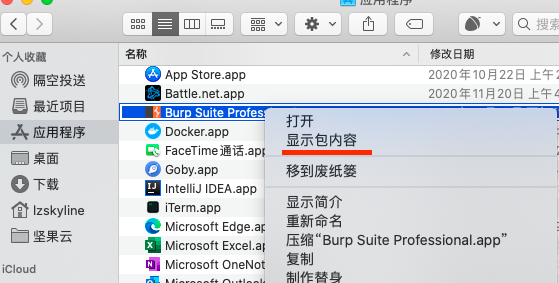
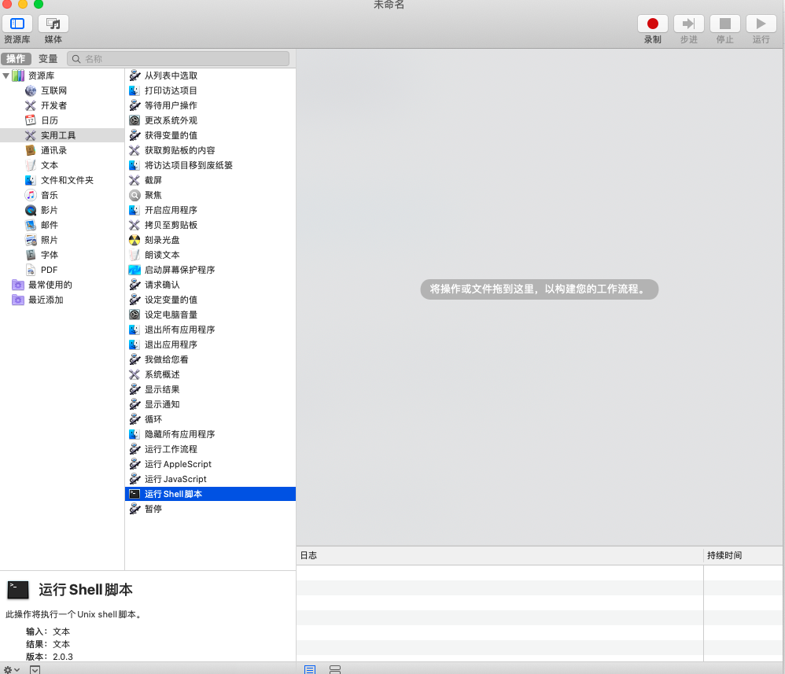

## 写在前面

如果破解后提示包损坏的，可以在破解替换文件之前先运行一遍原版，点一下允许外部程序运行，再进行破解，这样就不会显示包损坏了

至于评论区说的其他的报错情况我就不知道了，我这确实是一直可以正常用，文章写的步骤也检查过了没问题。所以还不行的话自己研究下吧，如果没放错文件路径，那可能是JDK版本的问题。

破解方法Windows也适用，burploader可以用这个: https://www.lzskyline.com/index.php/archives/162/


## 下载安装

下载注册机和启动器 <br>
https://github.com/lzskyline/BurpSuitePro-2.1/blob/master/burp-keygen-scz.jar  <br>
https://github.com/lzskyline/BurpSuitePro-2.1/blob/master/burp-loader-x-Ai.jar  <br>
下载1.9版本或以上的JDK  <br>
https://www.oracle.com/java/technologies/javase/jdk14-archive-downloads.html  <br>
自行下载原版burpsuite，目前网上流传的有两种格式： <br>


## dmg文件
官网下载地址： <br>
https://portswigger.net/burp/releases/  <br>

直达链接：<br>
Intel版本：https://portswigger.net/burp/releases/download?product=pro&version=2022.3.9&type=MacOsx <br>

M1版本：https://portswigger-cdn.net/burp/releases/download?product=pro&version=2022.3.9&type=MacOsArm64  <br>

（M1版本的启动速度亲测变快了，但由于目前官方只提供了APP文件，没有Updater，所以每次升级会覆盖掉一些配置，需要重新按照这个教程破解，自己取舍吧~） <br>

这种方法其实是把burpsuite封装成了mac app放到了"应用程序"中，所以没有直接的jar包，需要自己展开app的包内容来添加破解文件

在应用程序中找到burp，显示包内容，依次打开文件夹：`./Contents/java/app`（如果没有的话就是`./Contents/Resources/app`），然后就会看到我们熟悉的jar文件了



- 将启动器burp-loader-x-Ai.jar移动到当前app目录
- 返回到Contents目录，编辑vmoptions.txt，末尾追加两行内容

```shell
-noverify
-javaagent:burp-loader-x-Ai.jar


```
- 保存，从启动台中运行app，然后启动注册机burp-keygen-scz.jar，用老方法生成激活码激活即可

只要注册算法不变，后续升级都可以直接用官网的安装包app覆盖安装，然后重新在vmoptions.txt中追加上面的两行代码文件就行，别的不用管

>补充一下“老方法”： <br>
1.从启动台中运行app，然后启动注册机burp-keygen-scz.jar，注册机上会显示license <br>
2.把license填到app的页面以后，选中Manual register，进行手工注册，点击next  <br>
3.app页面上出现了request，把request的内容粘贴到注册机中，会在注册机中生成response  <br>
4.把注册机中的response，粘贴回app的页面，然后点击 next  <br>
5.提示注册成功  <br>

## jar包
- 确保三个jar包在同一目录下 <br>
- 双击运行burp-keygen-scz.jar，选择一个自己喜欢的名字，生成注册码。然后不需要点击run（1.8的-Xboot命令高版本不兼容了，所以点了也没反应） <br>
- 当前目录打开命令行，运行 <br>
`java -noverify -javaagent:"burp-loader-x-Ai.jar" -Xmx2048m -jar "burpsuite_pro.jar"`  <br>
- 在弹出的输入框输入注册机生成的注册码完成注册流程即可使用 <br>
如果不想每次都输命令，想一键运行的话，可以创建一个sh脚本，把命令放进去就可以了 <br>


如果要在启动台生成app的话，可以使用“自动操作”app <br>


## 参考

https://www.lzskyline.com/index.php/archives/121/