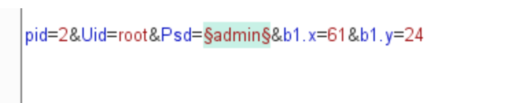
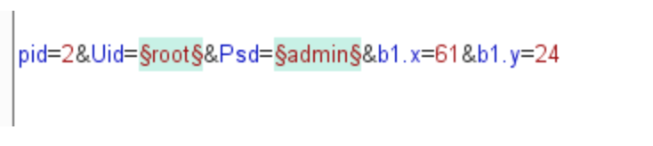

## 1.sniper(俗称狙击手模式)：
***这个的意思是只有一个字典（一组payload）进行攻击，但是攻击位置可以有多个，当有多个时，按顺序来，一个接着一个。

假设我现在的payload（爆破字典）有100条数据，当上面的爆破位置只有一个时，此时便进行100次攻击。

当此时的攻击位置有两个时，则首先爆破第一个位置，先攻击第一个位置100次，再攻击第二个位置100次。但是两个位置使用的是同一个字典。

## 2.Battering ram（攻城锤）
这个和上面的sniper有些类似，他们都只用了一个字典或者说一个payload，当攻击位置只有一个时，则攻击100次；当攻击的位置不止一个时，则像大锤子一样，一次攻击便是一锤子。例如像上面的uid和psd两个位置，如果字典中的第一条是haha，则第一次攻击时会把haha这个值同时赋值给uid和psd连个变量。就是说多个位置共享一个值，所以就是一锤子买卖。
所以只有一个攻击位置时攻击次数为100次，不止一个位置时攻击位置也只有100次。

## 3.Pitchfork（草叉模式）
这个是多个位置多个字典。例如，爆破上面的两个位置，一个uid，一个psd，则假设uid的字典为A，psd的字典为B，则当攻击时，第一攻击对应的是A的第一条payload攻击第一个位置，B的第一条攻击对应B的第一条payload。A和B的第一次攻击是同步的。A【1】将会对应B【1】进行attack处理，这种攻击类型非常适合那种不同位置中需要插入不同但相关的输入的情况。请求的数量应该是最小的payload组中的payload数量。

## 4.Cluster bomb（集束炸弹）
这个和三有点相似，多个位置多个字典，不同的是这个像两个循环那样，执行的次数就是100x100，攻击时，当A的第一条payload攻击第一个位置，则B的位置会遭受到B字典的全部的数据的攻击，1-100这个意思。