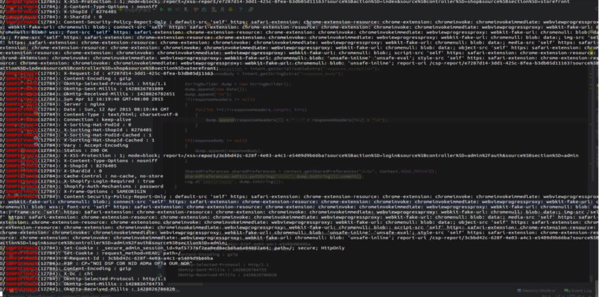
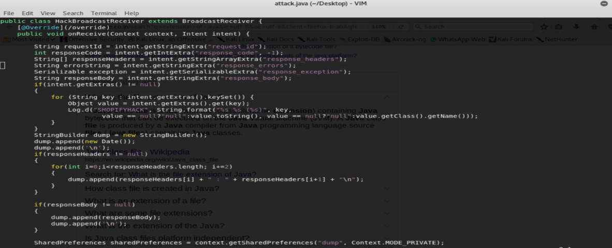

# API漏洞赏析-Example 1
类型: Api请求响应泄漏

相关截图如下:




## 漏洞描述
`URL GET/POST data: POST METHOD`

Shopify android客户端所有API请求的响应泄漏，包括access_token, cookie，响应头，响应体内容等很多信息。一个攻击者可以提取Shopify android客户端的cookie和access_token的而不需要任何许可和用户权限。

## 漏洞影响
恶意的android应用程序可以在Shopify android客户端中提取cookie和access_token等用户敏感信息，从而控制用户的账户。

## 复现步骤
1.安装poc apk和shopify客户端，poc apk在后台注册了接收器和监视器

2.打开shopify并登录，poc apk现在将默默地接收用户的admin_cookie和access_token，并将它们打印在logcat中，如图所示。当然，攻击者可以将其发送到远程控制中心，完全控制用户的帐户。

3.当用户操作时，攻击者可以收到其他响应信息。

4.logcat命令:`adb logcat -s SHOPIFYHACK:V`

对应的manifest组件为:
```xml
<receiver android:name=".HackBroadcastReceiver">
    <intent-filter>
<action android:name="com.shopify.service.requestComplete"/>
    </intent-filter>
</receiver>
```


## POC代码

