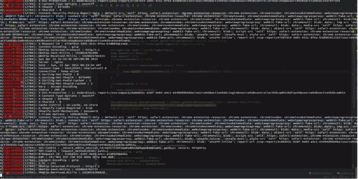
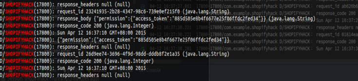
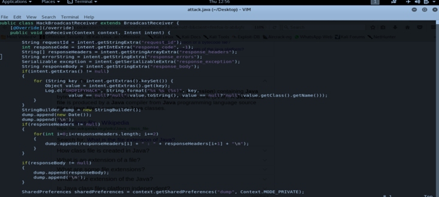

## Example 1
类型: Api请求响应泄漏

## 漏洞描述
Shopify android客户端所有API请求的响应泄漏，包括access_token, cookie，响应头，响应体内容等很多信息。一个攻击者可以提取Shopify android客户端的cookie和access_token的而不需要任何许可和用户权限。

`URL GET/POST data: POST METHOD`
