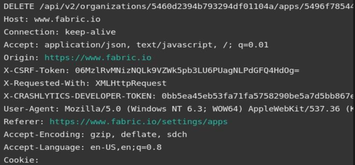

api漏洞系列-API权限升级

## 前言

声明：文章中涉及的程序(方法)可能带有攻击性，仅供安全研究与教学之用，读者将其信息做其他用途，由用户承担全部法律及连带责任，文章作者不承担任何法律及连带责任。

## 主要逻辑

使用能够嵌入Crashlytics的fabric SDK，用twitter登录到他们的Android/IOS应用程序。用户可以在https://fabric.io/dashboard上管理/跟踪仪表板上的报告。

## 漏洞描述

而在仪表板上，我们可以看到两种类型的用户:  
- 管理员-可以删除app，添加成员，删除成员  
- 成员-不能删除应用、不能添加成员、不能删除成员  

登录到Fabric;每个用户都会得到一个访问令牌,使用此访问令牌和会话cookie对每个请求进行身份验证。因此，我们检查成员的访问令牌是否可以用于执行管理请求。

我们从管理员的配置文件中拦截了一个删除请求，用成员的访问令牌和成员的会话cookie替换了访问令牌(X- CRASHLYTICS-DEVELOPER-TOKEN:)

如下类似:

在发送上述请求时，我们得到了一个200状态作为响应，并且成功删除了应用程序。

使用此漏洞，具有普通成员特权的攻击者可以使自己成为管理员，并可以接管该组织。

