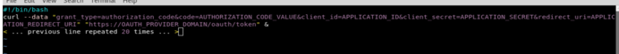

api漏洞系列-OAuth中的race conditions问题

## 前言

声明：文章中涉及的程序(方法)可能带有攻击性，仅供安全研究与教学之用，读者将其信息做其他用途，由用户承担全部法律及连带责任，文章作者不承担任何法律及连带责任。

## 漏洞描述

大多数OAuth2 的API实现在用于处理访问令牌或刷新令牌的请求的时候似乎有多个竞争条件漏洞。

竞争条件允许恶意应用程序获得多个`access_token`和`refresh_token`对，而实际上应该只生成一对。而且，当访问被撤销时，它会导致授权绕过。

### 访问令牌的竞争条件:

根据OAuth 2.0 RFC (https://datatracker.ietf.org/doc/html/rfc6749)，通过回调获得的代码只能使用一次来生成access_token(以及相应的refresh_token)。

竞争条件漏洞允许恶意应用程序生成多个access_token和refresh_token对。当用户撤销对应用程序的访问时，这会导致身份验证问题。其中一对access_token和refresh_token将被撤销，但其余的都保持活动状态。

## 复现步骤

0)注册一个使用目标提供者(注:一般是google,facebook,apple这种厂商)的OAuth 2.0 API的应用程序。获取应用程序的凭证

1)在浏览器中打开应用授权链接。通常它看起来是这样的:
`https://OAUTH_PROVIDER_DOMAIN/oauth/authorize?client_id=APPLICATION_ID&redirect_uri =https://APPLICATION_REDIRECT_URI&response_type=code
`

2)登录受害者的账户(如果需要的话)，并允许访问应用程序

3)通过回调获取code值:

`https://APPLICATION_REDIRECT_URI?code=AUTHORIZATION_CODE_VALUE`

4)尝试利用访问令牌请求的竞争条件。我使用了以下脚本:

对于有Race Condition bug的目标(11个测试中的10个)，它的执行结果给出了1到20个不同的access_token值(可能与refresh_token值成对)。

5)检查每个access_token。从目标API中获取最简单的请求，并对每个值进行尝试，比如:

`GET /api/me?access_token=ACCESS_TOKEN_VALUE HTTP/1.1Host: OAUTH_PROVIDER_DOMAIN`

通常，所有的access_token值都是有效的。

6)请注意Race Condition是概率漏洞。可能需要对PoC做一些尝试来重现它。攻击者通常可以向服务器生成一些额外的负载(不是DoS，而是许多对脆弱脚本的请求)，以增加成功利用的机会。

7)这里的执行流程有两个可能的方向:  
7A)进入受害者账户的设置或应用页面，撤销该应用的访问权限。然后重复步骤5，查看是否所有access_token都无效。如果所有的access_token都无效，那么尽管成功利用了竞态条件，但这是良好的行为。实际上，在某些情况下，只有一个access_token被撤销，而其他所有的token都保持有效。 
7B)对一个access_token使用撤销请求(比如/oauth/revoke)。然后重复步骤5，查看在这种情况下，只有一个令牌被撤销，而其他所有令牌都保持活动(除了一个被测试的目标)。  

### 刷新令牌的竞争条件:

虽然代码只能使用一次来获取access_token，但refresh_token通常也只能使用一次。在这种情况下，竞争条件漏洞允许攻击者生成大量的access_token和refresh_token对。这将使受害者很难撤销对恶意应用程序的访问。

