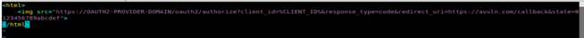
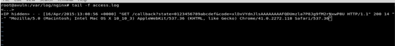

## 前言

声明：文章中涉及的程序(方法)可能带有攻击性，仅供安全研究与教学之用，读者将其信息做其他用途，由用户承担全部法律及连带责任，文章作者不承担任何法律及连带责任。

## 漏洞描述

OAuth2 API允许用户将访问他们账户的权限授予第三方应用程序。当然，用户能够管理此类应用程序对其帐户的访问，并可能拒绝任何应用程序的访问。当某些用户拒绝对应用程序的访问时，所有的access_token(以及使用的refresh_token)都将被撤销并变得无效。但是不仅access_tokens应该被撤销，授权码(它是OAuth2授权流中使用的中间令牌)也必须被撤销。目前大多数OAuth2 API实现在撤销访问时不撤销授权代码。它可能被利用恢复访问用户帐户后，恶意应用程序撤销访问。

目前的统计数据   
1.共测试了21家OAuth2提供商，其中  
2.11家权限撤销后 授权代码缺失 是没有影响的   
3.10家  用户和应用程序授予的所有授权码 是失效 的  
一句话: 11家没问题,10家有问题;

## POC
1)打开某个应用的OAuth2授权链接

2)登录您的账户(如果需要)，点击允许(或授权)

3)从回调url复制代码值

4)使用代码值获取access_token

5)通过发送一些API请求来检查access_token的有效性

6)重复步骤1和2(对于大多数实现，用户自动重定向到回调页面，如果访问授权)

7)从回调url中复制代码值并保存以备以后使用

8)进入帐户安全(或连接的应用程序)设置

9)删除或断开PoC期间使用的应用程序

10)为了确保访问被拒绝，重复步骤5

11)使用从步骤7获取的code和并替换它为access_token

12)检查access_token的有效性

### 注意点

对于真实的攻击场景，必须提到以下几点:

A)看起来第6步需要与用户交互，实际上这是不必要的

B)通过回调获得的授权代码有一定的时间限制，但也不是问题

恶意应用程序不想失去对用户帐户的访问只需要在其网站上设置类似如下:

这样的代码将在用户每次加载它时"悄悄"地产生新的授权代码:

## 影响

该漏洞允许恶意应用程序保持对受害者帐户的访问活动，即使访问权限被撤销。这不仅是绕过授权，而且还剥夺了受害者管理应用程序访问的能力。

与2做对比

如果access_token有效，说明OAuth2 Provider受漏洞影响。

