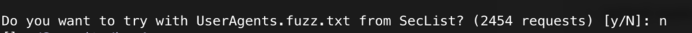
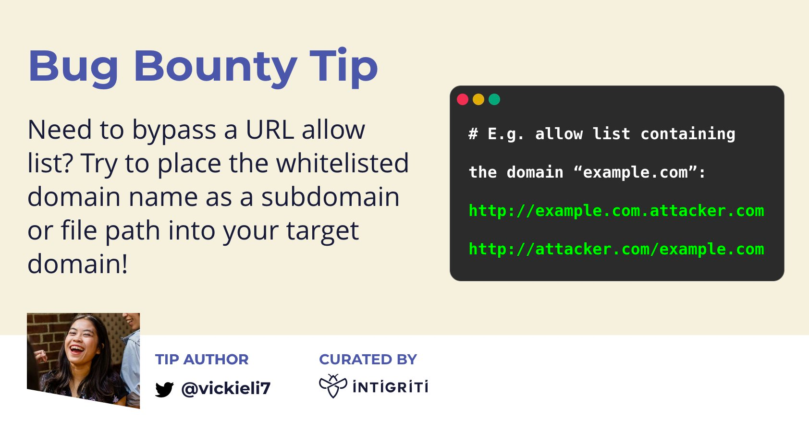

# 几个工具
## 1、byp4xx

`https://github.com/lobuhi/byp4xx`  <br>
安装： <br>

```shell
git clone https://github.com/lobuhi/byp4xx.git
cd byp4xx
chmod u+x byp4xx.py
./byp4xx.py
or
python3 byp4xx.py
```

或者使用pip安装：<br>

`pip install git+https://github.com/lobuhi/byp4xx.git` <br>
使用方法： <br>

`python3 byp4xx.py <cURL options> <target>`
示例： <br>

`python3 byp4xx.py https://www.google.es/test` <br>
byp4xx还自带了一个不错的字典，当使用默认参数测试完毕后，它会询问你是否使用自带的字典再跑一遍： <br>



## 2、Bypass-403

`https://github.com/iamj0ker/bypass-403`


安装：

```shell
git clone https://github.com/iamj0ker/bypass-403
cd bypass-403
chmod +x bypass-403.sh
sudo apt install figlet  #依赖安装
```


使用方法：

```shell
/bypass-403.sh https://example.com admin
或
./bypass-403.sh website-here path-here
```


## 3、forbinddenpass

`https://github.com/gotr00t0day/forbiddenpass`

安装：

```shell
git clone https://github.com/gotr00t0day/forbiddenpass.git

cd forbiddenpass

pip3 install -r requirements.txt

python3 forbiddenpass.py -h
```


使用方法：

`forbiddenpass.py [-h] [-p domain.com] [-d filename.txt] [-t site.com]`

示例：


```shell
python3 forbiddenpass.py -d domains.txt

python3 forbiddenpass.py -d domains.txt --path login

python3 forbiddenpass.py -t https://site

python3 forbiddenpass.py -t https://site --path login

```

# 403 tricks
## 403 Bypass tricks
https://twitter.com/mamunwhh/status/1496786769316294659
```
Bypass 403 on /api/v1/user/id

/api/v1/user/id.json
/api/v1/user/id?
/api/v1/user/id/
/api/v2/user/id
/api/v1/user/id&accountdetail
/api/v1/user/yourid&victimid
X-Original-URL: /api/v1/user/id/


```


## trick01
https://systemweakness.com/how-i-bypassed-403-forbidden-domain-using-a-simple-trick-c2d538de04b8

```
dig redacted.com

```


要点: 从 `$dig target.com `知道 CNAME 后.....如何获得 200 ....🤔🤔 ====>在浏览器中点击 cname


## trick02
https://twitter.com/remonsec/status/1290354885850886144
```shell
$ http://site.com/wp-admin/install.php > 403
$ http://site.com/wp-admin/install.php/* > 200
```


## trick03
https://twitter.com/iam_j0ker/status/1303658167205728256


还有一个工具仓库:<br>
https://github.com/yunemse48/403bypasser


## 重要ppt

https://docs.google.com/presentation/d/1ek6DzXKBQd6xUiVNGRT33pMACs8M13CSoYCkgepDKZk/edit#slide=id.gb344e2d586_0_278

已经下载了!!!

## tricks04
https://twitter.com/h4x0r_dz/status/1317218511937261570


## tricks05
https://github.com/Dheerajmadhukar/4-ZERO-3

## 一篇总结性文章

https://mp.weixin.qq.com/s/N32dGX3a6OYpaQa4a_EDrQ


## tip06


`/;/`;`/.;/`;`//;//`;

例如:`/.;/example.so`


## tips07
https://twitter.com/intigriti/status/1454412777011879941/photo/1



## tips08

https://twitter.com/intigriti/status/1497552035855675394/photo/1


## tips09
https://twitter.com/h4x0r_dz/status/1317218511937261570


