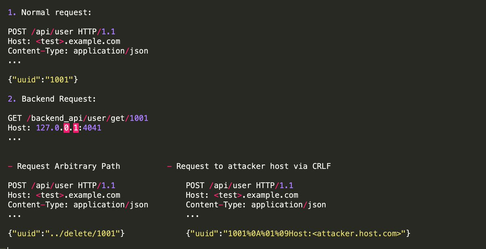
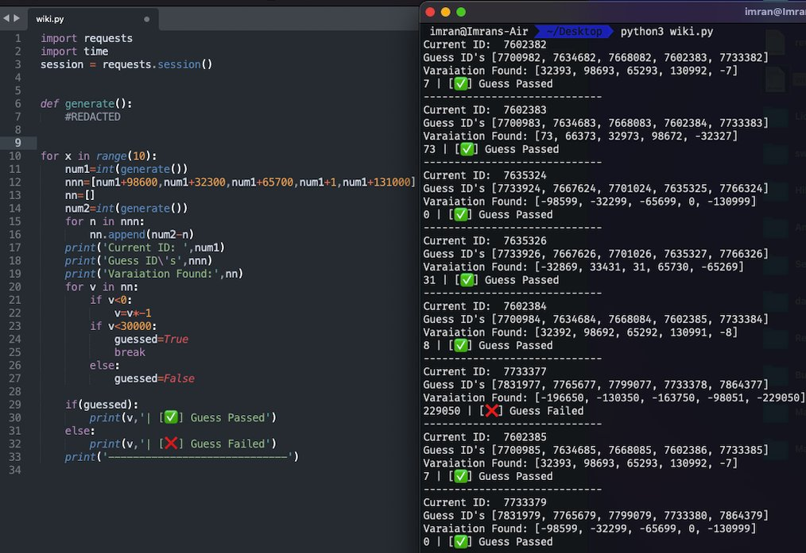

https://twitter.com/m4ll0k/status/1310439013581549568

主要是存在uuid的post请求

## an interesting idor

https://twitter.com/imranparray101/status/1553360991970553857

I  came across an interesting IDOR/BAC vulnerability that required a random ID to exploit.

I discovered that the next ID is generated by incrementing the previous ID with 90600,32300,65700 and a few more numbers.

I quickly wrote this POC that guesses the next ID.

