https://www.youtube.com/watch?v=KUs_WHtFid0&list=PLr-hXv9DE5yi9gquA9wUNKGlBfMzUrDG9&index=4

## 开始的前奏知识
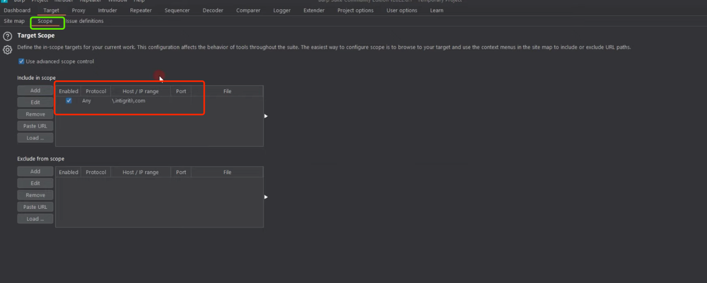

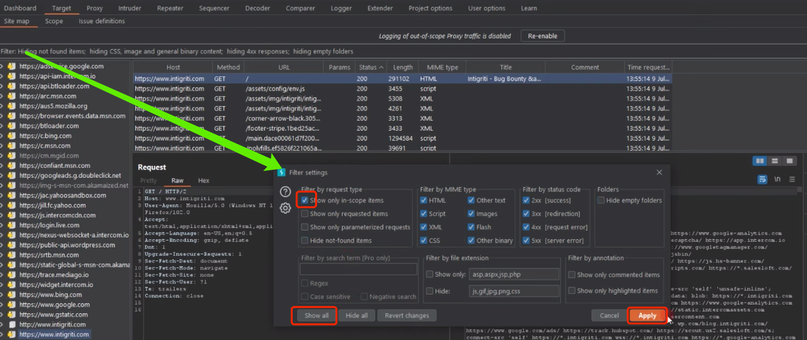

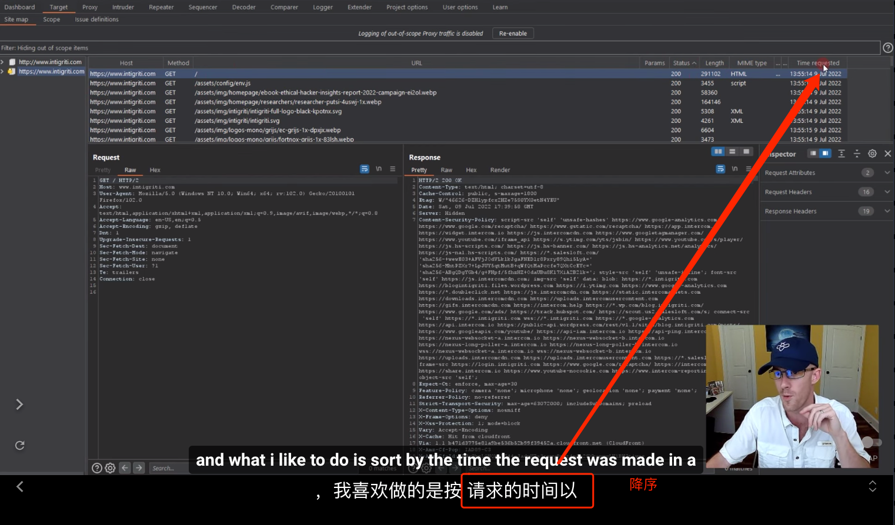

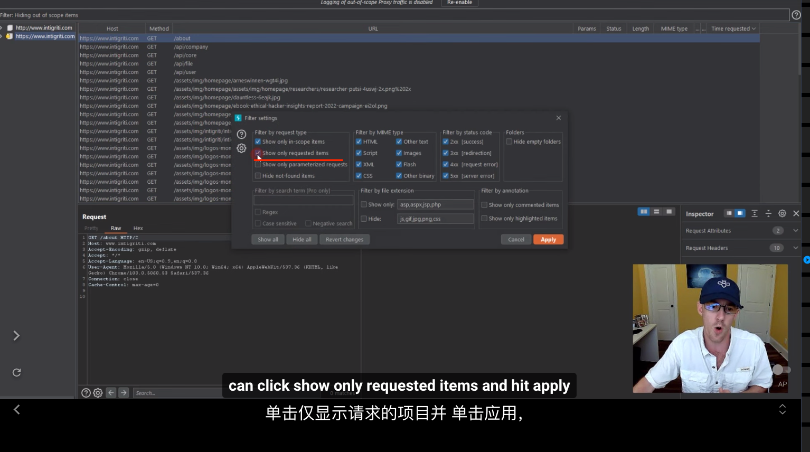

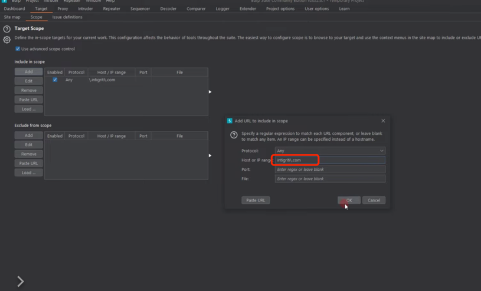

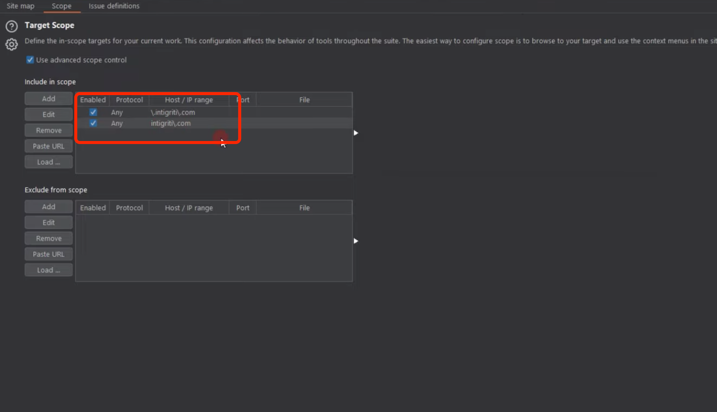

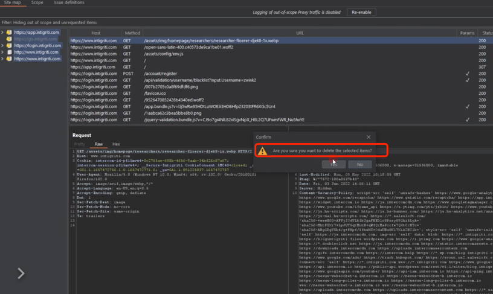

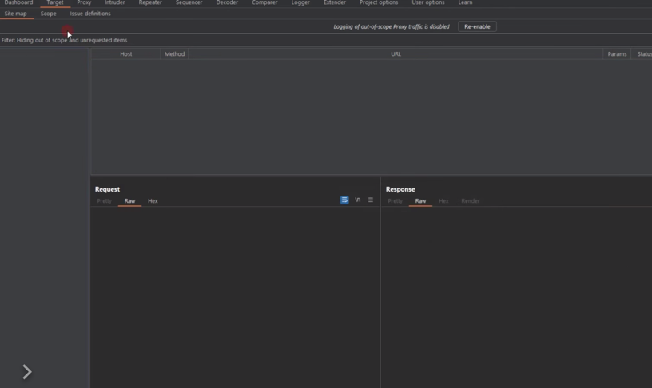

重新开始了:

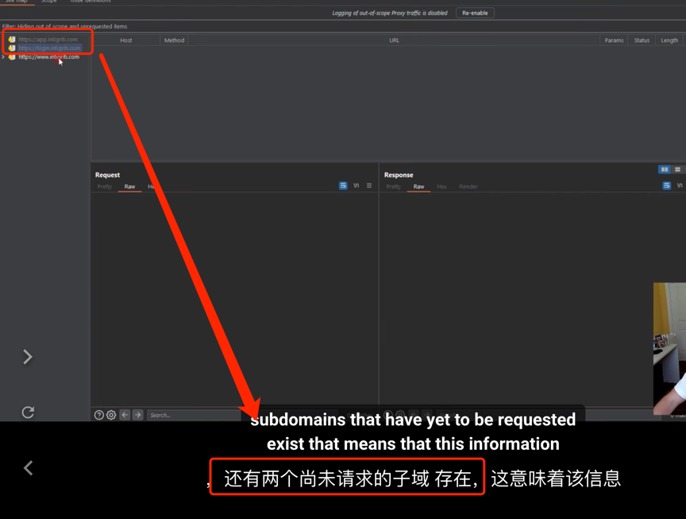

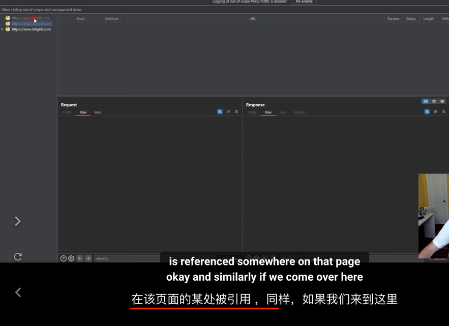

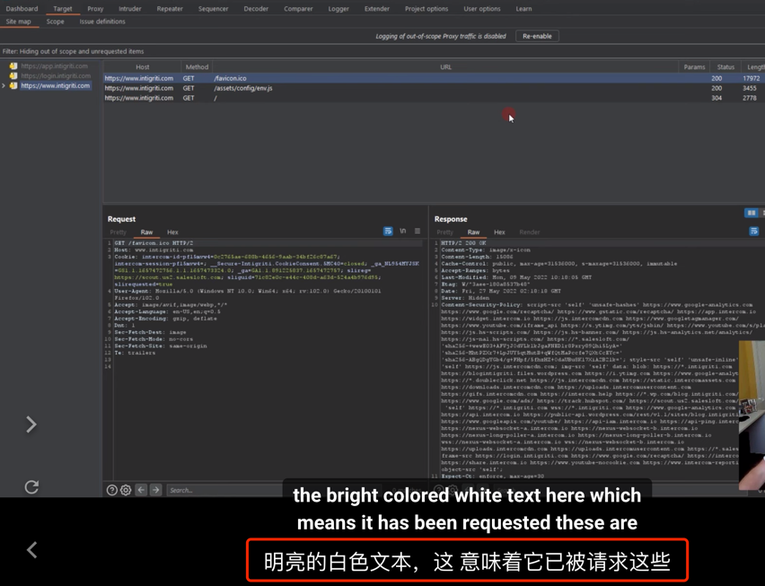

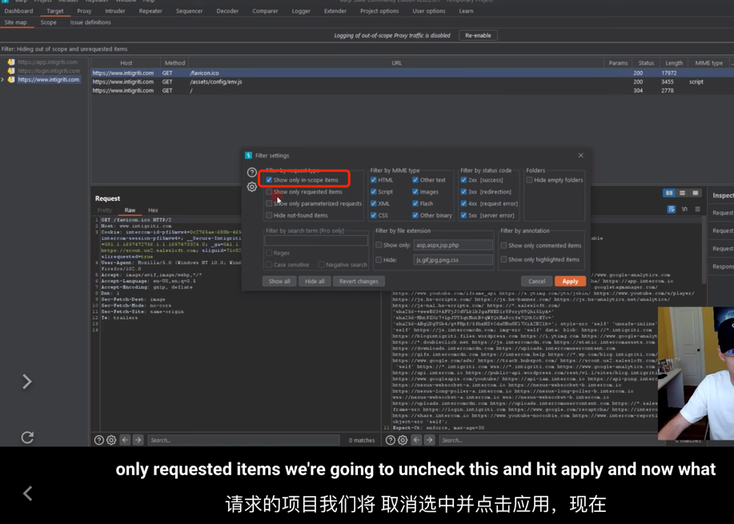

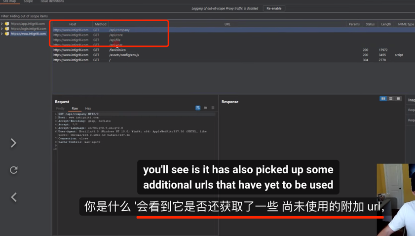

上面这几个图片所展示的是:

灰色的表示的请求是还没获取,但是这些灰色的会被该页面的某处引用;

### 小结

- 去噪,锁定目标;
- 在sitemap里面查看,按照时间降序来查看

