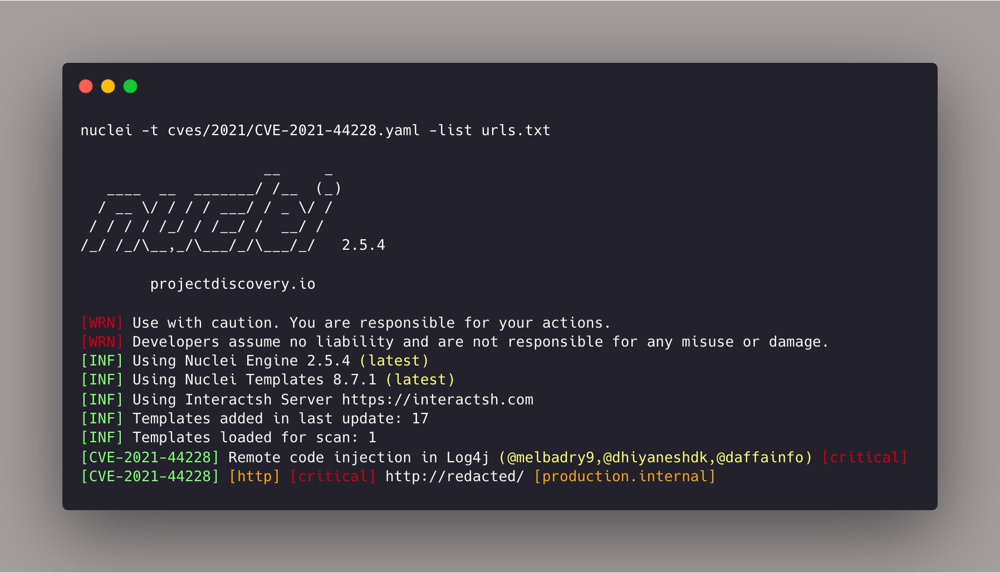

https://twitter.com/razielowfsky/status/1470202924961878019

## method01
https://github.com/OWASP/Nettacker
```shell
python3 nettacker.py -i owasp.org -m log4j_cve_2021_44228_vuln -o owasp.csv --skip-service-discovery
```

## method02

https://github.com/portswigger/log4shell-everywhere


## method03

https://github.com/proferosec/log4jScanner


## method04
https://twitter.com/pdnuclei/status/1469757887526227974




## poc
https://github.com/tangxiaofeng7/CVE-2021-44228-Apache-Log4j-Rce