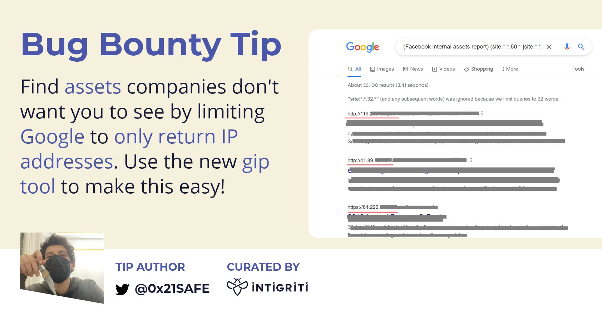
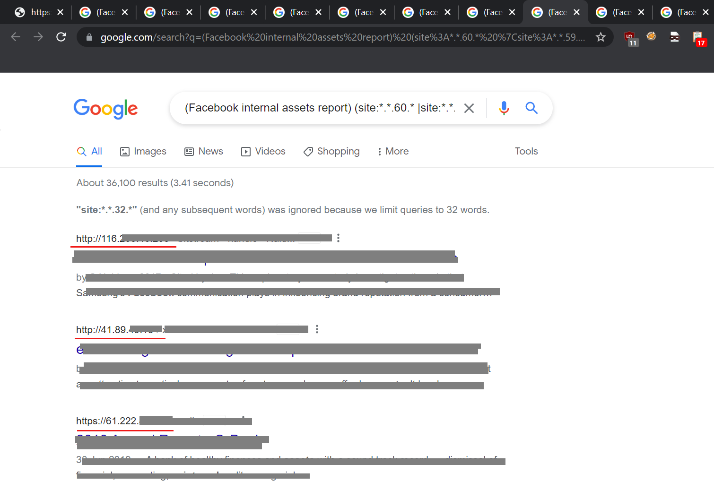
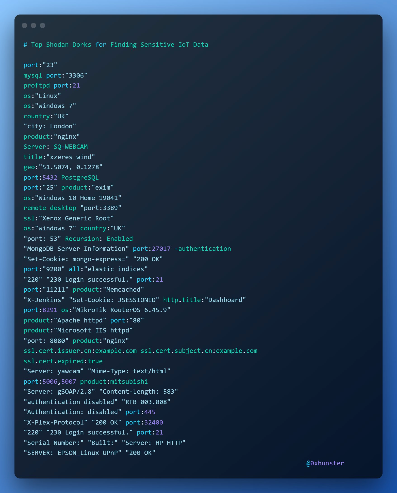
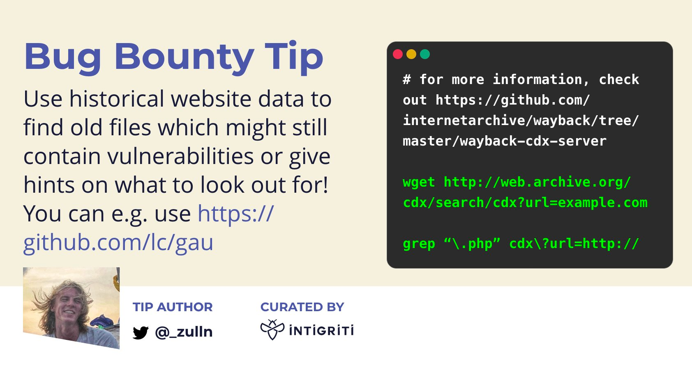
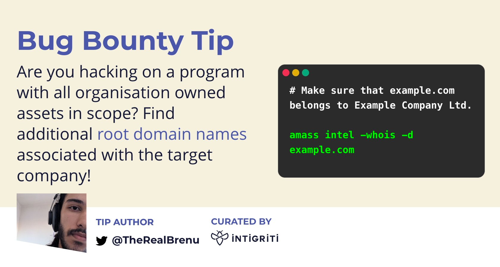

## tips-01

https://twitter.com/intigriti/status/1527977514341048320

https://github.com/SeifElsallamy/gip

https://0iq.me/gip/

eg:  (Facebook internal assets report)(site: *.*.60.* | site: *.*.)

## Top Shodan Dorks for Finding Sensitive IoT Data
https://twitter.com/0xhunster/status/1548382647759491074

## 历史数据/版本的查找
https://twitter.com/intigriti/status/1456964593524346883/photo/1

## root domain names found

https://twitter.com/intigriti/status/1459501309485322244/photo/1

## google dorks

https://twitter.com/Dinosn/status/1539226361516154883

https://infosecwriteups.com/google-dorks-an-advanced-hacking-tool-a523c4996279

