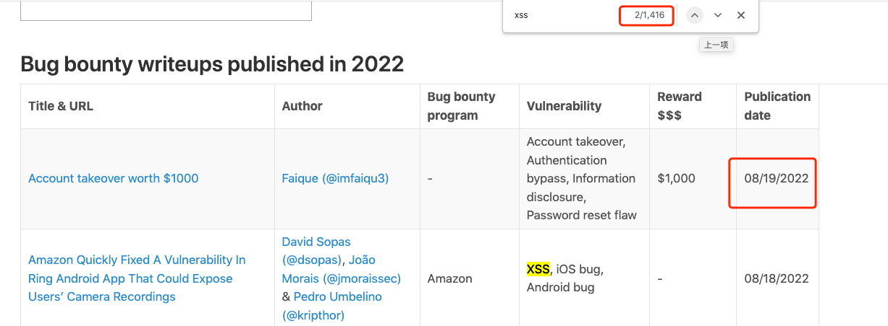

https://pentester.land/list-of-bug-bounty-writeups.html

Escalating Open Redirect to XSS

XSS via Angular Template Injection

WordPress Transposh: Exploiting a Blind SQL Injection via XSS - RCE Security

Tableau Server Leaks Sensitive Information From Reflected XSS

From Open Redirect to Reflected XSS manually

XSS Blind Stored at Asset Domain Android Apps TikTok

Hacking Swagger-UI - from XSS to account takeovers

ResolveURI RXSS Imperva Waf Bypass

Chained Bug: XML File Upload to XSS to CSRF to Full Account Take Over (ATO)

Sensitive Data Exfiltration through XSS ($450)

SSRF and Account Takeover via XSS in ERPNext (0-day)

Stealing cookies from subdomain leads to takeover user accounts at redacted.com

From XSS to RCE (dompdf 0day)

How I managed to trigger XSS automatically to get critical account takeover

A Tale of Open Redirection to Stored XSS

Circumventing Browser Security Mechanisms For SSRF

CVE-2022-24948: Apache JSPWiki preauth Stored XSS to ATO

XSS via X-Forwarded-Host header

XSS via file upload

Stored XSS by bypassing signature

SVG based Stored XSS

Account Takeover via Stored XSS

Write Up – XSS Stored In files.slack.com Via XML/SVG File (iOS) – $1,000 USD

“A tale of making internet pollution free” - Exploiting Client-Side Prototype Pollution in the wild   ----->好文

Weaponizing Reflected XSS to Account Takeover

Mistuned Part 1: Client-side XSS to Calculator and More, Mistuned Part 2: Butterfly Effect & Part 3

Account Takeover via XSS in e-signature feature worth 2500$

Bug Bounty Guest Post: Local File Read via Stored XSS in The Opera Browser

chaining bugs from self XSS to account takeover

Cache Poisoning via SelfXSS + Path Parameter

Reflective XSS via search box [Bypassing Cloudflare WAF].

Alun Jones (@ftp_alun) Microsoft Subdomain takeover, Broken link hijacking - 08/15/2021
1st Bug Bounty WriteUp: Open Redirect To XSS on Login Page

PostMessage Xss vulnerability on private program

How I escalate my Self-Stored XSS to Account Takeover with the help of IDOR

Account takeover via stored xss

Chaining Open Redirect with XSS to Account Takeover

Mattermost Server v5.32 > v5.36 Reflected XSS in OAuth flow

How I Found Multiple Bugs On FaceBook In 1 Month And a Part For My Methodology & Tools      ---> 好文章

How I Bypassed a tough WAF to steal user cookies using XSS!

How i was able to bypass Cloudflare for XSS!

Blind XSS in Apple School- Enrollment Data Disclosure

Escalating XSS to Arbitrary File Read

Stored XSS via Invite leading to Mass Account Takeover at Opera.

Account takeover via stored XSS with arbitrary file upload

XSS in the AWS Console

Chaining XSS with authentication issues to turn it into full account takeover

XSS via postMessage in chat.mozilla.org

One-click reflected XSS in www.instagram.com due to unfiltered URI schemes leads to account takeover

XSS Through Parameter Pollution

Chaining CSRF with XSS to deactivate Mass user accounts by single click

Exploiting XSS via Markdown on Xiaomi

Pwning your assignments: Stored XSS via GraphQL endpoint

(CRITICAL) Blind Storage XSS — My first Bug Bounty 💰

How I leveraged XSS to make Privilege Escalation to be Super Admin!

Self-XSS to rXSS via Uploaded File Name

How I was able to Turn a XSS into a Account Takeover

Chaining a self XSS to Account Takeover

How I was rewarded a $1000 bounty after abusing File Upload functionality to Stored XSS Vulnerability leading to credential theft of a vistor in a website.

Stealing User Information Via XSS Via Parameter Pollution

XSS on forums.oculusvr.com leads to Oculus and Facebook account takeovers

Chaining CORS by Reflected xss to Account takeover #My first Blog

EN | Account Takeover via Web Cache Poisoning based Reflected XSS

Content-Security-Policy Bypass to perform XSS using MIME sniffing

Escalating XSS to Account Takeover

Facebook DOM Based XSS using postMessage

Leveraging XSS to Read Internal Files

Write Up – Google Bug Bounty: XSS To Cloud Shell Instance Takeover (Rce As Root) – $5,000 USD

XSS->Fix->Bypass: 10000$ bounty in Google Maps

Self stored xss to full account takeover

XSS in Zoom.us Signup Flow

XSS to Database Credential Leakage & Database Access — Story of total luck!

Local file read via XSS using PDF generate functionality

Story About OTP Bypass To Stored XSS

Parsing the DOM elements of Other pages via XSS: A Bug Bounty Story

Reflected XSS in Facebook’s mirror websites

Bug Hunting with Param Miner: Cache poisoning with XSS, a peculiar case

(Shopify.com) Blind Stored XSS Via Staff Name \(\)

From Copy&Paste XSS To Full Account Takeover!

Stored XSS Leads to Plaintext Password Disclosure

Self stored xss to full account takeover

XSS WAF & Character limitation bypass like a boss

Self XSS to Account Takeover

Blind XSS against a Googler

Arbitary File Upload too Stored XSS - Bug Bounty

Escalating reflected XSS with HTTP Smuggling

XSS on Facebook-Instagram CDN Server bypassing signature protection

Exploiting a Self Stored XSS with an IDOR

Microsoft Edge (Chromium) - EoP via XSS to Potential RCE

HTML Injection to XSS bypass in [REDACTED.com]

How I paid 2$ for a 1054$ XSS bug + 20 chars blind XSS payloads

XSS to Account Takeover

[Bug Bounty] Exploiting Cookie Based XSS by Finding RCE

Leveraging AngularJS-based XSS to Privilege Escalation

How I Found XSS By Searching In Shodan

Chaining Cache Poisoning To Stored XSS

XSS to RCE in …

Yeah! I got P2 in 1 minute - Stored XSS via Markdown Editor

How a classical XSS can lead to persistent ATO Vulnerability?

Unicode vs WAF — XSS WAF Bypass

Exploiting File Uploads Pt. 1 – MIME Sniffing to Stored XSS #bugbounty

From parameter pollution to XSS

From Reflected XSS to Account Takeover — Showing XSS Impact

Stealing local storage data through XSS

CSRF Attack can lead to Stored XSS

How I found Blind XSS Vulnerability in redacted.com

Chaining Tricky OAuth Exploitation To Stored XSS

Antihack.me Blind XSS To PHP File Upload Vulnerability

Uploading files to api.techprep.fb.com

Turning Self XSS to good XSS via access control

XSS to XXE in Prince v10 and below (CVE-2018-19858)

Self XSS leads to blind XSS and reflected XSS.

Blind-XSS in Chrome Experiments - Google (Write Up)

Yahoo — Two XSSi vulnerabilities chained to steal user information. ($750 Bounty)

How I found XSS via SSRF vulnerability -Adesh Kolte

How i converted SSRF to XSS in Jira.

Self-XSS + CSRF to Stored XSS

XSS worm – A creative use of web application vulnerability

How i found blind XSS in Apple

Turning Self-XSS into non-Self Stored-XSS via Authorization Issue at “PayPal Tech-Support and Brand Central Portal

How I got stored XSS using file upload

Bypass CSP by Abusing XSS Filter in Edge

Reflected XSS via AngularJS Template Injection

Taking note: XSS to RCE in the Simplenote Electron client

Local File Read via XSS in Dynamically Generated PDF

Stored XSS to Full Information disclosure

Facebook XSS via Cross-Origin Resource Sharing