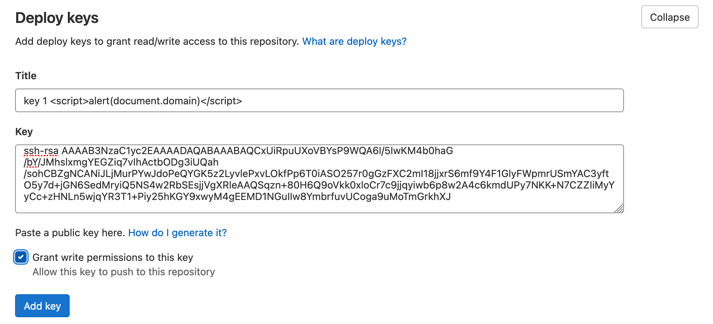
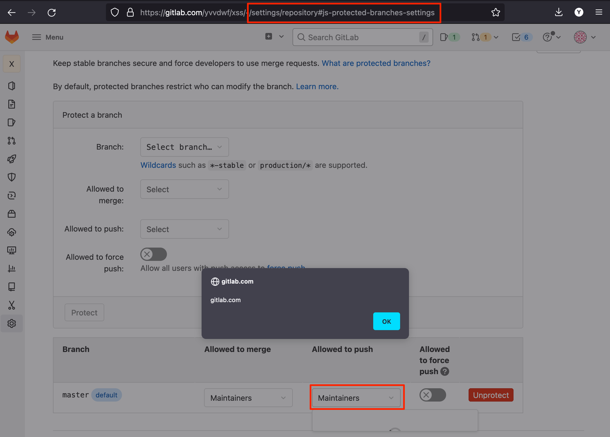

https://gitlab.com/gitlab-org/gitlab/-/issues/364164

CSP-bypass XSS in project settings page

声明：文章中涉及的程序(方法)可能带有攻击性，仅供安全研究与教学之用，读者将其信息做其他用途，由用户承担全部法律及连带责任，文章作者不承担任何法律及连带责任。

##  背景

这个漏洞是 yvvdwf 小哥发现的,于2022年6月1日提交了这个漏洞，这个漏洞主要是 一个函数出现了问题:

```ruby
  deployKeyRowHtml(key, isActive) {  
    const isActiveClass = isActive || '';

    return `  
      <li>  
        <a href="#" class="${isActiveClass}">  
          <strong>${key.title}</strong>  
          <p>  
            ${sprintf(  
              __('Owned by %{image_tag}'),  
              {  
                image_tag: ``,  
              },  
              false,  
            )}  
            <strong class="dropdown-menu-user-full-name gl-display-inline">${escape(  
              key.fullname,  
            )}</strong>  
            <span class="dropdown-menu-user-username gl-display-inline">${key.username}</span>  
          </p>  
        </a>  
      </li>  
    `;  
  }  
```

上面这个函数的作用是: 在下拉菜单中渲染部署键。 因为部署标题由用户控制，所以它可以是任何html内容，例如`<script>alert(document.domain)</script>`。此外，html内容将使用jQuery渲染，所以` <script> `标签将被执行，而CSP的script-src具有`'strict-dynamic'`值:

```ruby
  renderMenu(html) {  
    if (this.options.renderMenu) {  
      return this.options.renderMenu(html);  
    }  
    return $('<ul>').append(html);  
  }  

```

## 复现步骤

1.在一个已存在的项目中，或者创建一个新项目，转到`Settings/Repository`。然后在`Deploy keys`中填写如下表单:

```shell
Title:  test <script>alert(document.domain)</script>


Key:  ssh-rsa AAAAB3NzaC1yc2EAAAADAQABAAABAQCkhkyrQJvb30Q5lLZzxeALqCyBrLOh+QzRYWh+gPGpqi2efyGMf5beN2zda66OI6DaclB31SJ0jYzaYKgKXQw7rzu/IYazONdy5lz5O2iUB2BkDzJYZ+BObTaTCjyDgSvNNuezUqNXXqoXftEMa1l0+FRSkTusH5F2P3JCV3Tf1BBQImrbDIpdc6ps+UxsiX7S/dT+7bNIVXblC8s8k+AK4CWsC2KmfMToK35pk+sa9JI+rb26hzv8IHA8n7cqXOmR5qAj2qX962p1kOLNXCyHJAKAIfRXCuDPbXiB+kjnu478eIcudOPveo3CK3G6hBI0hPSRfoyAUIubcddnnbhR 


Grant write permissions to this key:  Checked

```

然后单击“添加”按钮保存表单。



注意:


- 标题可以是表示攻击有效载荷的任何HTML内容。在上面的例子中，我们只显示了一个包含当前域的警报。

- Key可以是任何有效的SSH公钥。在上面的示例中，提供了一个随机密钥，以便可以复制粘贴到表单中，而不需要生成密钥


2.必须要在设置/存储库页面中，单击受保护的分支链接来展开它的表单

3.单击allow to push下的下拉框，应该会看到在执行上面的有效负载时生成的警报




注意点:

这不是任何项目维护者可以访问设置页面的自xss。此外，受害者可以添加为项目维护者，而不需要他们明确的接受  <br>

可以通过直接访问url上的`#js-protected-branches-settings`(例如`https://gitlab.com/yvvdwf/xss/-/settings/repository#js-protected-branches-settings`)来忽略步骤2