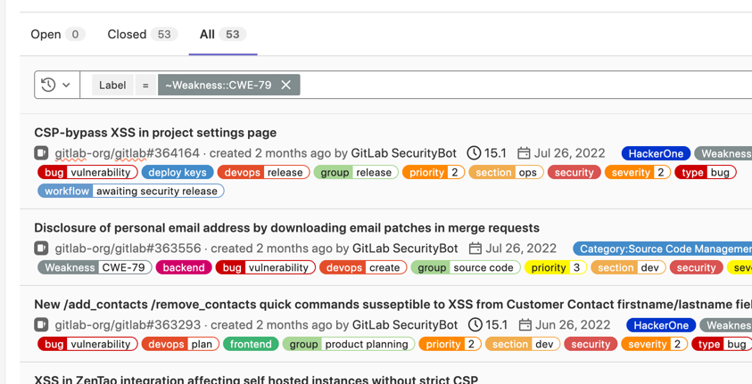

## 漏洞集合
[总的](https://gitlab.com/groups/gitlab-org/-/issues?sort=created_date&state=all&label_name[]=HackerOne
)

[CWE-284](https://gitlab.com/groups/gitlab-org/-/issues?sort=created_date&state=closed&label_name[]=Weakness::CWE-284
)    

[权限相关的漏洞](https://gitlab.com/groups/gitlab-org/-/issues?sort=created_date&state=opened&label_name[]=Category:Authentication+and+Authorization&label_name[]=HackerOne
)

[dos](https://gitlab.com/groups/gitlab-org/-/issues?sort=created_date&state=closed&label_name[]=Weakness::CWE-400
)

[ssrf](https://gitlab.com/groups/gitlab-org/-/issues?sort=created_date&state=closed&label_name[]=Weakness::CWE-918
)

[information disclose](https://gitlab.com/groups/gitlab-org/-/issues?sort=created_date&state=all&label_name[]=Weakness::CWE-200
)

[idor](https://gitlab.com/groups/gitlab-org/-/issues?sort=created_date&state=all&label_name[]=Weakness::CWE-639
)

[store-xss](https://gitlab.com/groups/gitlab-org/-/issues?sort=created_date&state=all&label_name[]=Weakness::CWE-79
)

[权限提升](https://gitlab.com/groups/gitlab-org/-/issues?sort=created_date&state=all&label_name[]=Weakness::CAPEC-233
)

[gitlab 高危漏洞1](https://gitlab.com/groups/gitlab-org/-/issues?page_after=NDA&sort=label_priority_desc&state=closed&label_name[]=priority::1&label_name[]=HackerOne
)

[gitlab 高危漏洞2](https://gitlab.com/groups/gitlab-org/-/issues?page_after=NDA&sort=label_priority_desc&state=closed&label_name[]=HackerOne&label_name[]=severity::1
)

[gitlab 高危漏洞3](https://gitlab.com/groups/gitlab-org/-/issues?sort=label_priority_desc&state=closed&label_name[]=priority::1&label_name[]=HackerOne&label_name[]=severity::1)

其他相关:

https://gitlab.com/groups/gitlab-org/-/issues?sort=updated_desc&state=closed&label_name[]=Weakness::CWE-99
https://gitlab.com/groups/gitlab-org/-/issues?sort=updated_desc&state=closed&label_name[]=Weakness::CWE-312
https://gitlab.com/groups/gitlab-org/-/issues?sort=updated_desc&state=closed&label_name[]=Weakness::CWE-352
https://gitlab.com/groups/gitlab-org/-/issues?sort=updated_desc&state=closed&label_name[]=Weakness::CWE-77

