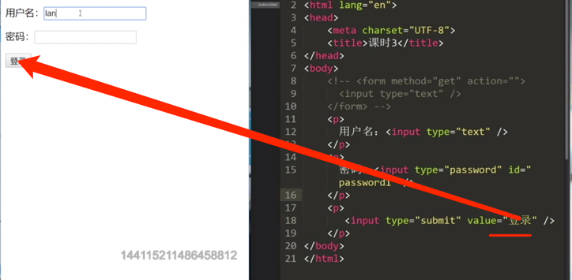
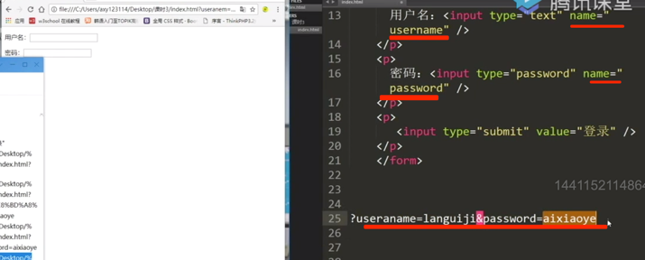
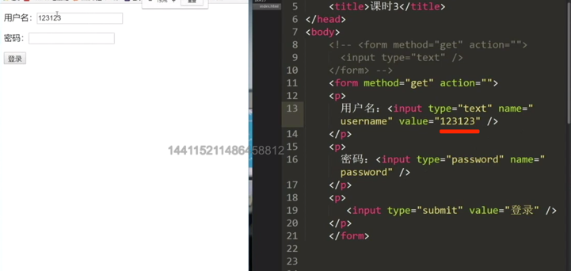
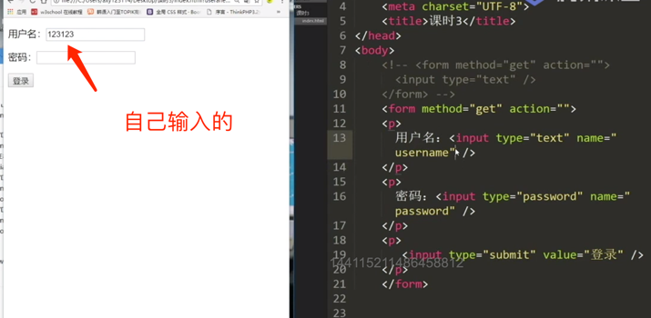

[TOC]

https://ke.qq.com/course/329070/6852920968807790#term_id=100390499

## 前提(需要记忆)

用户提交数据的两个重要点: 

数据名称(name属性)+数据值(value属性)

## form标签

敲出h5然后就会出现html模板

type="text | password"  两个属性

form块级元素(block)

```html
<!doctype html>
<html lang="en">
<head>
  <meta charset="UTF-8">
  <meta name="viewport"
        content="width=device-width, user-scalable=no, initial-scale=1.0, maximum-scale=1.0, minimum-scale=1.0">
  <meta http-equiv="X-UA-Compatible" content="ie=edge">
  <title>Document</title>
</head>
<body>
<form method="get" action="后端url">
  <input type="text" name="username" value="123456"/>
  <input type="password" name="password" value="123456"/>

</form>
</body>
</html>
```








这个value可以自己输入也可以利用value来定义(对比上下两个图),上面这个图是利用value来定义的




