[TOC]

## 预备知识

浏览器组成: shell+内核

Google Chrome     webkit(google和apple一起开发的)/blink
Safari           webkit
firefox          gecko
IE               trident
opera            presto  -----要死不活-----被360和昆仑万维收购


内核: 渲染(rendering)引擎; JS引擎(重点优化的对象,Google的V8引擎直接将JS转换为机器码)

## CSS
### CSS含义

CSS        cascading style sheet          层叠样式表

2.2.选择器书写格式

```css
选择器 {
属性名: 属性值;	
属性名: 属性值;
}
```


### CSS书写格式

内联样式 - 行间样式，行内样式  <br>
```html
<div style="1px solid red"></div>

```
内部样式表 <br>


外部样式表 <br>


### 权重(优先级)
`!important(慎用) > 内联样式 > 内部样式表 > 外部样式表`


### 选择器分类


id选择器 #id - 唯一性 _连接复合单词 <br>
类选择器 .class - 可以出现多次 -连接复合单词 <br>
标签选择器 <br>
通配符选择器 `* `<br>
属性选择器 [] <br>
派生选择器 <br>
并列选择器 <br> 
分组选择器 <br>

### 选择器权重
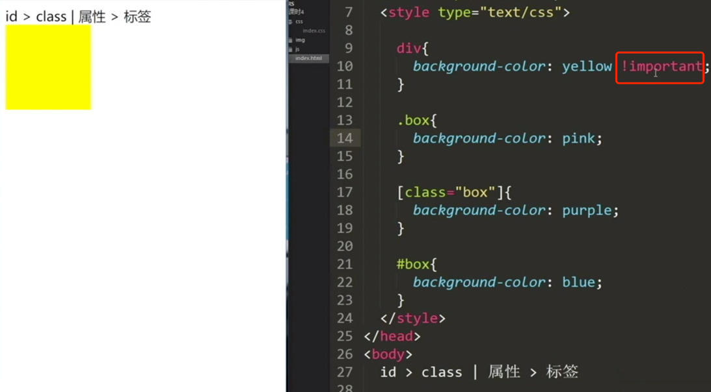

!important > id > class | 属性 > 标签 > 通配符

### 派生选择器/父子选择器

可以通过父亲来区别

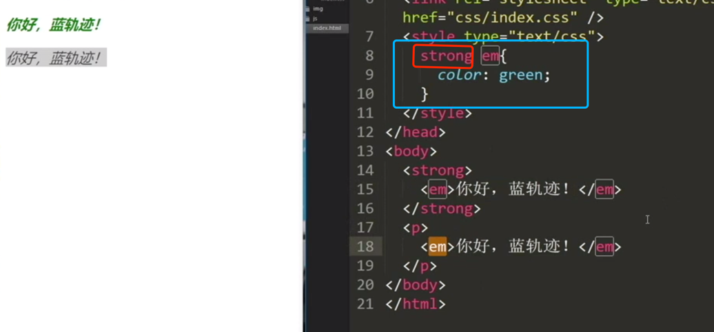

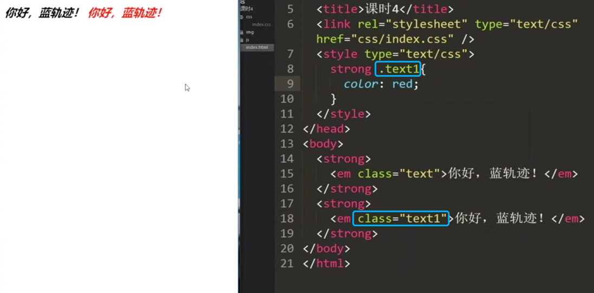

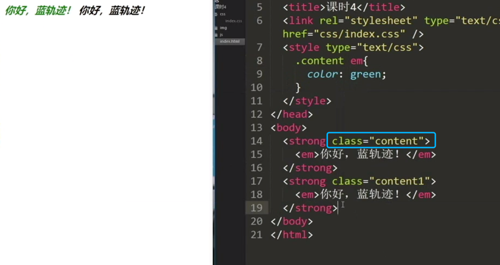

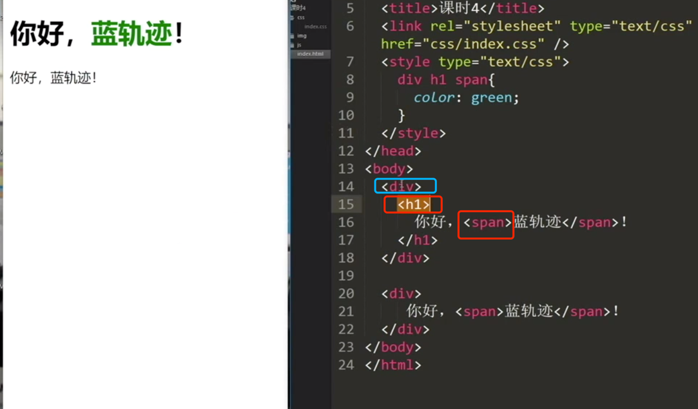


### 权重(需要记忆)

*号                                           0  <br>
标签，伪元素                          1  <br>
class，属性，伪类                  10  <br>
id                                               100  <br>
内联样式                                   1000  <br>
!important                                正无穷  <br>

`!important > 内联样式 > id >class，属性，伪类  > 标签，伪元素> *号`

### 并列选择器(重要)

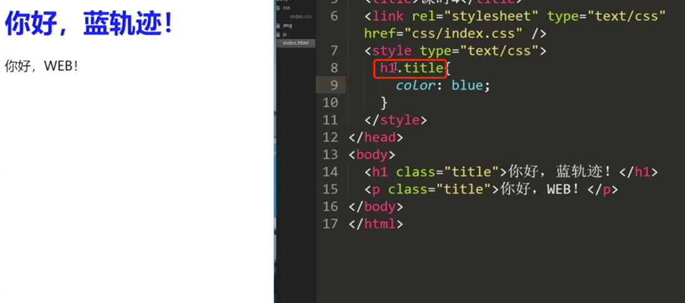

#### 类的合并(常用)

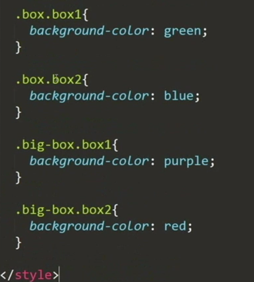

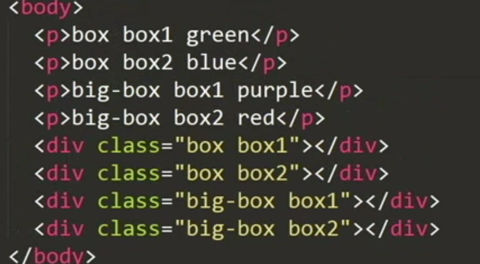


一个需求: (先写样式 )

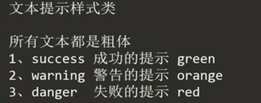

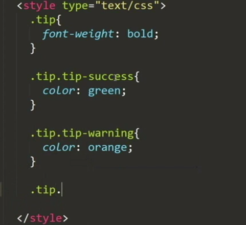
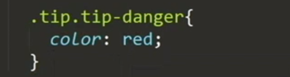

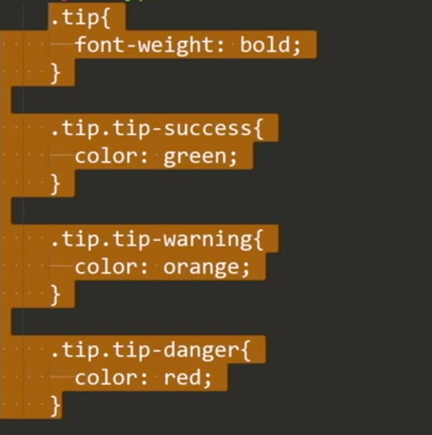

后面还会讲类的封装


### 分组选择器
outline相关样式:
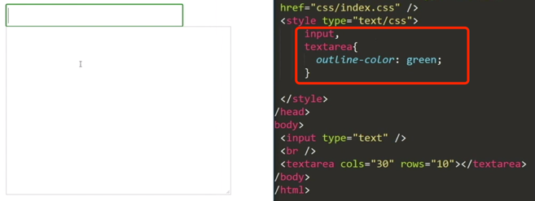
outline一般设置为none:
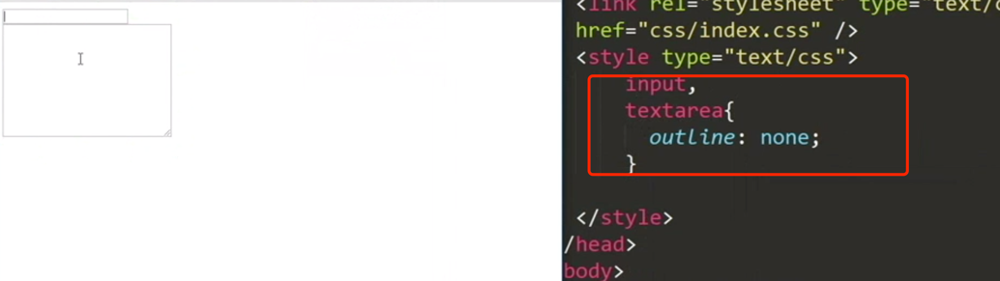


## 浏览器对父子选择器的匹配规则

 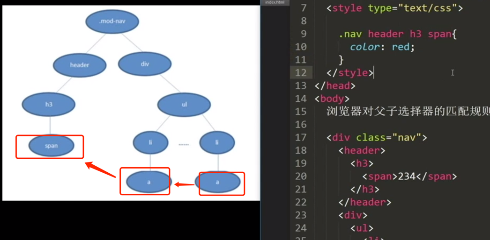

浏览器对CSS的匹配规则是从右到左，从下到上的。

### 符合类名与id写法
`.btn-success`-----> 类名

`#btn_success`-----> id写法
### 作业
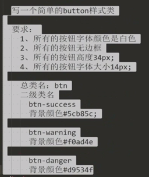


