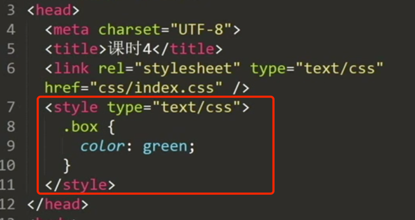
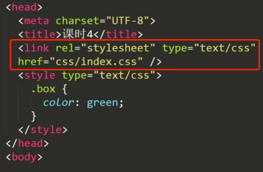
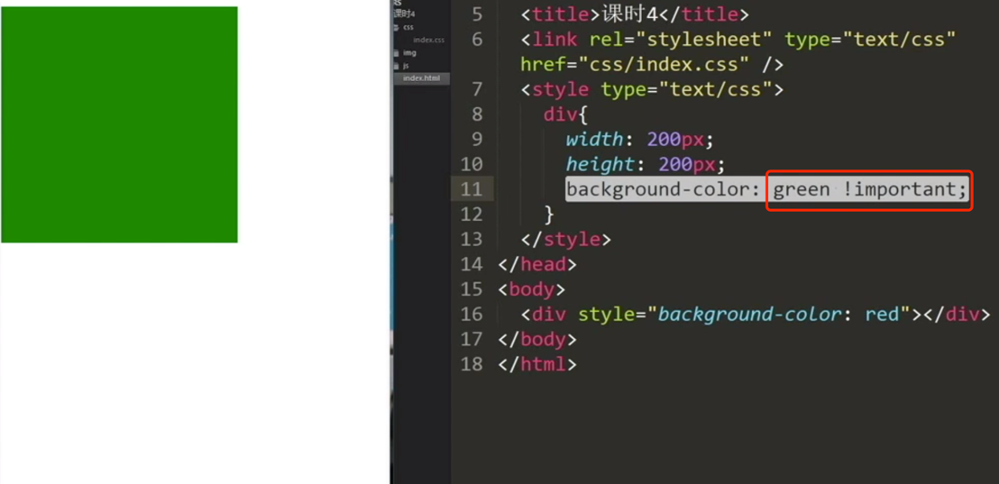
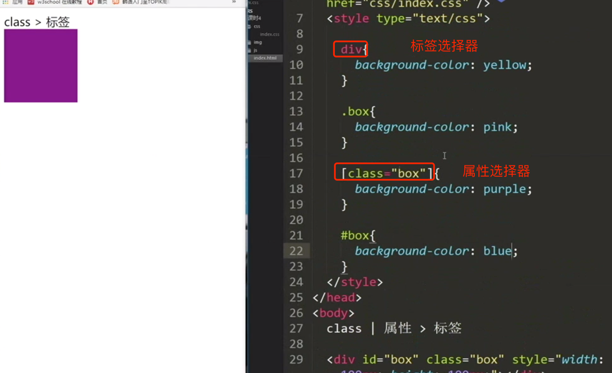

## 预备知识

浏览器组成: shell+内核

Google Chrome     webkit(google和apple一起开发的)/blink
Safari           webkit
firefox          gecko
IE               trident
opera            presto  -----要死不活-----被360和昆仑万维收购


内核: 渲染(rendering)引擎; JS引擎(重点优化的对象,Google的V8引擎直接将JS转换为机器码)

## CSS
### CSS含义

CSS        cascading style sheet          层叠样式表

2.2.选择器书写格式

```css
选择器 {
属性名: 属性值;	
属性名: 属性值;
}
```


### CSS书写格式

内联样式 - 行间样式，行内样式  <br>
```html
<div style="1px solid red"></div>

```
内部样式表 <br>


外部样式表 <br>



### 权重(优先级)
`!important(慎用) > 内联样式 > 内部样式表 > 外部样式表`



### 选择器分类



id选择器 #id - 唯一性 _连接复合单词 <br>
类选择器 .class - 可以出现多次 -连接复合单词 <br>
标签选择器 <br>
通配符选择器 `* `<br>
属性选择器 [] <br>
派生选择器 <br>
并列选择器 <br>
分组选择器 <br>


