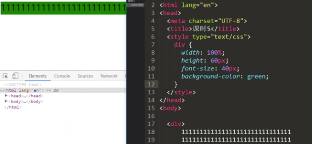
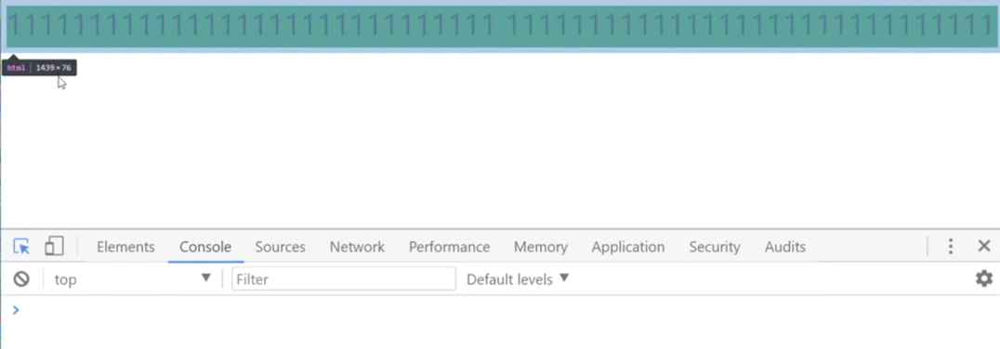
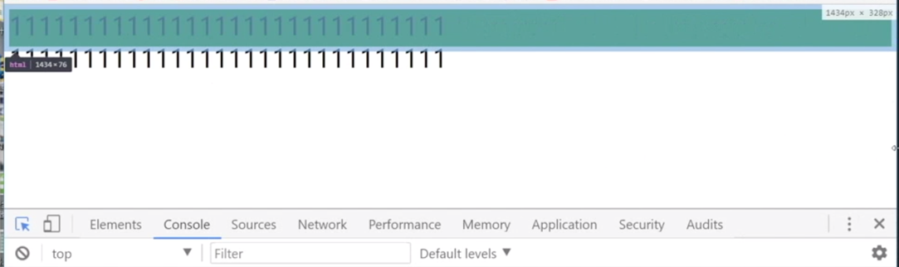
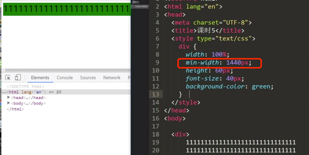
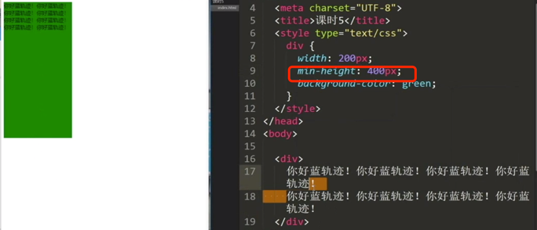
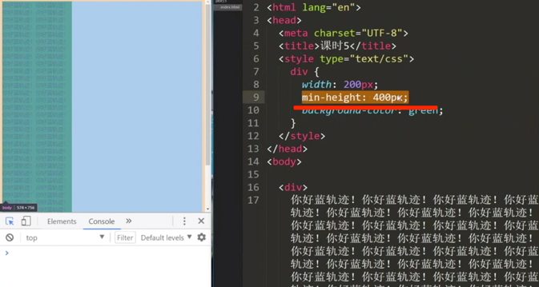
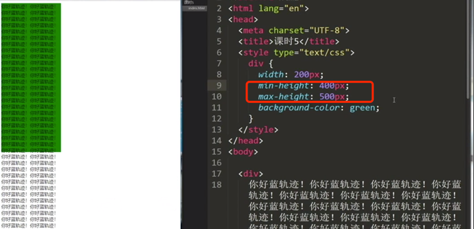
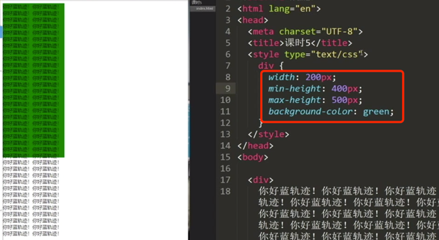
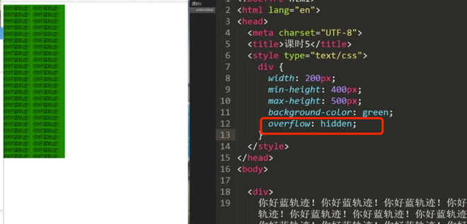

[TOC]

## css参考手册

http://css.doyoe.com/

## 宽高属性(必须掌握)

### 宽度

`min-width`属性(用的比较多),假设当字体的属性正好为1440px的时候,正好为一行,当字体的属性小于1440px的时候,就变为两行了,
此时可以设置`min-width`为1440px;

如上为1439px;小于这个值的时候就换行了;说明这个盒子需要一个最小宽度;

可以设置一下最小宽度为1440px,浏览器可见宽度小于这个值的时候，就会出现滚动条

还有一个属性 `max-width` ====>用的比较少

### 宽度小结
`min-width`属性(用的比较多),必须设置一个最小的宽度来容纳盒子里边的内容，用`min-width`属性;

`min-width`：宽度缩小到一定大小会出现横向的滚动条

### 高度
min-height:400px

被撑到超过 min-height

设置最大height值:

### 高度小结

min-height：高度缩小到一定大小会出现纵向的滚动条

## overflow(溢出)属性(3个)

`over-flow: hidden(隐藏)`

对比上面两个图,将溢出的隐藏了;

`over-flow: hidden(隐藏) | scroll(滚动条) | auto(自动)`

滚动条一般占用内部17个像素

没有溢出没有滚动条,溢出用滚动条---> auto属性

## 字体
### 字体大小

- 浏览器默认的字体大小 16px
- px - pixel(全称)
- 浏览器设置字体大小，设置的是高度，宽度是自动缩放的   --->需要记忆

### 字体属性

font-size: 12px | 14px | 16px   --->这三个是常用的; 12px用于小按钮

font-weight(字体粗细): 100-900 | lighter | normal | bold | bolder  

