[TOC]

## css参考手册

http://css.doyoe.com/

## 宽高属性(必须掌握)

### 宽度

`min-width`属性(用的比较多),假设当字体的属性正好为1440px的时候,正好为一行,当字体的属性小于1440px的时候,就变为两行了,
此时可以设置`min-width`为1440px;

如上为1439px;小于这个值的时候就换行了;说明这个盒子需要一个最小宽度;

可以设置一下最小宽度为1440px,浏览器可见宽度小于这个值的时候，就会出现滚动条

还有一个属性 `max-width` ====>用的比较少

### 宽度小结
`min-width`属性(用的比较多),必须设置一个最小的宽度来容纳盒子里边的内容，用`min-width`属性;

`min-width`：宽度缩小到一定大小会出现横向的滚动条

### 高度
min-height:400px

被撑到超过 min-height

设置最大height值:

### 高度小结

min-height：高度缩小到一定大小会出现纵向的滚动条

## overflow(溢出)属性(3个)

`over-flow: hidden(隐藏)`

对比上面两个图,将溢出的隐藏了;

`over-flow: hidden(隐藏) | scroll(滚动条) | auto(自动)`

滚动条一般占用内部17个像素

没有溢出没有滚动条,溢出用滚动条---> auto属性

## 字体
### 字体大小

- 浏览器默认的字体大小 16px
- px - pixel(全称)
- 浏览器设置字体大小，设置的是高度，宽度是自动缩放的   --->需要记忆

### 字体属性

font-size: 12px | 14px | 16px   --->这三个是常用的; 12px用于小按钮

font-weight(字体粗细): 100-900 | lighter | normal | bold | bolder  

font-style: italic(斜体) | oblique(倾斜)

font-family(设置字体): 有空格的字体标识或中文字体标识必须加引号

字体有一个特性,你同时设置好几个字体,第一个不行，就用第二个,一次类推

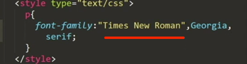

 比较好的设置字体的模板：这个能够在window和mac的字体样式是基本一样的： 

color(字体颜色)

## 颜色

- 英文单词
- 十六进制：rgb(255, 255, 255)

## 边框

用border来设置

可视宽高=盒子本身宽高+2*边框的宽高
 
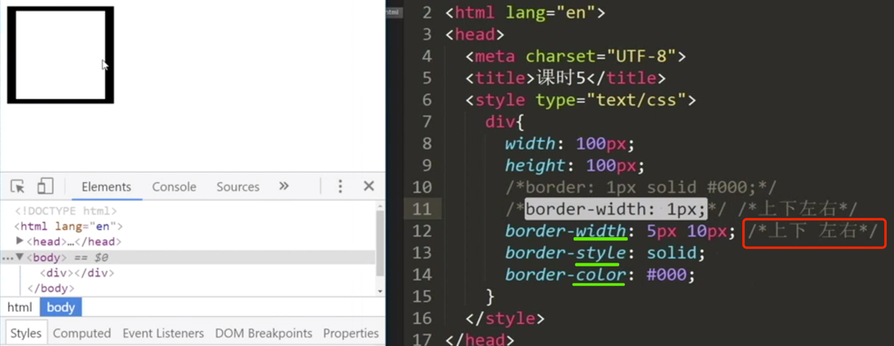

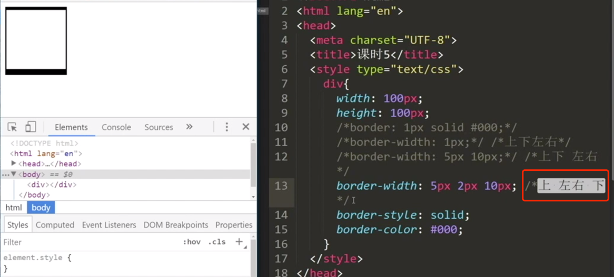

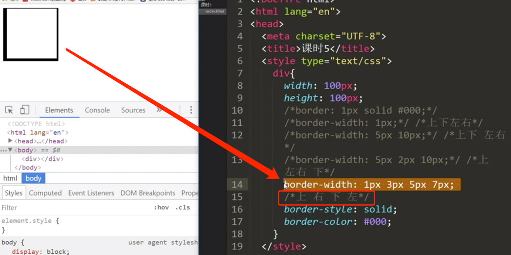

### 透明色

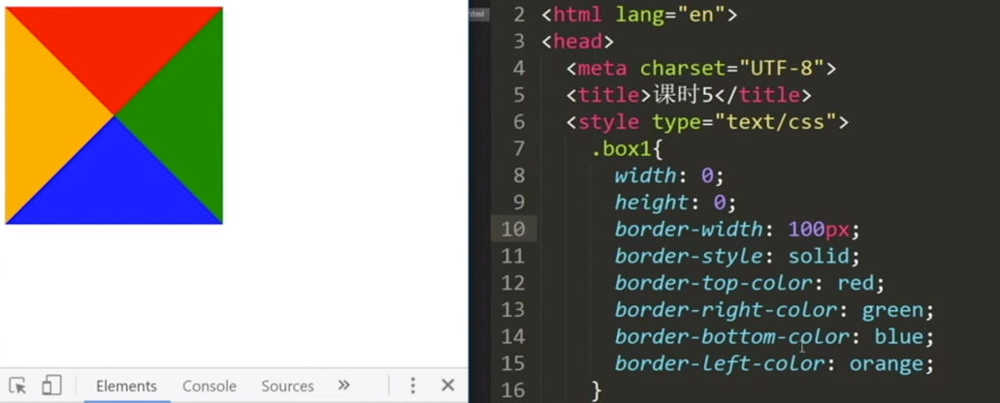

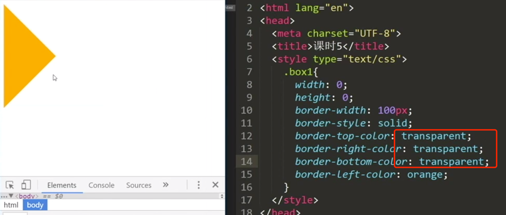

简化一下：

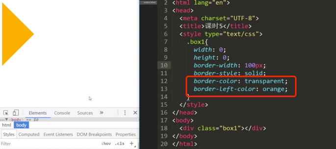

## 文本
### 文本对齐问题

text-align来设置(默认为left)

 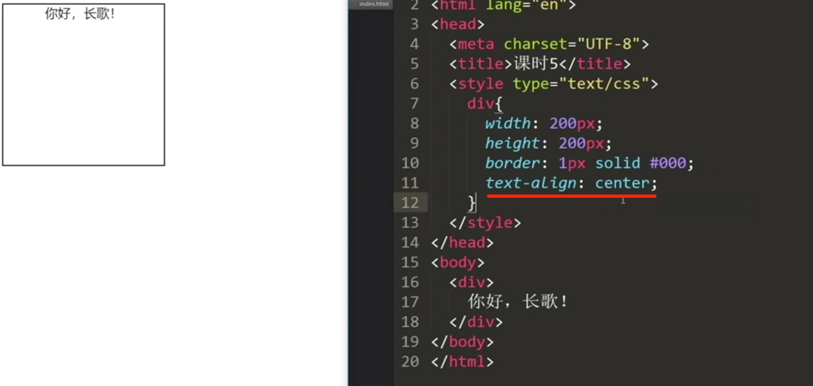

注意:他这里的文字对齐一定是具有一定宽高的容器去对齐。

### (文本)行高问题
line-height来设置

行高表示的就是一行占据的高度；能够让其垂直居中。line-height: 一行所占据的高度，默认为22px

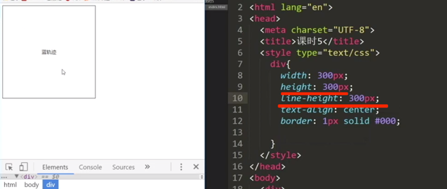

### 文本缩进

text-indent: 2em;(主要用在input标签中)

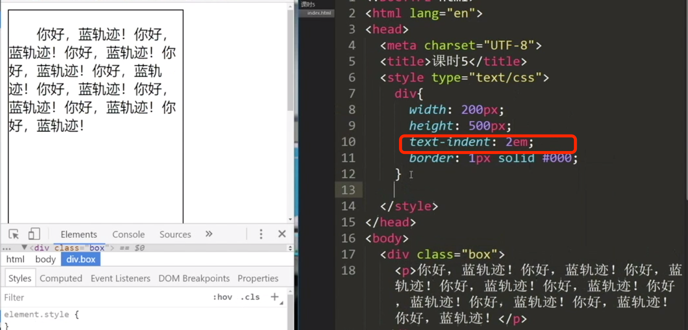

### 绝对单位与相对单位

绝对单位：px（pixel）：一个像素只能显示一个颜色，多个像素形成一个图像。

相对单位：em：相对于当前元素内文本的字体尺寸的大小

浏览器默认字体为16px, 在这里一个字体16个像素，这里的2em就是32个像素

text-indent: 2em  ---->其实就是缩进了32px

正常默认情况下: 1em = 16px  ---> 1:16 = 1 px / em

------->  现在想把这个比例调整为 1 px / em  = 1：10

就是说原来默认情况下: 1em = 16px (默认字体大小为16px)

现在想让 1em  = 10px

只要将默认字体设置为 62.5% (10/16=0.625)  ,即现在字体大小为10px ----> 此时1em就是10px了

如果想让字体还为16px大小,此时可以设置为1.6em

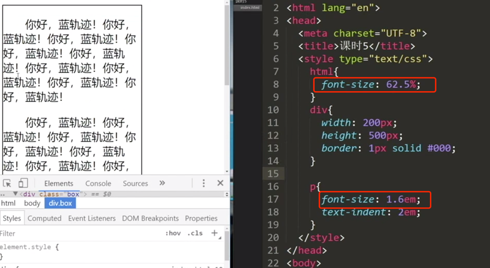

### 移动端设置

我们在做移动端的时候经常设置font-size为62.5%：

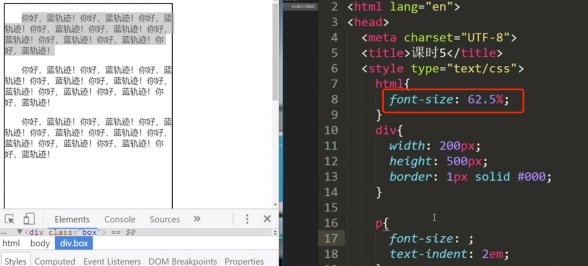

### 文本修饰

text-decoration: none | underline | line-through | overline;

### 文本三大件(记忆)

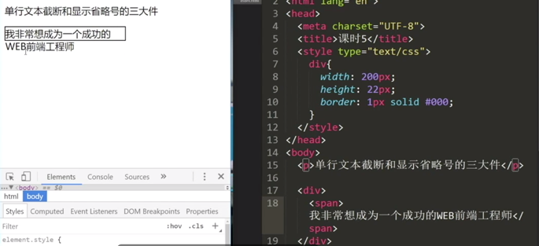

不换行:

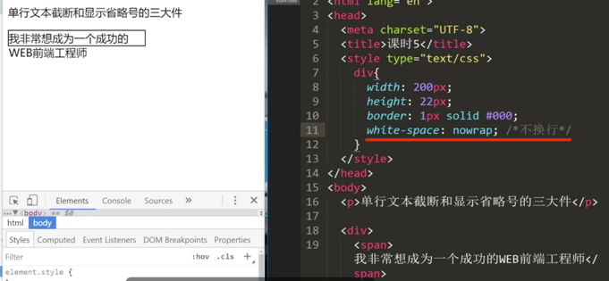

隐藏溢出x轴

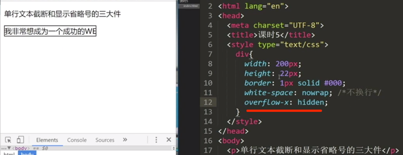

加省略号：

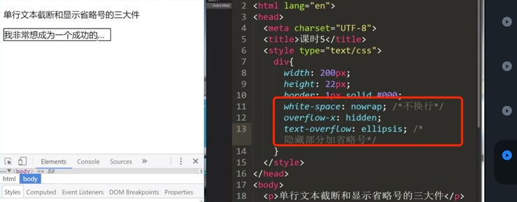

#### 小结
- write-space: nowrap;(不换行) 
- overflow-x: hidden;(x轴上的省略号，y轴上的是overflow-y)
- text-overflow: ellipsis;(隐藏部分加省略号)

### 一些常识(行高的由来)

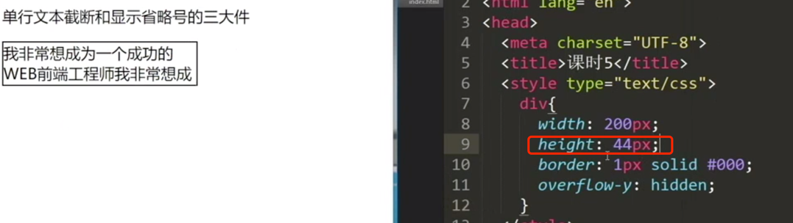

默认字体 16px,默认行高22px; (行高和文字的上下有大概3px左右边距)

若字体是14px,行高就是20px

## display

display:inline/inline-block/block(更改元素类型)（一般内联元素变为块级或内联块级）

span和div效果:  
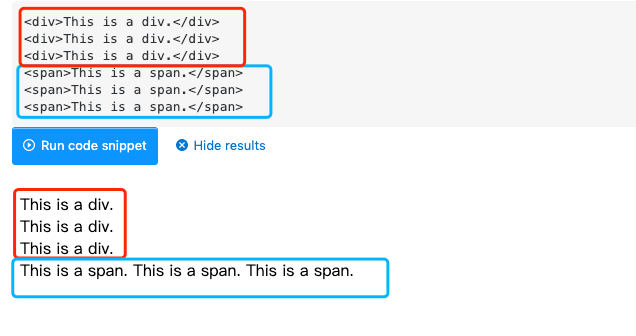

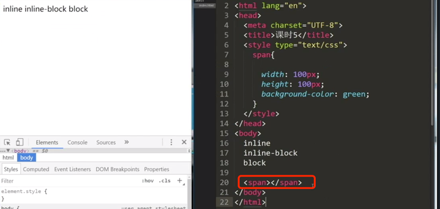

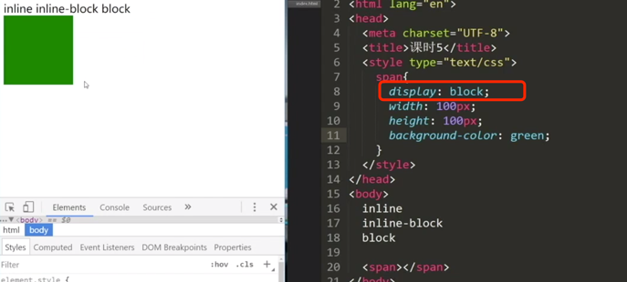

display:block (对比上下两幅图)

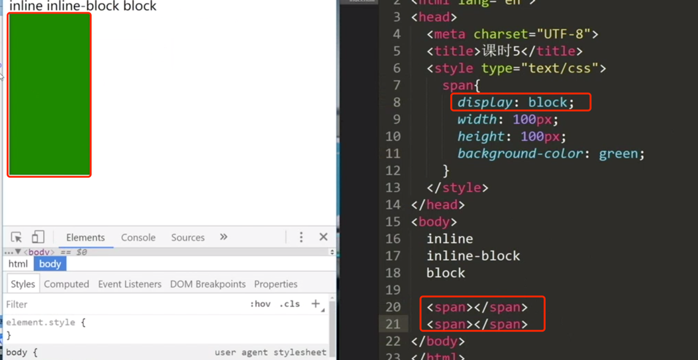

display:inline-block

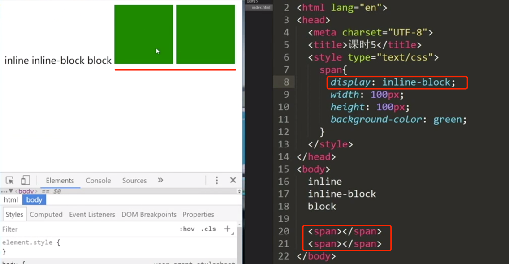

空格或者换行会被当成文本分割符(对比上下两幅图):

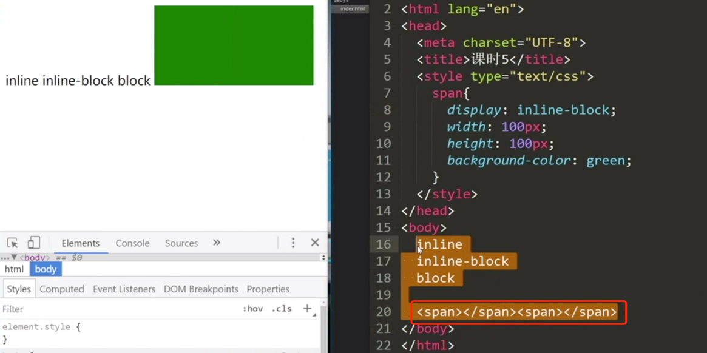

### button是内联块级元素
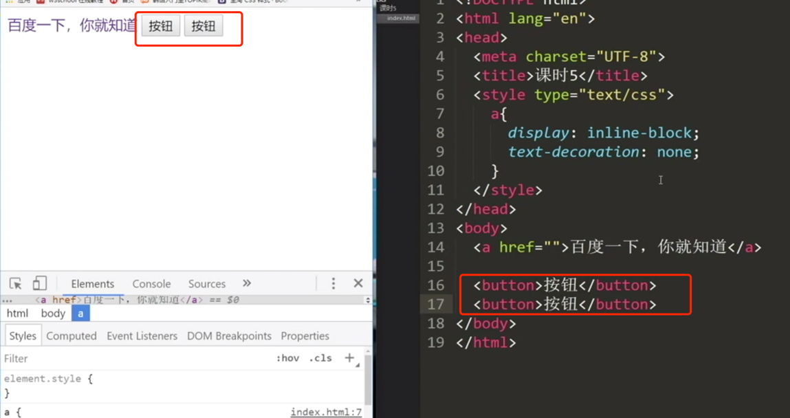

### a标签变为按钮

## 伪类选择器

