[TOC]

## 盒子模型

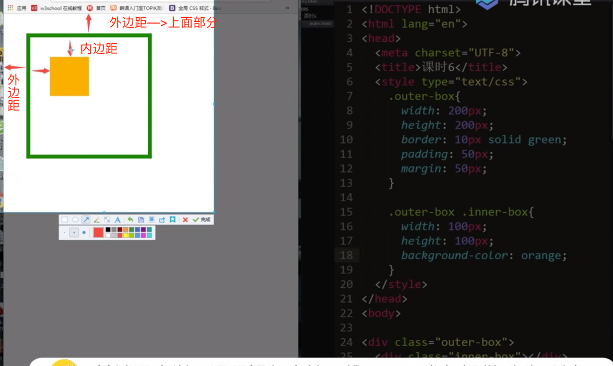

四大要素:

1.宽高所划分的区域;

2.边框

3.内边距： padding

4.外边距： margin


内边距和边框是不占据盒子本身的宽和高的;

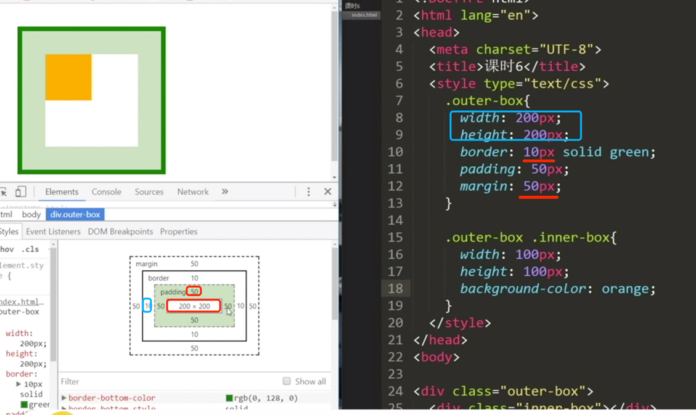

可视区域宽/ 高: `宽/高  + padding(内边距) *2 + border(边框)*2`


居中方案:

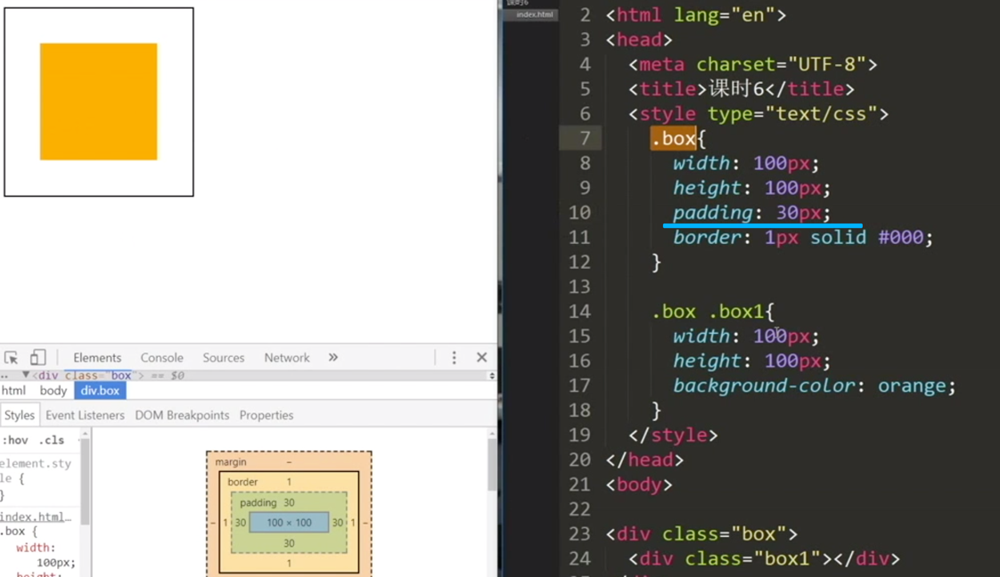


### 下面这种记住:(内部盒子居中问题)

外层盒子固定宽高,内层盒子宽高100%(这是继承外层盒子的)， 外层盒子再给一个padding;

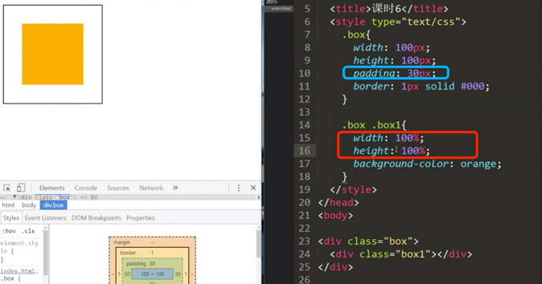

### 解决可视尺寸问题

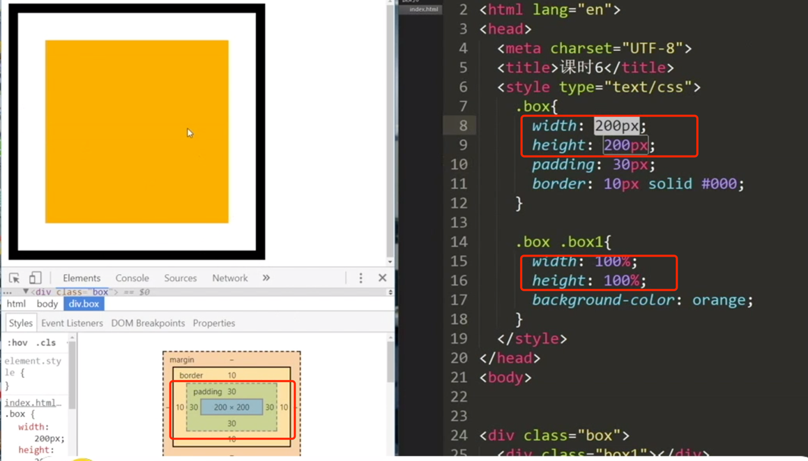

目前可视尺寸为280px;

但是想要可视尺寸只有200px呢(利用box-sizing:border-box):

就是将边框和内边距收到盒子内部

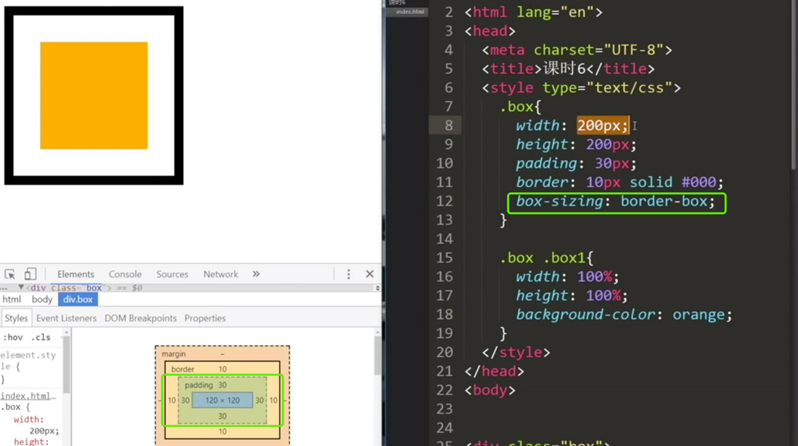


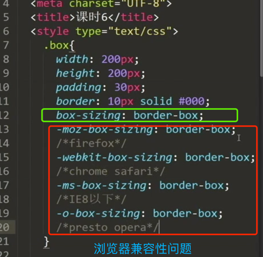

### padding相关的属性:
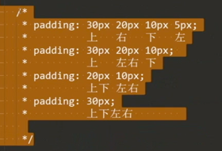
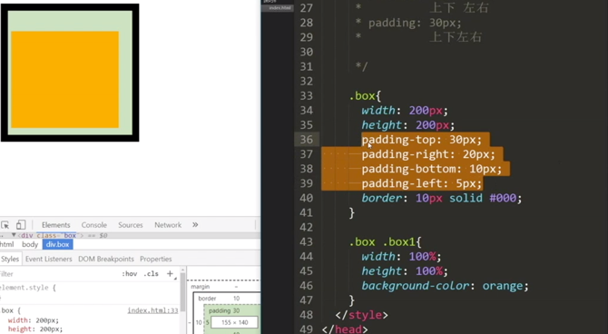


### 盒子居中问题

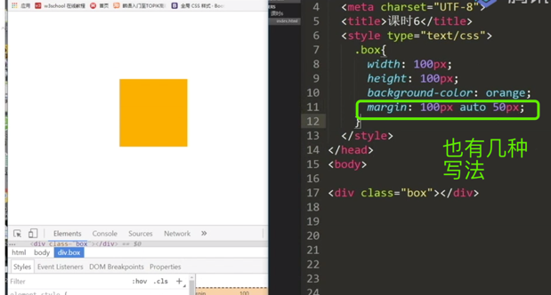

上面这是盒子相对浏览器水平居中的;


浏览器默认的margin是8;

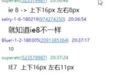


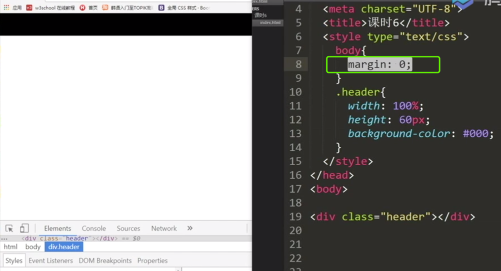

## 定位

### 绝对定位
- position: absolute;

- left|right，top|boottom: 基准线不一样

- 相当于新建图层，绝对定位的元素到另外一层去了，位置就会被占据

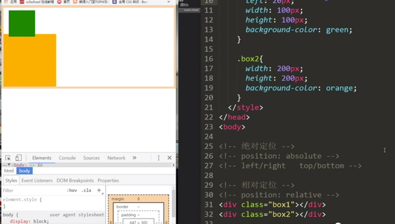

又一个例子:

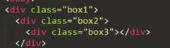

由于这里的box3的父级元素box1是有定位元素 `position:relative/absolute`的,所以这里的box3(通过派生选择器来选定)的bottom是以box1为基准的:

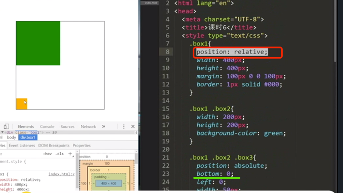

同理如果定位元素在box2：

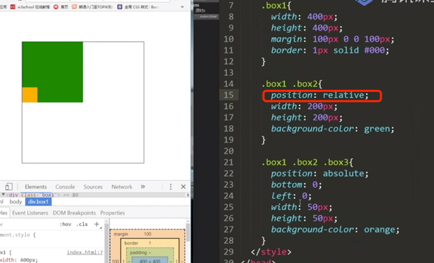

### 定位小结(重要)

子元素有一个`position:absolute`;(这里需要注意) <br>

如果一个父级元素都没有,那么就相对整个html文档定位;如果父级box2和box3(爷爷级)都有定位元素 `position:relative/absolute`,那么就找直系父级(box2)的那个即可;

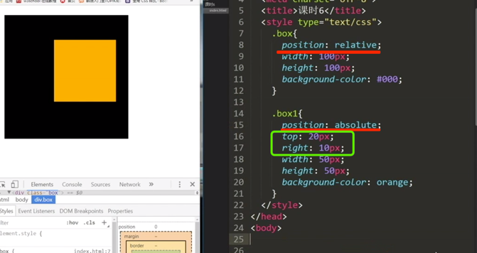

定位的另外一种用法:

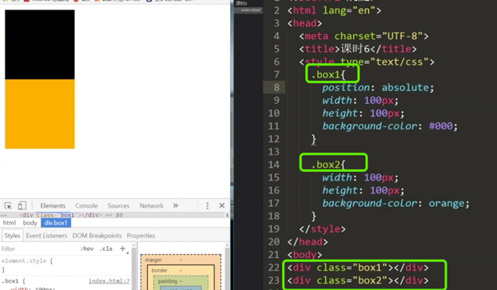

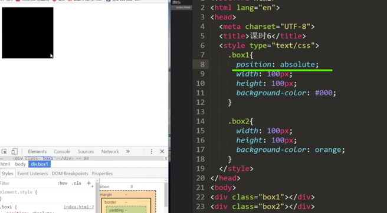

让下边排到上边呢(这种方法用的比较多 ):

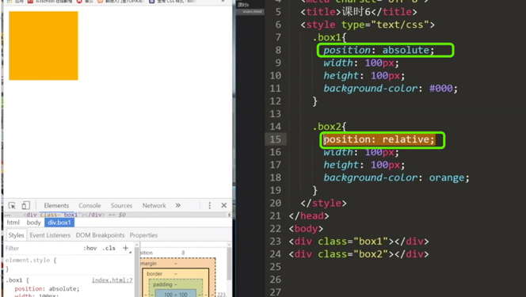


但是定位元素放在下面,他就不会跑上去:


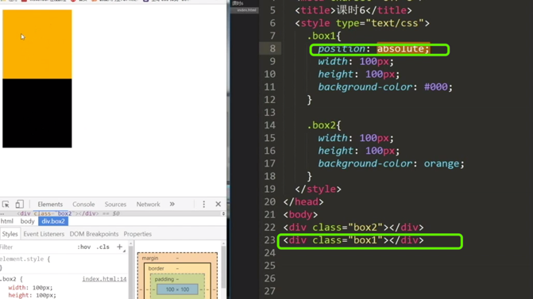


先来的在下边,后来的在上边:(注意对比下边两个图)

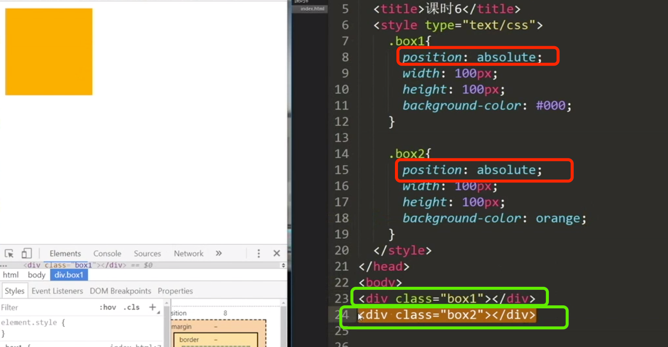

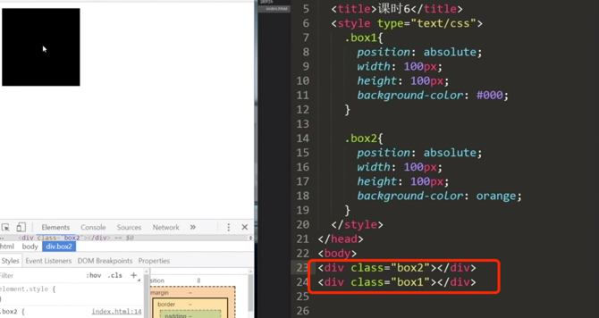

也可以通过z-index值来排:

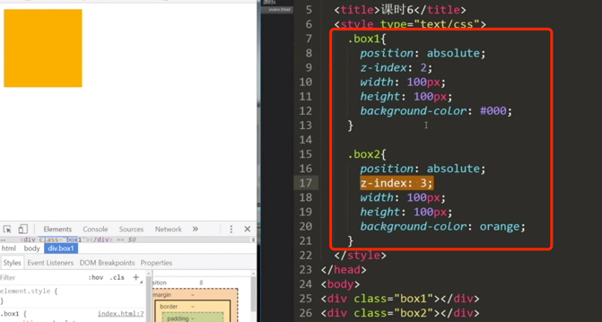

## 绝对定位中的两栏设计(有需要记忆的)

左栏固定,右栏是自适应:(需要记忆)


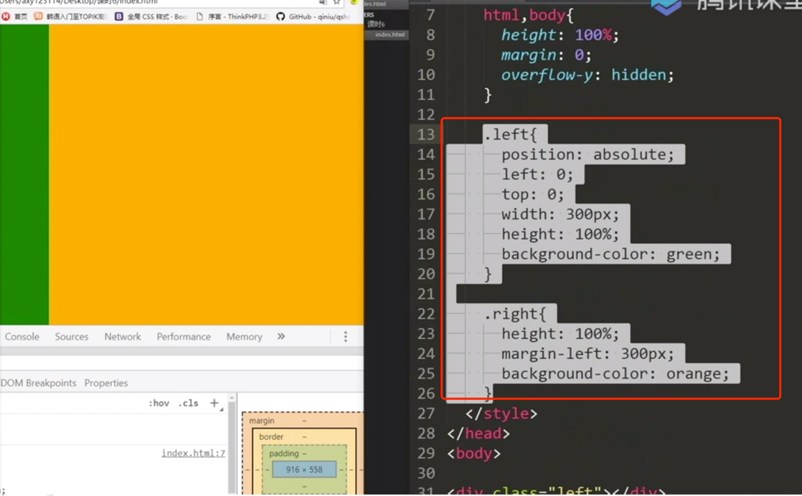
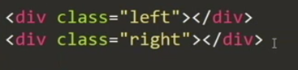


```css
.left{
  position: absolute;
  left: 0;
  top:0;
  width: 300px;
  height: 100%;
  background-color: green;
  
}


.right{
  height: 100%;
  margin-left: 300px;
  background-color: orange;
}

```

右侧固定,左侧自适应:

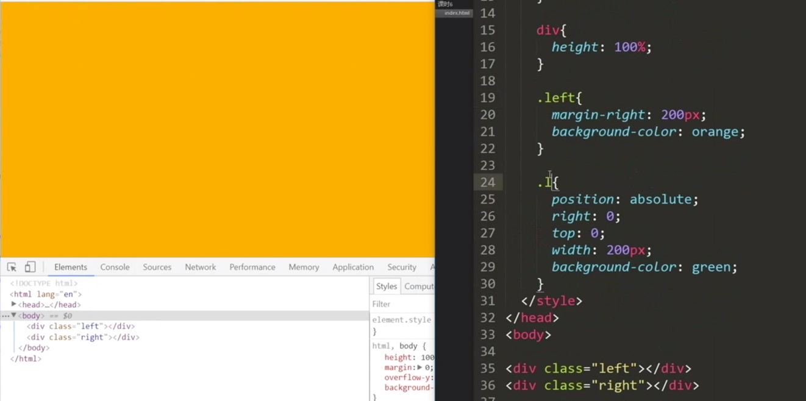


## 浮动

注意下面这个问题的演化:

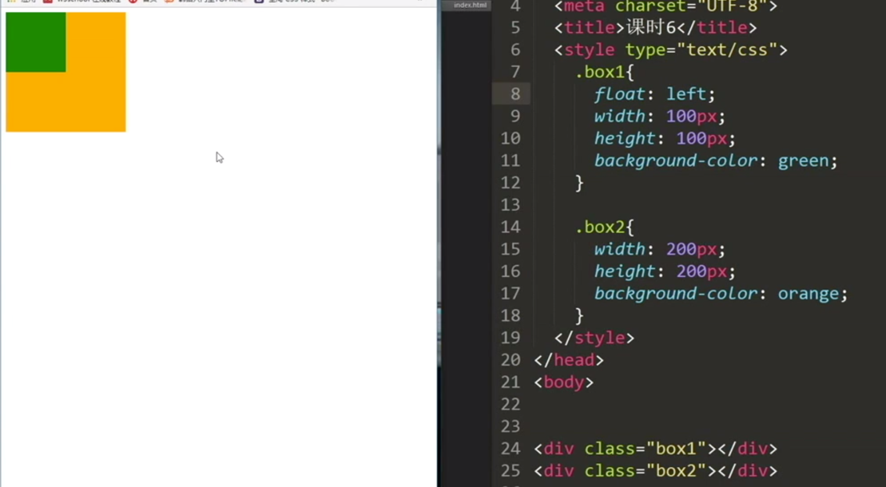


