[TOC]


## 模型1-盒子阴影

两个基本偏移量:


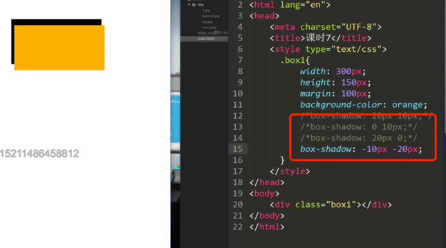


### 模糊距离
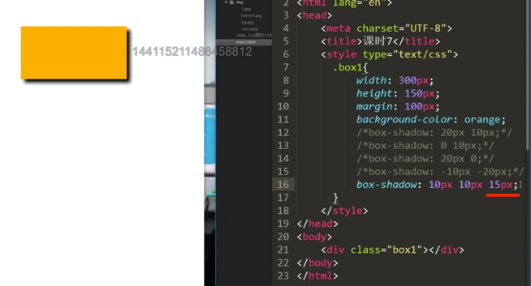

### 阴影尺寸


### 遮住阴影
遮住之前:

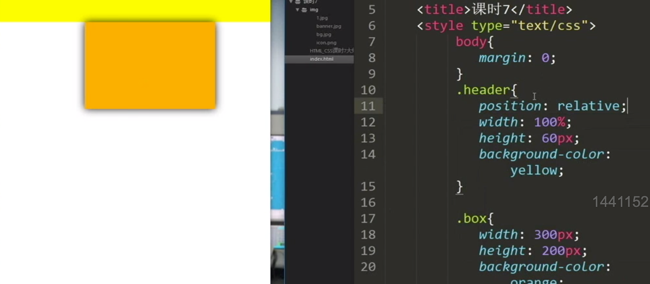

黄色的遮住了橙色的阴影(让黄色的header处于上层);

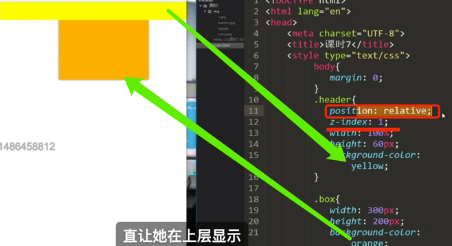

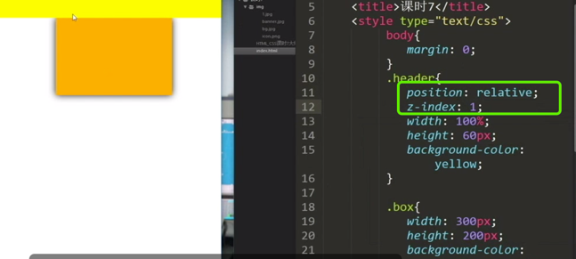


### 遮住阴影-浏览器兼容性

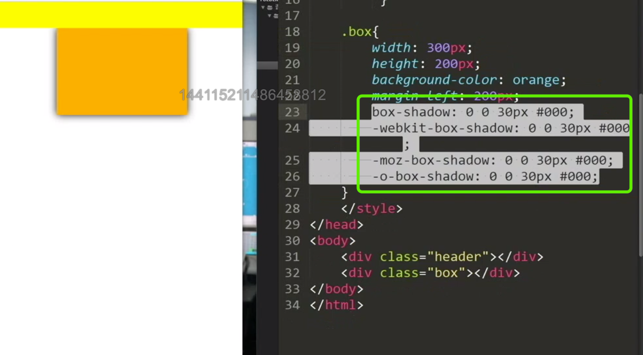


## 圆角


1.做纯圆的时候会用百分号(50%,宽高一样):

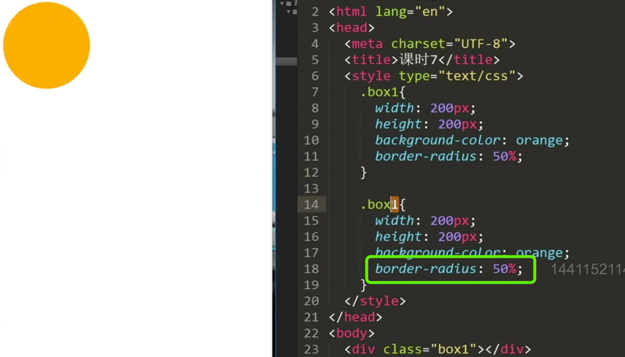

2.半圆角 height/2  + px

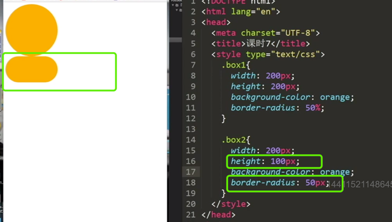


## 圆角-浏览器兼容性

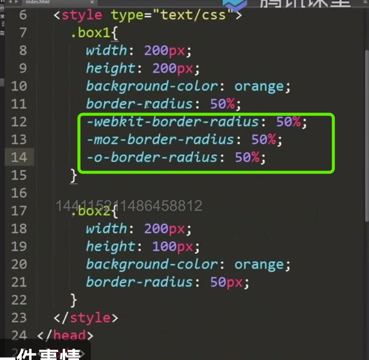


```css
.box{
  width: 200px;
  -webkit-border-radius: 50%;
  -moz-border-radius: 50%;
  -o-border-radius: 50%;
}
```

## 圆角的四个角被遮住的问题

解决方案
`overflow: hidden`
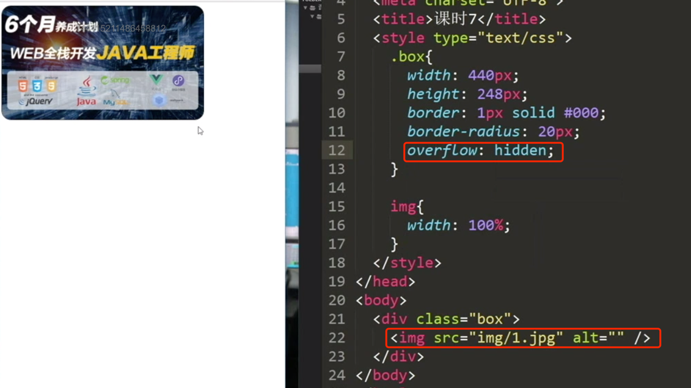

## 拖动页面页面中内容不会变形

```css
.banner{
  background-size: cover;
  background-position: center center;
}
```

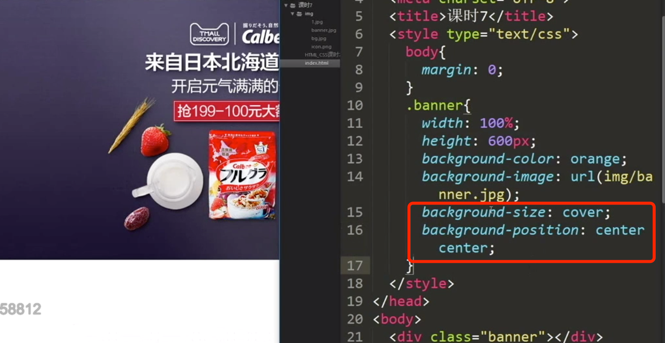

## 页面滚动而图片不滚动的解决方法

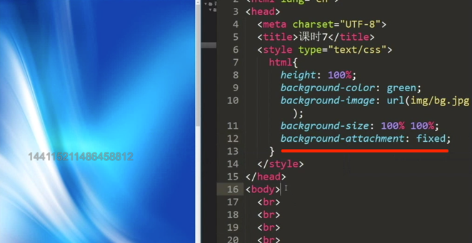

## background复合值

注意一定要按照顺序


```css
html{
  background-color: #00FF00;
  background-image: url(img/bg.jpg);
  background-size: 100% 100%;
  background-attachment: fixed;
  
}
```

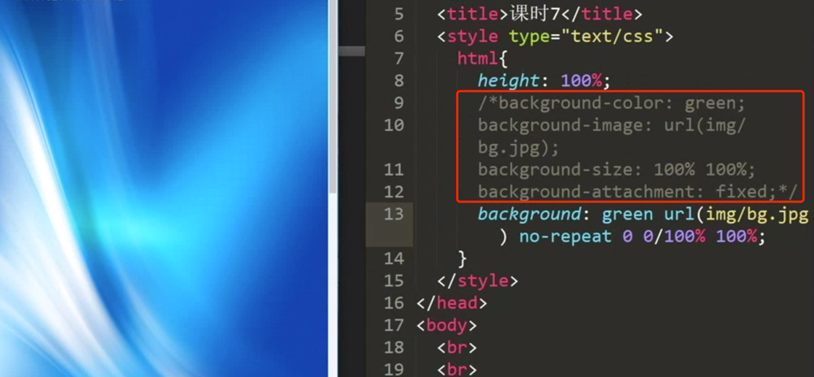

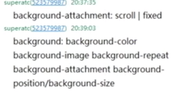


## logo相关问题


