[TOC]


## 模型1-盒子阴影

两个基本偏移量:


### 模糊距离


### 阴影尺寸


### 遮住阴影
遮住之前:


黄色的遮住了橙色的阴影(让黄色的header处于上层);


### 遮住阴影-浏览器兼容性


## 圆角


1.做纯圆的时候会用百分号(50%,宽高一样):


2.半圆角 height/2  + px


## 圆角-浏览器兼容性


```css
.box{
  width: 200px;
  -webkit-border-radius: 50%;
  -moz-border-radius: 50%;
  -o-border-radius: 50%;
}
```

## 圆角的四个角被遮住的问题

解决方案
`overflow: hidden`


## 拖动页面页面中内容不会变形

```css
.banner{
  background-size: cover;
  background-position: center center;
}
```


## 页面滚动而图片不滚动的解决方法


## background复合值

注意一定要按照顺序


```css
html{
  background-color: #00FF00;
  background-image: url(img/bg.jpg);
  background-size: 100% 100%;
  background-attachment: fixed;
  
}
```


## logo相关问题(网速不好的时候也能显示)

企业级写法:


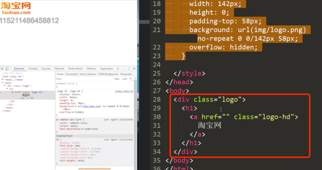


```css
h1{
  margin: 0;
}
.logo{
  width: 142px;
  height:58px;
}
.logo h1 .logo-hd{
  display:block;
  width:142px;
  height: 0;
  padding-top: 58px;
  background: url(img/logo.png)
         no-repeat 0 0/142px 158px;
  overflow: hidden;
}
```

## table注意的问题

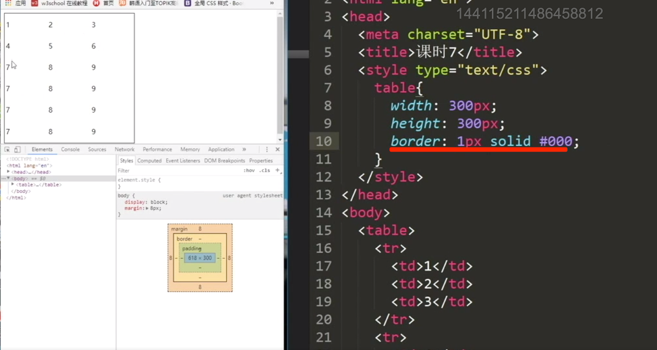


### 表格标题


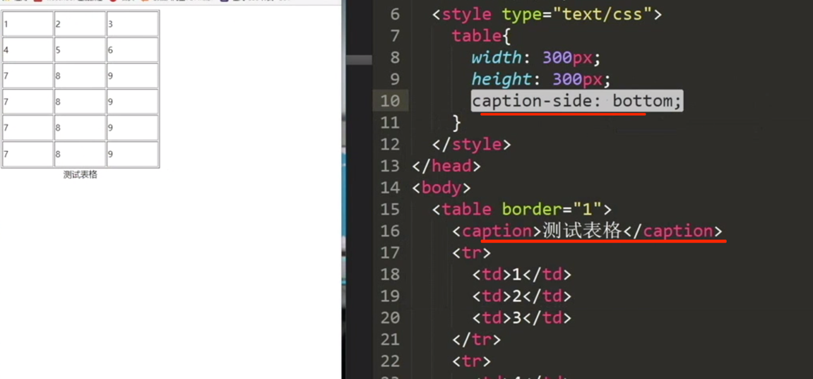


### 单元格宽度一致:

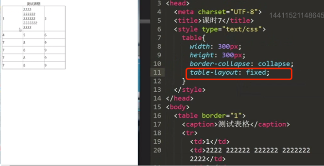

### 合并边框:

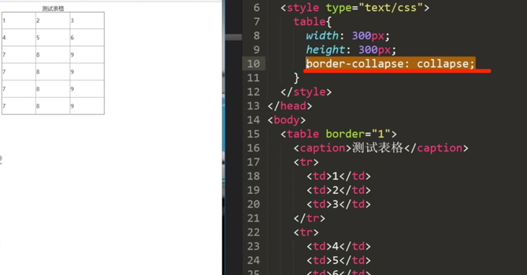


### 设置居中

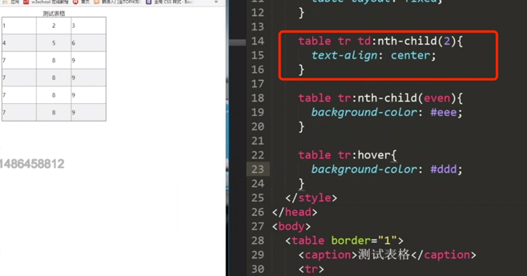


### li的移动

实际的宽高为100px;

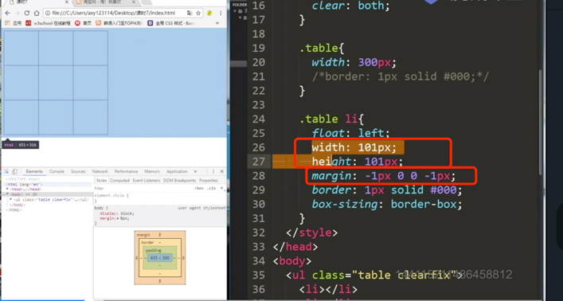


### 两边没有边框的盒子

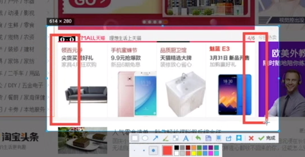
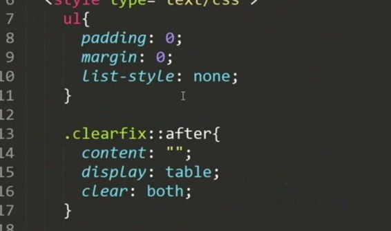
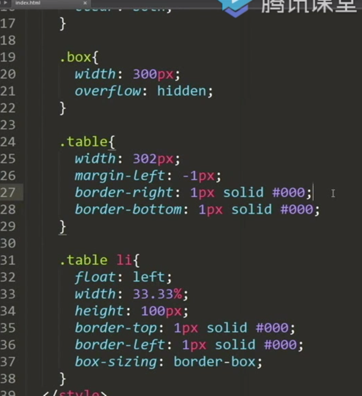

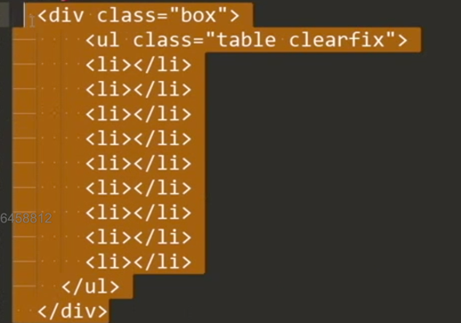


有-1(注意是margin)的时候:

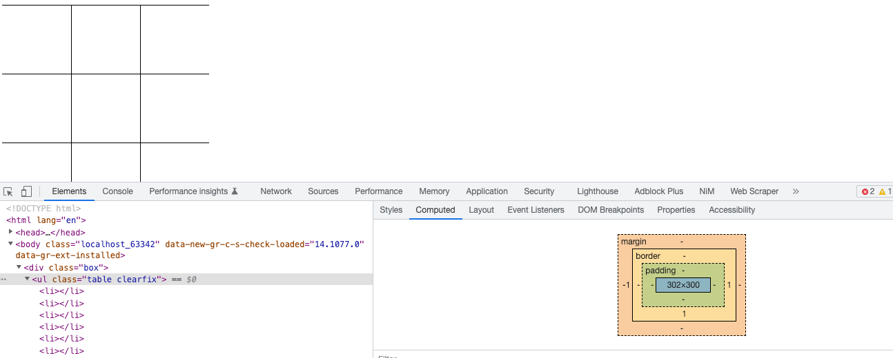

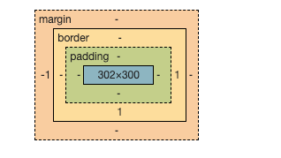

没有-1的时候:<br>
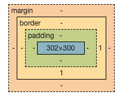
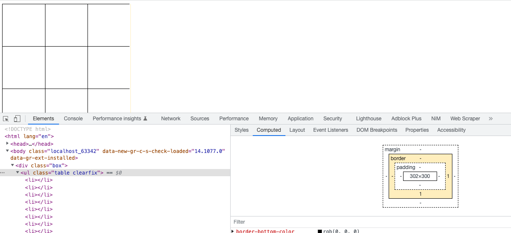

```html
<!DOCTYPE html>
<html lang="en">
<head>
  <meta charset="UTF-8">
  <title>Title</title>
</head>
<style>
  ul{
    padding: 0;
    margin: 0;
    list-style: none;
  }
  .clearfix::after{
    content: "";
    display: table;
    clear:both;
  }

  .box{
    width: 300px;
    overflow: hidden;
  }

  .table{
    width: 302px;
    /*margin-left: -1px;*/
    border-right: 1px solid #000;
    border-bottom: 1px solid #000;
  }

  .table li{
    float: left;
   width: 33.33%;
    height: 100px;
    border-top: 1px solid #000;
    border-left: 1px solid #000;
    box-sizing: border-box;
  }
</style>
<body>


<div class="box">
  <ul class="table clearfix">
    <li></li>
    <li></li>
    <li></li>
    <li></li>
    <li></li>
    <li></li>
    <li></li>
    <li></li>
    <li></li>
  </ul>
</div>
</body>
</html>
```


