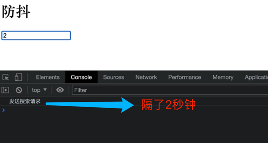
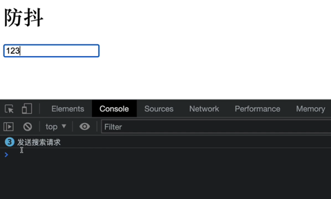
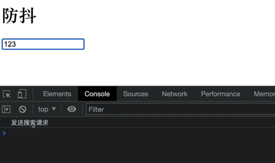

## 场景

有一个搜索框,我们回想服务器发送一个搜索请求,比方说逆向搜123,你只想知道123的结果,但是其实向服务器发送了1,12,123这三次请求


```js
const inputDom = document.getElementById('hInput')


function debounce(fn) {
  return function () {
    console.log("debounce 返回的函数执行了")
    fn()
  }
}

inputDom.addEventListener('input',debounce(()=>{
  console.log('发送搜索请求')
}))
```


新的需求: 用户输入完毕的时候,才发送一次 HTTP请求

改进一下代码:


```js
const inputDom = document.getElementById('hInput')


function debounce(fn) {
  return function () {
     setTimeout(()=>{
      fn()
    },2000)
  }
}

inputDom.addEventListener('input',debounce(()=>{
  console.log('发送搜索请求')
}))
```



需求还是有问题:




在改进一下代码:

在设置(生成)新的定时器的之前将老的定时器终止掉,只执行最后一次定时器

```js

const inputDom = document.getElementById('hInput')


function debounce(fn) {
  let timer = null
  
  return function () {
    if(timer){
      clearTimeout(timer)
    }
     //这里的延迟时间非常重要,保证了:
    //在设置(生成)新的定时器的之前将老的定时器终止掉
     timer = setTimeout(()=>{
      fn()
    },2000)
  }
}

inputDom.addEventListener('input',debounce(()=>{
  console.log('发送搜索请求')
}))

```


再改进:

```js
const inputDom = document.getElementById('hInput')


function debounce(fn,deply) {
  let timer = null
  
  return function () {
    if(timer){
      clearTimeout(timer)
    }
     timer = setTimeout(()=>{
      fn()
    },deply)
  }
}

inputDom.addEventListener('input',debounce(()=>{
  console.log('发送搜索请求')
}),1000)
```

### 小结
- 延迟函数
- 在设置(生成)新的定时器的之前将老的定时器终止掉,只执行最后一次定时器


