## WebPack
概念： 
webpack是 JavaScript 应用程序的模块打包器,可以把开发中的所有资源（图片、js文件、css文件等）都看成模块，通过loader（加载器）和plugins（插件）对资源进行处理，打包成符合生产环境部署的前端资源。所有的资源都是通过JavaScript渲染出来的。

## 识别
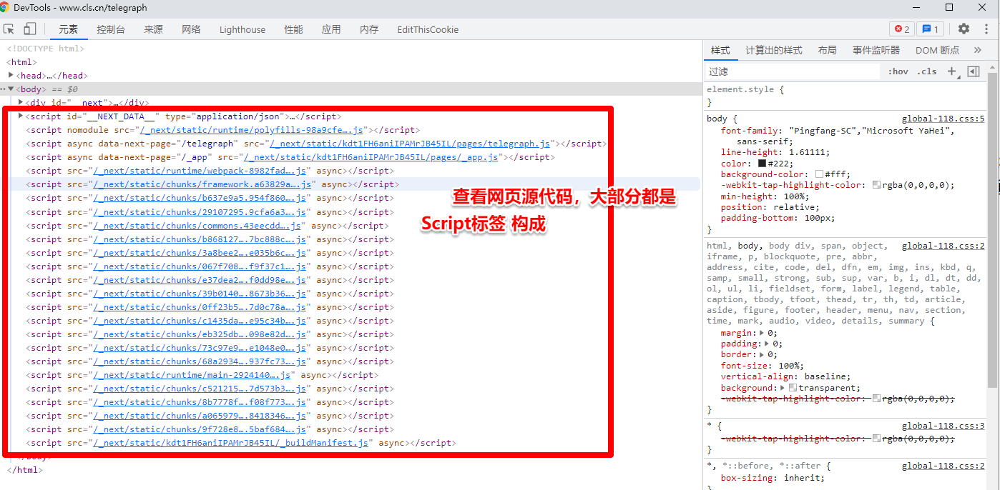
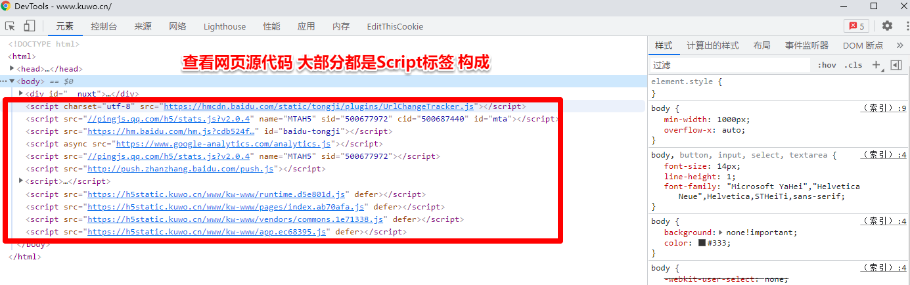

## 种类
基本结构：

### 第一种

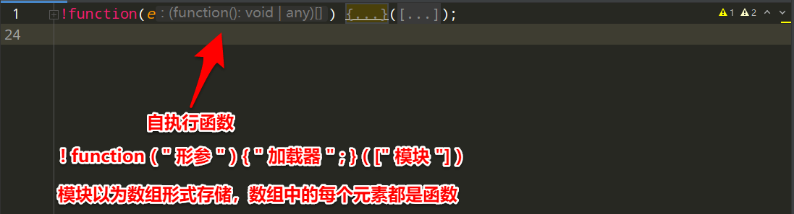

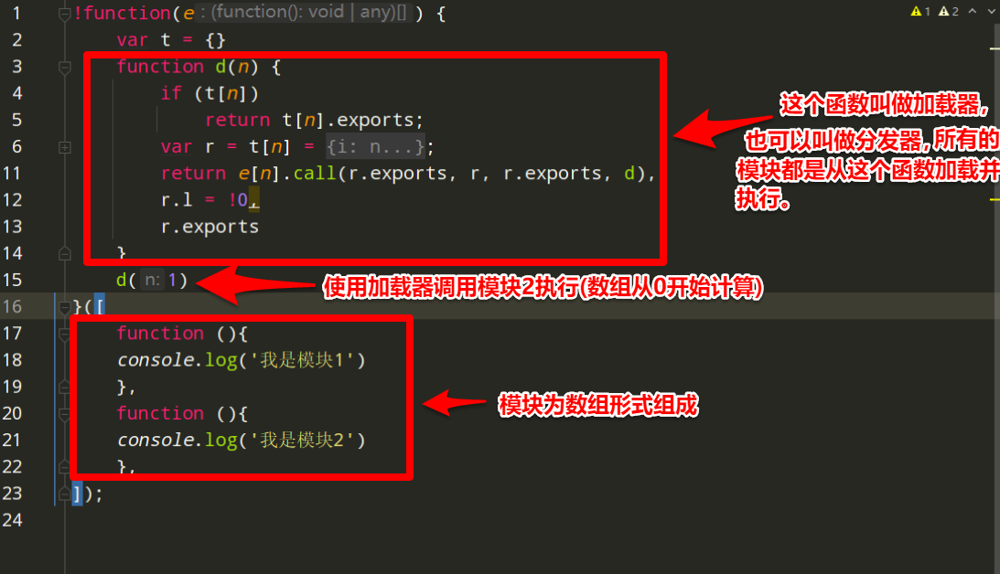

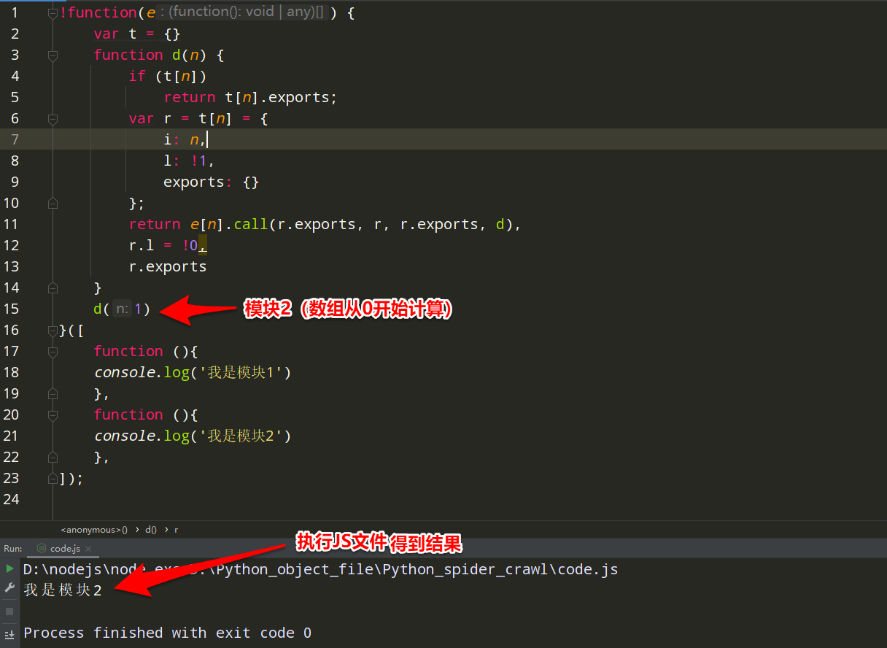

### 第二种
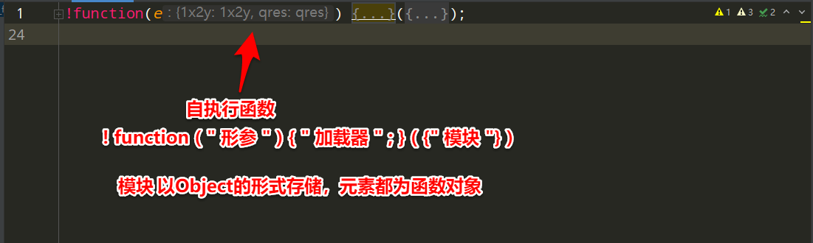

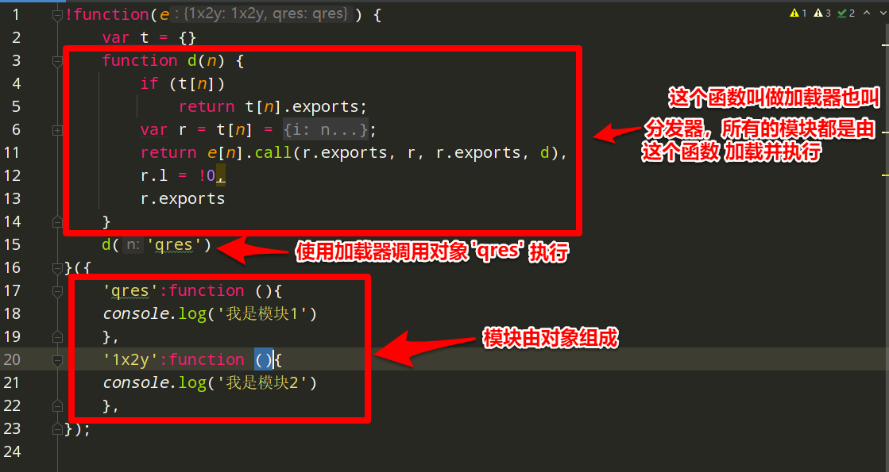

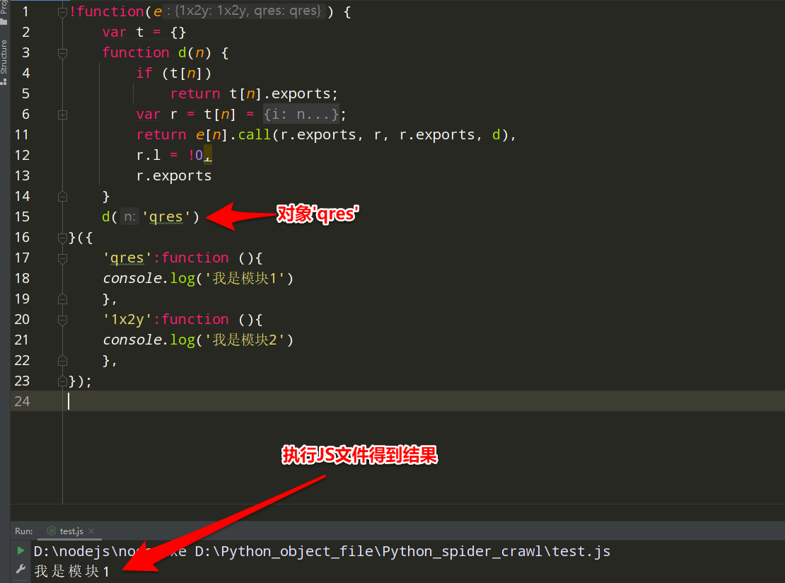

## 第三种

多个JS文件打包： 
如果模块比较多，就会将模块打包成JS文件, 然后定义一个全局变量` window["webpackJsonp"] = [ ]`，它的作用是存储需要动态导入的模块，然后重写 `window["webpackJsonp"] `数组的 `push( )` 方法为 `webpackJsonpCallback( )`,也就是说 `window["webpackJsonp"].push( ) `其实执行的是 `webpackJsonpCallback( ),window["webpackJsonp"].push( )`接收三个参数,第一个参数是模块的ID,第二个参数是 一个数组或者对象,里面定义大量的函数,第三个参数是要调用的函数(可选)。 

每个JS模块文件开头都是类似这样的开头形式：

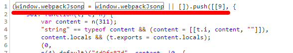   

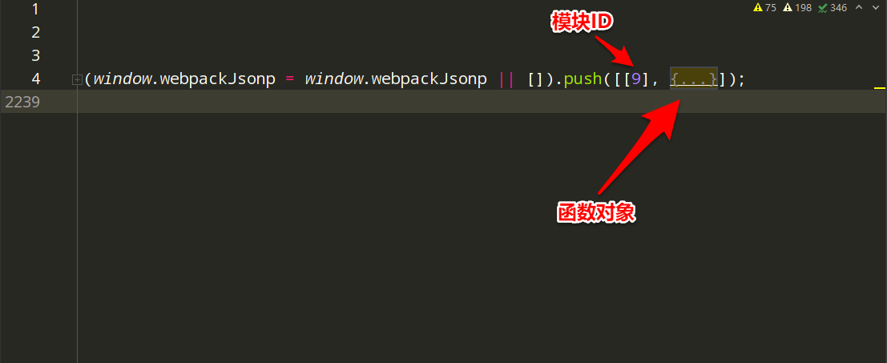   

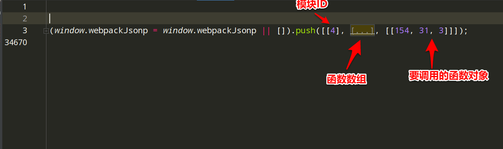   

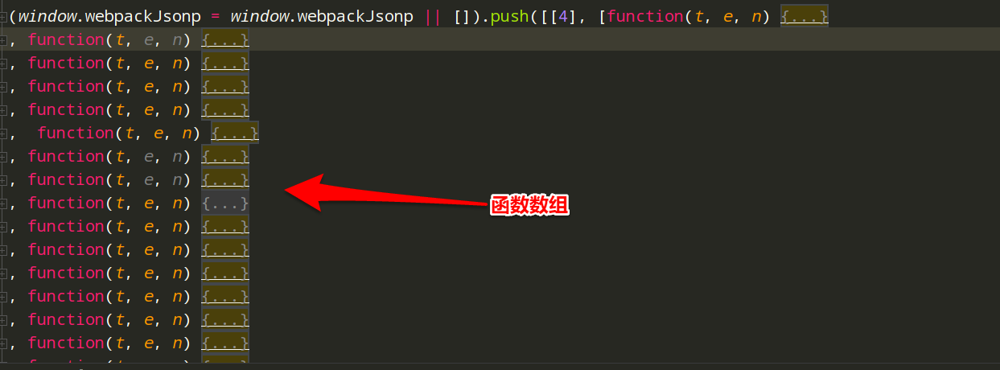   

## 参考

https://app.yinxiang.com/fx/970ae39c-9964-4aae-aa96-7e81fee4ef8f