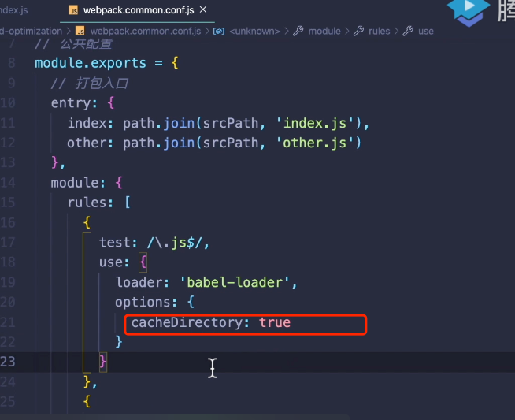
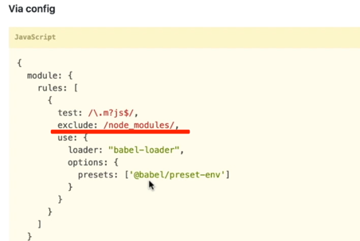
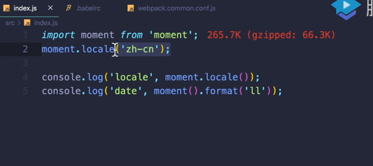
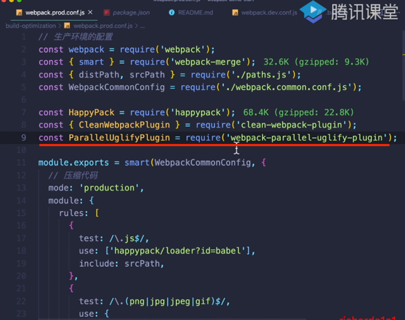
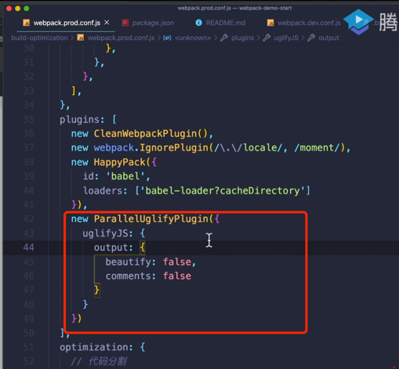

[TOC]

## 前言
优化的点:
- 优化打包构建速度(其实就是生成线上代码的时间变短,一般用 `yarn build`)
- 优化产出代码体积

## 利用缓存的机制减少需要编译的代码

```js
import a from './abc'  // [1]  babel将abc文件中的ES6编译为ES5
import b from './aaa'   // [2]  babel将aaa文件中的ES6编译为ES5

```
如果没有缓存机制,[1]要被编译2次,如果有缓存机制,[1]只要被编译1次


相关配置如下:



```js
module.exports = {
  module:{
    rules:[
      {
        test:/\.js$/,
        use:{
          loader: 'babel-loader',
          options:{
            //利用缓存来优化的配置
            cacheDirectory:true
          }
        },
        //指定哪些目录下的代码可以被编译,这里的srcPath指的是src目录下的代码
        include: srcPath,
        //排除哪些代码,这些代码是不被编译的,include与exclude二选一
        exclude: path.resolve(__diename,'node_modules')
        
      },{
      
      }
    ]
  }
}
```


下次编译的时候看缓存中有没有编译好的代码,如果有，就可以直接用,不用重新编译了;

具体详见: https://webpack.js.org/loaders/babel-loader/

注意,这个只对js有效果!!!

path.js:

```js
const path = require('path');

const srcPath = path.join(__dirname,'..','src');
const disPath = path.join(__dirname,'..','dist');

module.exports = {
  srcPath,
  distPath
}
```

### 小结1(需要记忆)

babel可以优化的点:(可以提升打包的速度)

- 指定哪些文件可以被编译，哪些可以不被编译(include/exclude)
- 定义缓存: `cacheDirectory:true`

## 优化场景2(按需加载)

引入某个包,这个包里面包含很多功能模块,但是我在项目中知识需要其中某一个功能模块;

例如下面这个例子:引入了语言包,里面包含了所有国家的语言,但是我只是需要中文的



### 按需加载

https://babeljs.io/setup#installation

```shell

npm install --save-dev babel-loader @babel/core
#或者
yarn add babel-loader
yarn add babel-core

npm install @babel/preset-env --save-dev
#或者
yarn add babel-preset-env
```

继续上面的需求:

引入某个包,这个包里面包含很多功能模块,但是我在项目中只是需要其中某一个功能模块;

例如下面这个例子:引入了语言包,里面包含了所有国家的语言,但是我只是需要中文的


```js
import moment from 'moment' //265.7k
import 'moment/locale/zh-cn'  //这一行是后面写的,表示手动引入可以结合 plugin 里面的IgnorePlugin插件
moment.locale('zh-cn')

console.log('locale', moment.locale())

console.log(moment().format('ll'))
```
怎么实现上面的这个需求呢?

```js
const webpack = require('webpack')

module.exports = {
  // 对于以vue.min.js结尾的,不去做解析
  noParse:[/vue\.min\.js$/],
  mode: 'development',
  entry: {
    main: './src/index.js'
  },
  output: {
    filename: 'bundle.js',
    path: path.resolve(__dirname, 'dist')
  },
  module: {
    rules: [
      {
        test: /.(jpg|png|gif)$/,
        use: {
          loader: 'url-loader',
          options: {
            // 占位符 placeholder
            name: '[name]_[hash].[ext]',
            outputPath: 'images/',
            limit: 2048
          }
        }
      },
      {
        test: /.css$/,
        use: [
          'style-loader',//将css-loader生成的css代码放入html的head标签里面
          'css-loader'  //帮助分析css文件之间的引用关系并生成css代码
        ]
      }
    ]
  },
  plugins: [
    new HtmlWebpackPlugin({
      template: './src/index.html'
    }),
    new CleanWebpackPlugin(),
    //下面这行表示可以忽略moment这个库里面的locale这个文件夹
    new webpack.IgnorePlugin(/\.\/locale/,/moment/)
  ]
}

```

最后的结果是由原来的265k---->后面的55k , 体积变为原来的 20%

### 小结2

IgnorePlugin与noParse区别:

IgnorePlugin: 不引入相应的代码(包),最终打包生成的代码里面没有对应的包里面的代码 --->忽略,完全不要

noParse : 不做打包，最终打包生成的代码  有代码(

比如  `noParse:[/vue\.min\.js$/]`,表示对vue.min.js这个文件不会进行处理,但是这个文件最终还是会原封不动地在最终的产出代码里面--->不去管,但是要

其实noParse的作用就是减少打包时间,但是没有减少打包体积  
)


- 使用`new webpack.IgnorePlugin`(对于打包构建速度与产出代码体积,IgnorePlugin同时做到了优化)

- 使用`noParse`(对于打包构建速度与产出代码体积,noParse只做到了前者)

## 多进程打包(项目很大的时候可以考虑使用)

Webpack 基于 NodeJS 单线程 开启多进程打包

 happyPack
```shell
yarn add happypack
```

看一下相对应配置文件:

```js

const happyPack = require('happyPack')

module.exports = {
  module: {
    rules: [
      {
          test:/\.js$/,
          // loader: 'babel-loader',
        //多进程打包
          //id等于babel的happyPack实例
          use:['happypack/loader?id=babel'],
        include:srcPath
        
      },
    ]
  },

  plugins: [
    new HtmlWebpackPlugin({
      template: './src/index.html'
    }),
    new CleanWebpackPlugin(),
    //下面这行表示可以忽略moment这个库里面的locale这个文件夹
    new webpack.IgnorePlugin(/\.\/locale/,/moment/),
    //多进程打包
    new happyPack({
      id: 'babel',
      loaders:['babel-loader?cacheDirectory']
    })
  ]
}

```

还有一个东西:
```shell
yarn add webpack-parallel-uglify-plugin
```


多进程压缩js:



项目比较小使用多进程反而会减慢速度,项目比较大的时候可以考虑多进程打包;


## 参考

https://zhuanlan.zhihu.com/p/25212283

https://zhuanlan.zhihu.com/p/44438844

