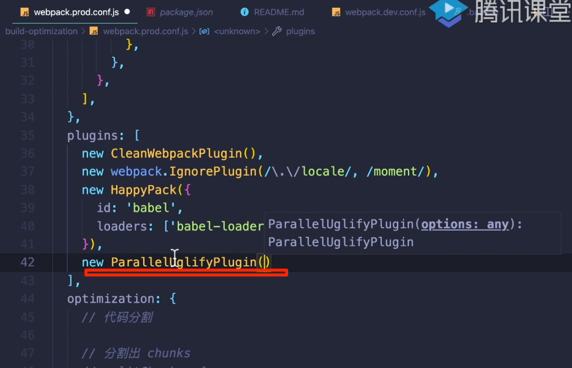
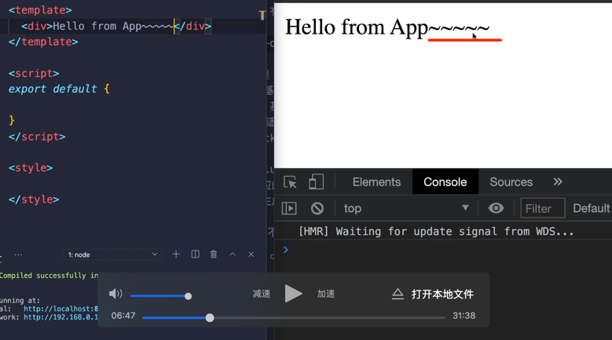

[TOC]

## webpack性能优化3-热更新

### 如何配置热更新

https://zhuanlan.zhihu.com/p/44438844

webpack的热更新又称热替换（Hot Module Replacement），缩写为HMR。 这个机制可以做到不用刷新浏览器而将新变更的模块替换掉旧的模块。



效果:能够做到不需要刷新浏览器即可看到相对应的部分被替换

`watch:true`监听源代码变化,一检测到代码发生变化，就会重新打包;

想要监听/忽略某个具体的行为:

```
module.exports = {
//如果使用webpack-dev-server之后,下面这几个配置默认就都有的,了解即可
  watch:true,
  watchOPtions:{
   ignored:/node_modules/,
   aggregateTimeout:300,  //表示检测到变化之后,再等300ms才重新打包
   poll: 1000  //通过电脑里面的文件系统来判断文件有没有变
  }
}

```

感觉3th讲没有讲什么？？就开了个头

## 4th讲
### 自动刷新和热更新的区别
 - 自动刷新:保存代码,但是页面重新刷新一遍,速度比较慢,整个页面之前的状态会丢失
 - 热更新: 新的代码生效,网页不刷新,整个页面之前的状态不丢失,变化的仅仅是你改变的那一部分


 


## 参考

https://v4.webpack.js.org/configuration/

https://v4.webpack.js.org/guides/hot-module-replacement/

https://webpack.js.org/configuration/

https://zhuanlan.zhihu.com/p/44438844