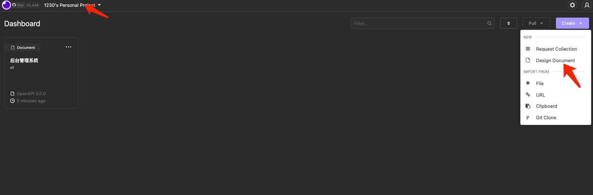

## 如何开启服务

```shell
docker ps
CONTAINER ID   IMAGE                 COMMAND                  CREATED       STATUS             PORTS                                            NAMES
5b958e54cc4c   redis:latest          "docker-entrypoint.s…"   2 days ago    Up 14 minutes      0.0.0.0:6379->6379/tcp                           redis_01
a7c9a718b0bd   elasticsearch:8.4.0   "/bin/tini -- /usr/l…"   3 days ago    Up 14 minutes      0.0.0.0:9200->9200/tcp, 0.0.0.0:9300->9300/tcp   richard_elasticsearch
b3fe499e2c9b   adminer               "entrypoint.sh docke…"   3 weeks ago   Up About an hour   0.0.0.0:8080->8080/tcp                           nest-events-backend-adminer-1
226741c1aa6e   mysql:8.0.23          "docker-entrypoint.s…"   3 weeks ago   Up About an hour   0.0.0.0:3306->3306/tcp, 33060/tcp                nest-events-backend-mysql-1
c05cf2c5f087   postgres:13.1         "docker-entrypoint.s…"   3 weeks ago   Up About an hour   0.0.0.0:5432->5432/tcp                           nest-events-backend-postgres-1

#主要就是要开启上面5个服务,其中下面三个是绑定在一起的
#主要开启最上面上面两个
⇒  docker start 5b958e54cc4c

⇒  docker start a7c9a718b0bd

```

除此以外,还有一个注意点,导入接口的时候需要在url后面加json:

```shell
pnpm dev
- RestAPI: http://127.0.0.1:3100
- RestDocs:
    [DEFAULT]:
      <应用接口>: http://127.0.0.1:3100/docs
      <管理接口>: http://127.0.0.1:3100/docs/manage

    [V1]:
      <应用接口>: http://127.0.0.1:3100/docs/v1
      <管理接口>: http://127.0.0.1:3100/docs/v1/manage

```




下面这张图是重点:
原来是 `http://127.0.0.1:3100/docs/manage  `,`http://127.0.0.1:3100/docs`

导入的时候需要写成:  `http://127.0.0.1:3100/docs/manage-json`,`http://127.0.0.1:3100/docs-json`


