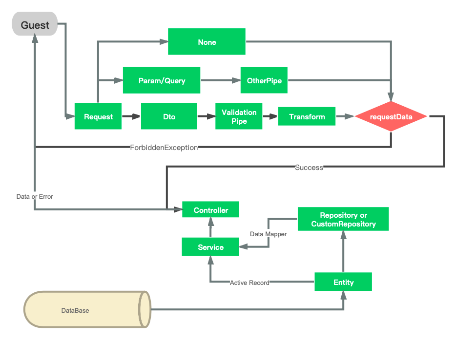
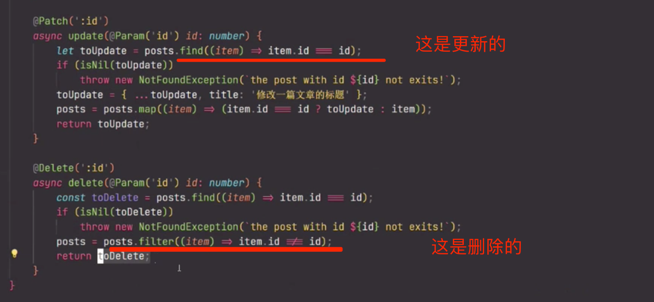

https://pincman-classroom.feishu.cn/wiki/wikcncRYMjAQgbcThufVxHlFLAf


## 学习目标
- 更换http驱动为fastify
- 控制器及其方法，请求对象及DTO
- 提供者概念，自定义提供者，异步提供者，循环依赖，注入范围
- 全局模块，动态模块，模块懒加载和模块参考

提前安装以下后
- lodash 一个通用的JS函数工具库
- class-validator 用于类的验证，本节主要结合DTO对请求数据进行验证
- class-transformer 系列化响应数据，本节用于结合class-validator进行序列化
- @nestjs/swagger nestjs的openapi支持库，本节只使用里面的PartialType函数


```shell

 pnpm add lodash class-validator class-transformer @nestjs/swagger
 
```


## 应用执行流程图





## 更换http驱动
使用fastify代替默认的express，以提高应用的http响应速度，并把访问地址改成0.0.0.0以便外网访问
先安装fastify驱动
`pnpm add @nestjs/platform-fastify`

代码如下

```TypeScript
async function bootstrap() {
    const app = await NestFactory.create<NestFastifyApplication>(
        AppModule,
        new FastifyAdapter(),
    );
    // 指定url前缀
    app.setGlobalPrefix('api');
    await app.listen(3000, '0.0.0.0');
}

```





模块共享:

逻辑:

a模块中的a1类想要用b模块中的中b1类(就是说b1类要怎么注入到不是本模块中)
在a模块中:1.注册a1; ------->2.导出这个类`export [a1]`

3. 在中心模块中导入
4. 在b1中导入,在b1中注入(类似如下)
```ts
//b1中:
constructor (private userService:UserService){}
```


### 动态导入


