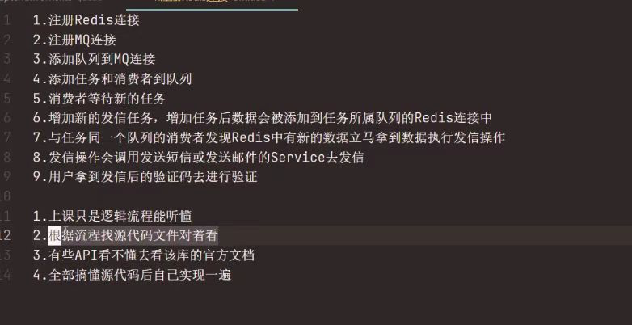

在学习前老师会把大家的ID添加到`git.pincman.com`中，大家可以登录后改密码

仓库使用   
在老师讲完课后，进入指定组织。git存储地址为`git.pincman.com`    
组织名称为"班名称+期数"，比如全栈1期，则为"fullstack-1"，那么整个组织的地址就是`git.pincman.com/fullstack-1`   
进入组织后,将有每个课时的代码就是一个仓库，比如，第一节代码仓库就是: `git.pincman.com/fullstack-1/chapter1 `  
每个仓库的main分支是老师创建的本课时的标准代码，大家可以克隆下来对比学习   

作业进度

在每周上完课后，老师会需要同学们上传自己的代码到仓库，同学们利用业余时间在上完课的5天内完成代码

>不懂的地方，可以在晚上在飞书群中向老师提问

写作业的步骤如下

>千万不要push到main，谢谢

1. 首先克隆老师给的代码仓库中上一节的源代码，比如，这一节的作业是chapter2，则克隆chapter1(作业的老师完成版本在chapter2，本节作业在本节仓库中提交)
2. 然后rm -rf .git && git init && git remote add origin {这一节的代码仓库}
3. 接着checkout -b到你的飞书群名称(中文名请使用拼音代替)的分支，比如git checkout -b sun，然后push一下这个分支
4. 然后再checkout -b到刚才的分支+-dev后缀的新分支，比如git checkout -b sun-dev，开始编写这一节的作业
5. 写完后提交pr到你的分支(不要pr到main)
6. 然后通知助教老师@Cc.辰或者老师本人@pincman进行review
7. 如果得到问题反馈，则再次修改代码重新PR，如果没问题这节作业完成啦
8. 可以在群里的飞书查看自己作业完成的进度，已完成则老师会点(不要自己点)

文档和资料  
每一节的课程的源代码中都包含README.md文件，本节课时的文档就在此处  
更加建议直接进入飞书文档查看，每个班的文档是不同的，也是互相不公开的（除了《学习流程和方法》等公用文档）。  
请不要随意公开所在班级的资料  
文档中如果有过期或错误信息请联系@pincman改正  
另一方面，一些教学内的一些非课时内的资料(比如翻译某某库的文档等)，可访问飞书百科。如果是免费的公开资料则会放到平克小站的资料栏目里  
所有需要下载的附件等请到飞书文档空间下载   

