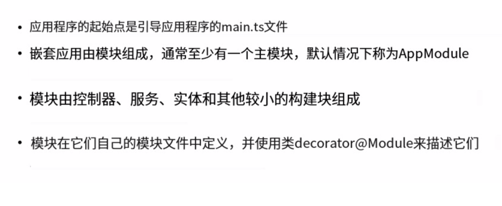
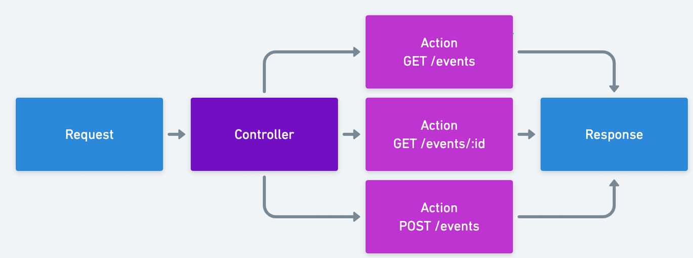
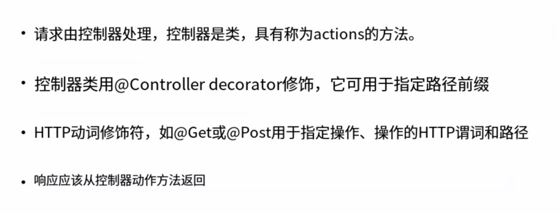
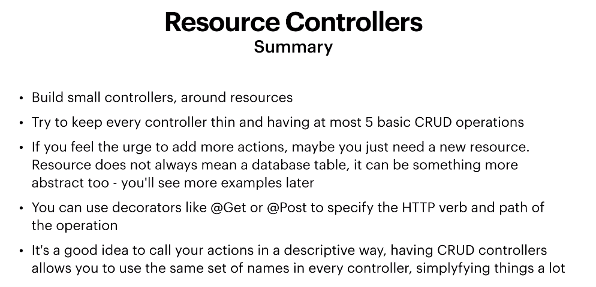
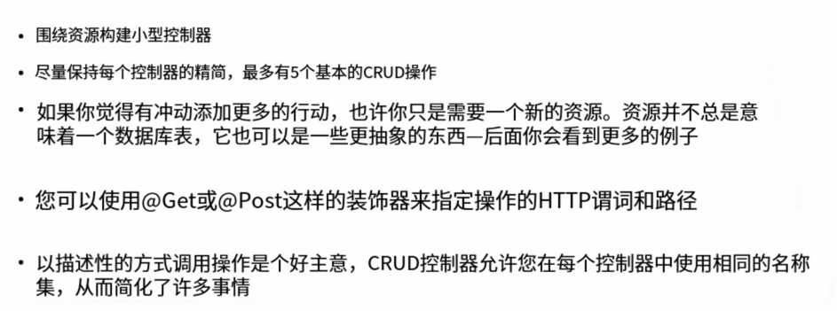
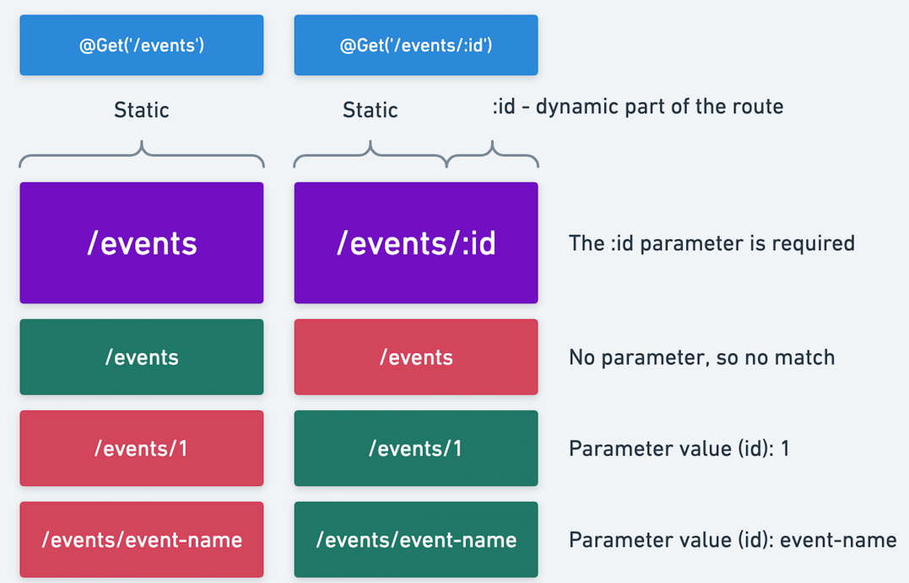
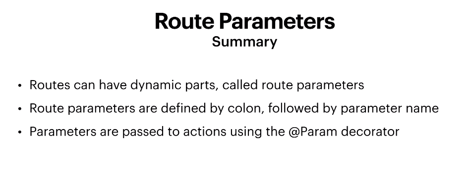
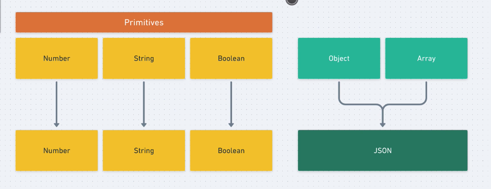

## Nest introduction





## REST API




### controllers总结




### resource controller








### route parameters







### request body and response




## Database basic

```shell
#在docker-compose.yml(就是项目)目录下执行
docker-compose up

```


密码为默认: example


## 小结
```shell
#开启容器
docker-compose up -d

#停止
docker-compose stop
```


