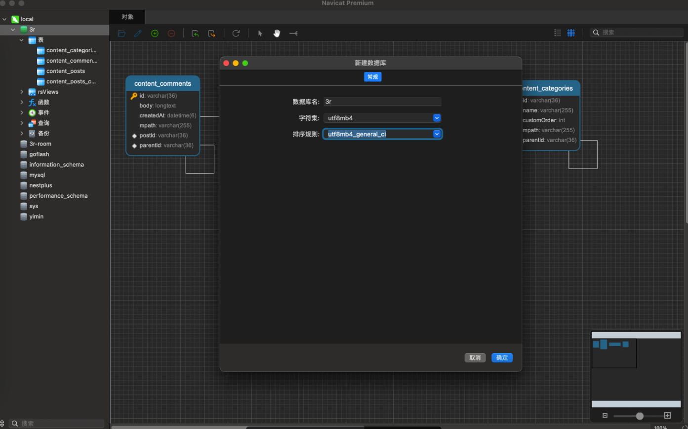

https://pincman-classroom.feishu.cn/wiki/wikcnmha4eHAfhWauw3dobe3v3p

## Mysql相关配置与安装

开启docker之后

```shell
#项目地址是在 /Users/mac/WebstormProjects/fullstack/nest-events-backend  里面
#主要是要开启 nest-events-backend  这个服务,在master-nest里面的
#用户名字和密码是:root,  example

```
在  `/Users/mac/WebstormProjects/fullstack/nest-events-backend`这个地址
有一个`docker-compose.yml `的文件

```shell
version: "3.8"

services:
  mysql:
    image: mysql:8.0.23
    command: --default-authentication-plugin=mysql_native_password
    restart: always
    environment:
      MYSQL_ROOT_PASSWORD: example
    ports:
      - 3306:3306

  postgres:
    image: postgres:13.1
    restart: always
    environment:
      POSTGRES_PASSWORD: example
    ports:
      - 5432:5432

  adminer:
    image: adminer
    restart: always
    ports:
      - 8080:8080

```

3r里面并不是这样的,如下:

```shell
~ brew update
~ brew install mysql
# 启动服务
~ brew services start mysql
# 重启服务
~ brew services restart mysql
```
执行初始化

密码建议12345678这种简单点的

```shell
~ mysql_secure_installation
```
尝试登录

```shell
~ mysql -u root -p #回车后输入你的密码
```

下载一个数据库管理工具,这里推荐使用Navicat(收费的)，建议可以去这个网站(https://appstorrent.ru/)看看，下载后连接数据库，并新增一个库(比如3r)



注意:如何jk

## 依赖库


