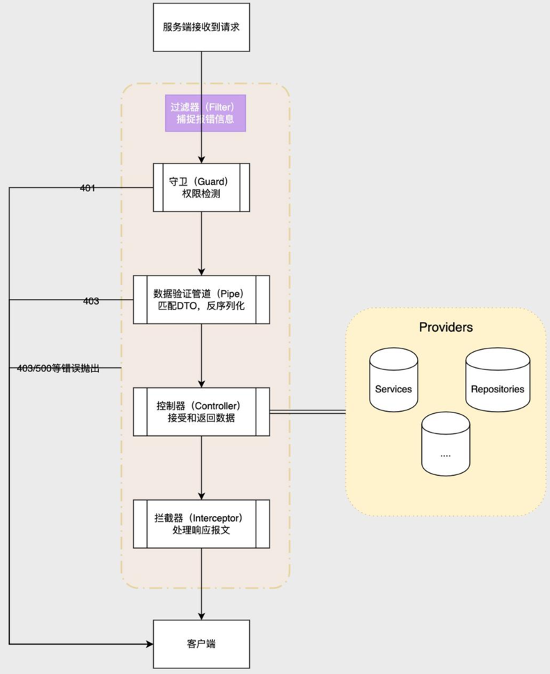

https://pincman-classroom.feishu.cn/wiki/wikcnkwhENCL7cm3kILtS5J2BJc


使用Fastify驱动以及请求数据的验证和响应数据的序列化

## 预准备
请在开始学习本节课之前务必查看class-validator和class-transformer的文档
- 我的网站翻译的文档(比较老) https://pincman.com/class-validator-and-class-transformer-cn/
- 或自行谷歌搜索官网文档


## 学习目标
- 使用Fastify作为Nestjs的HTTP驱动
- DTO验证类的编写
- 数据序列化拦截器的使用

## 依赖库
- class-validator 用于类的验证，本节主要结合DTO对请求数据进行验证
- class-transformer 序列化响应数据，本节用于结合class-validator进行序列化
- @nestjs/swagger是nestjs的openapi支持库，本节只使用里面的PartialType函数，因为Swagger是我们后续章节内容，本节并没有涉及
- @nestjs/platform-fastify是Nestjs适配fastify框架的HTTP驱动

```shell
~ pnpm add class-validator class-transformer @nestjs/swagger @nestjs/platform-fastify
```

## 更换http驱动

使用fastify代替默认的express，以提高应用的http响应速度。为了能使应用可以被不同网络的客户端访问，我们可以开启跨域。

不过后续会遇到很多坑，比如OAuth2登录,文件上传等，我们后续的课程会教大家如何一步步把fastify的坑给磨平

```shell
async function bootstrap() {
    const app = await NestFactory.create<NestFastifyApplication>(
        AppModule,
        new FastifyAdapter(),
    );
    // 允许跨域
    app.enableCors();
    await app.listen(3000);
}
```


## 流程图
一般为了客户端对我们后端应用的操作所提交的请求数据能正确并且安全，需要对其进行数据验证。在Nestjs比较流行的验证方案是使用class-validator+验证管道。只有通过验证后的数据才能传递给控制器对数据进行操作。而在数据操作完毕返回给前端响应时，我们需要对数据进行序列化，以确保能规避一些不愿暴露的敏感数据或者在呈现列表时也出现大量关联和内容数据等以影响我们的应用性能，同时也可以使前端得到可读性更高的数据格式，nestjs中一般通过class-transfomer(和class-validator同一个作者)+拦截器来进行序列化.

Nestjs中的Restful API(Graphql则是另一套模型)从请求到数据验证，再到数据操作，最后到数据响应的大致流程如下
>本节课还没有涉及到守卫，所以可以略过



## 文件结构
本节课的修改集中在内容模块，其文件结构如下

```shell
./src/modules/content
├── constants.ts
├── content.module.ts
├── controllers
│   ├── index.ts
│   └── post.controller.ts
├── dtos
│   ├── index.ts
│   └── post.dto.ts
├── entities
│   ├── index.ts
│   └── post.entity.ts
├── repositories
│   ├── index.ts
│   └── post.repository.ts
├── services
│   ├── index.ts
│   ├── post.service.ts
│   └── sanitize.service.ts
└── subscribers
    ├── index.ts
    └── post.subscriber.ts
```

## 代码编写

```shell
 mkdir -p src/modules/content/dtos
 touch src/modules/content/dtos/post.dto.ts
```


...

```shell
mkdir -p src/modules/core/providers 
touch src/modules/core/providers/app.interceptor.ts
```