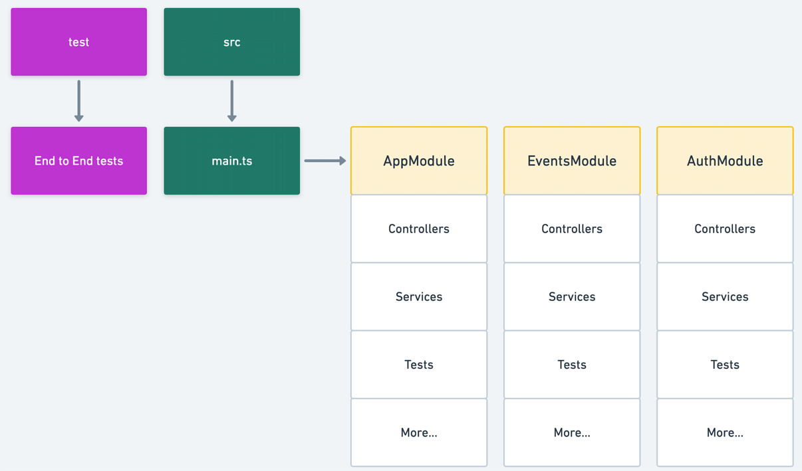
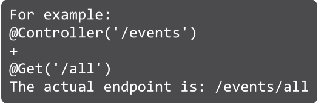
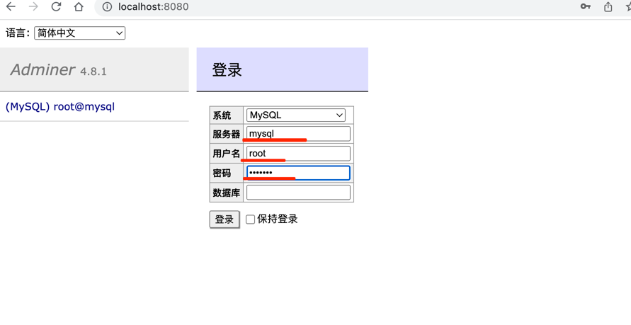
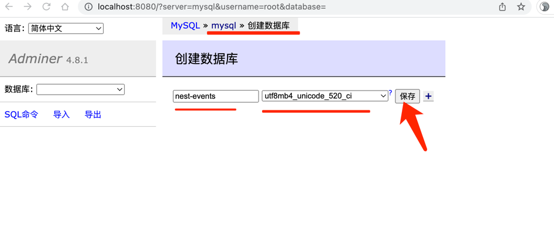

## Nest introduction




## REST API




### controllers总结


### resource controller


### route parameters


### request body and response


## Database basic

```shell
#在docker-compose.yml(就是项目)目录下执行
cd ~/WebstormProjects/fullstack/nest-events-backend

docker-compose up

```




系统:MySQL
服务器:mysql
用户名:root
密码为默认: example

utf8mb4_unicode_520_ci





## 小结
```shell
#开启容器
cd ~/WebstormProjects/fullstack/nest-events-backend

docker-compose up -d

#停止
docker-compose stop
```

## ORMs


```shell
pnpm add --save @nestjs/typeorm typeorm mysql
```

开启数据库

```shell
mac@192:~/WebstormProjects/fullstack/nest-events-backend|main⚡ 
⇒  docker-compose up -d

[+] Running 3/3
 ⠿ Container nest-events-backend-adminer-1   Started                                                                                           1.2s
 ⠿ Container nest-events-backend-mysql-1     Started                                                                                           1.2s
 ⠿ Container nest-events-backend-postgres-1  Started  
 
# 开启服务
pnpm dev

 ```

登陆数据库管理页面:


删除一个表:


## 21th——entity

代码见:

https://github.com/richard1230/nest-events-backend/commit/e1b446a5610e0fb38dc5c2bb52945b6e225284f5#diff-089f4f2474b64391c42b6e66aed33977e132058d92108f0a63234a7862e1f8b8

app.module.ts:主要负责连接数据库

event.entity.ts : 主要创建一个event的表,里面一定要有主键

前提需要有数据库服务,这里是利用docker起mysql这个服务的,编写了一个docker-compose.yml文件(具体操作见上)


## 22th-23th_respository pattern


#填充数据

```sql

SET NAMES utf8mb4;

INSERT INTO `event` (`id`, `description`, `when`, `address`, `name`) VALUES
(1,	'Let\'s meet together.',	'2021-02-15 21:00:00',	'Office St 120',	'Team Meetup'),
(2,	'Let\'s learn something.',	'2021-02-17 21:00:00',	'Workshop St 80',	'Workshop'),
(3,	'Let\'s meet with big bosses',	'2021-02-17 21:00:00',	'Boss St 100',	'Strategy Meeting'),
(4,	'Let\'s try to sell stuff',	'2021-02-11 21:00:00',	'Money St 34',	'Sales Pitch'),
(5,	'People meet to talk about business ideas',	'2021-02-12 21:00:00',	'Invention St 123',	'Founders Meeting');
```


控制器中的方法顺序很重要,先定义的优先!!!


