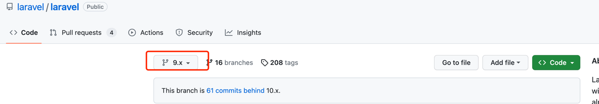

```shell
cd ~/WebstormProjects/fullstack/laravel
git clone git@github.com:laravel/laravel.git laravel9-admin
⇒  ls
admin-php      example-app    laravel9-admin weibo
⇒  cd laravel9-admin

cp pls-lara-docker/.env .
cp pls-lara-docker/.dockerignore .
cp pls-lara-docker/docker-compose.yml .
cp pls-lara-docker/vite.config.js .

docker-compose up -docker
#dcx app sh
⇒  docker-compose exec app sh
/var/www/html $ composer insta
/var/www/html $ php artisan serve --host=0.0.0.0
```

