[TOC]

## Jsx本质

```jsx
class App extends React.Component {
  render() {
    return (
      <div className='box' id='J_Box'>
        <h1 className='title'>
          This is a <span>TITLE</span>
        </h1>
      </div>
    );
  }
}

ReactDOM.render(
  <App/>,
  document.getElementById('app')
)
```

return里面可以换一种写法:

```jsx
class App extends React.Component {
  render() {
    return (
      React.createElement(
        div,
        {
          className: 'box',
          id: 'J_Box'
        },
        // div(标签) , 属性,子元素
        React, createElement(
          'h1',
          {
            className: 'title'
          },
          'This is a',
          React.createElement(
            'span',
            null,
            'TITLE'
          )
        )
      )
    );
  }
}
```

### 小结

JSX其实是React.createElement函数调用的语法糖;

JSX ---> 编译 ---> React.createElement函数调用

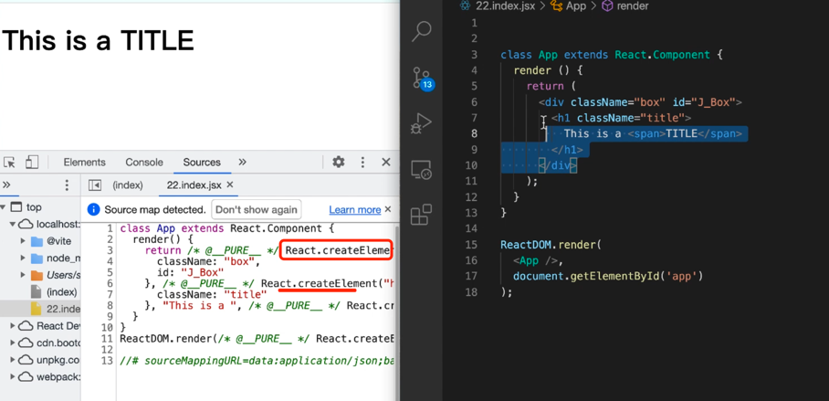

## React元素类型

```jsx
class MyButton extends React.Compponent {

  render() {
    return (
      <button>Click</button>
    )
  }
}

class App extends React.Component {
  render() {
    return (
      <MyButton/>
    );
  }
}

```

React ---> 编译 ---> JSX ---> React.createElement调用形式

React ---> createElement ---> 让React库存在当前的模块作用域中

`import React from 'react'`(index.html---> script ---> src ---> React cdn 是不需要 import的)

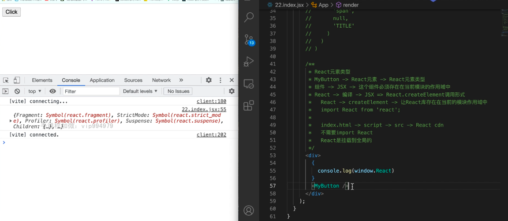

## 如何在JSX中使用点语法

```jsx

const colorSystem = {
  'primary': 'blue',
  'success': 'green',
  'warning': 'orange',
  'danger': 'red'
}

const MyUI = {
  Button: class extends React.Component {
    render() {
      const {type, children} = this.props;

      return (
        <button
          style={{
            color: '#fff',
            backgroundColor: colorSystem[type]
          }}
        >
          {children}

        </button>
      )
    }
  },
  Input: function (props) {
    const {placeholder, onValueInput} = props;
    return (
      <input
        type="text"
        placeholder={placeholder}
        onCHange={(e) => onValueInput(e)}
      />
    )
  }
}

class App extends React.Component {
  render() {
    return (
      <div>
        <MyUI.Button
          type='danger'
        >
          Click
        </MyUI.Button>

        <MyUI.Input placeholder="请填写" onValueInput={this.valueInput}>
        </MyUI.Input>
      </div>

    );
  }
}
```

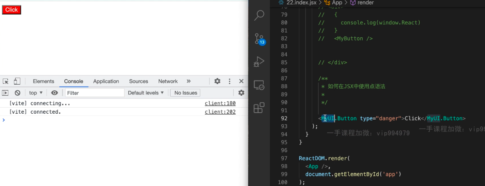


## JSX书写规范

小写字母开头代表HTML的内置组件,标签转换为 字符串: `div` =====> `'div'` --->作为React.createElement的第一个参数

大写字母开头代表自定义组件 , 例如 `MyButton`，编译 React.createElement(MyButton)

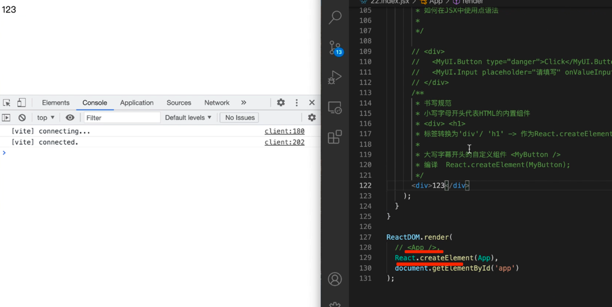

## 运行时选择组件

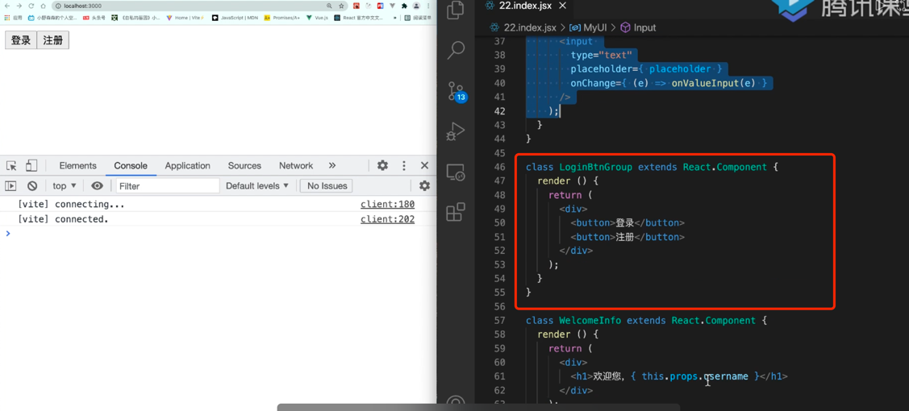

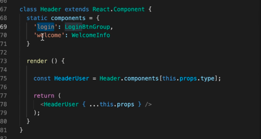
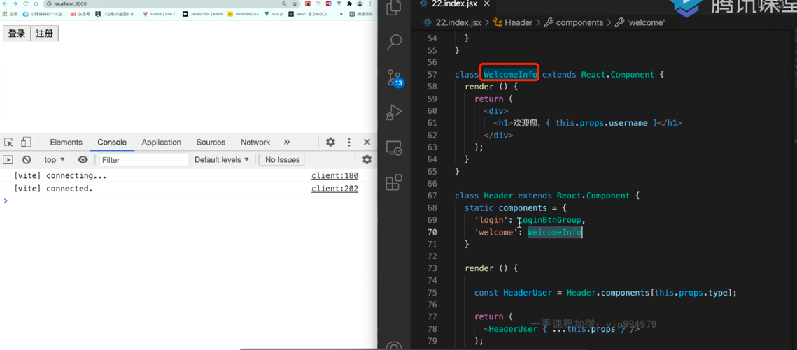
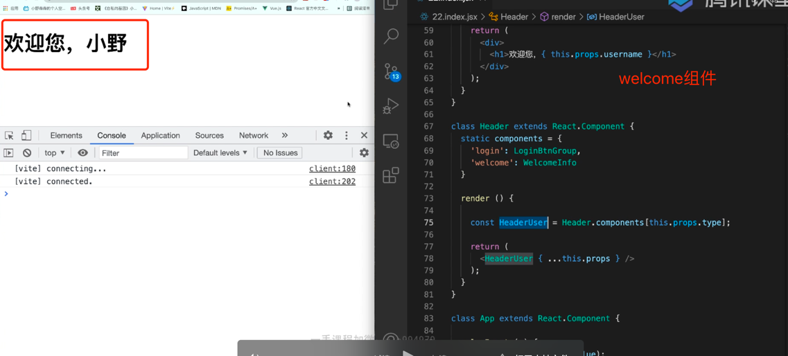

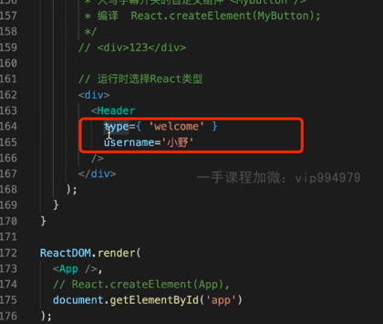

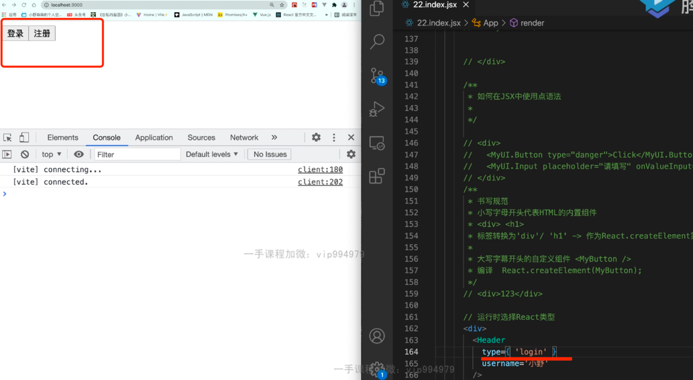

```jsx
class Login extends React.Component {
  render() {
    return (
      <div>
        <button>登陆</button>
        <button>注册</button>
      </div>
    )
  }
}

class welcome extends React.Component {
  render() {
    return (
      <div>
        <h1>欢迎您</h1>
      </div>
    )
  }
}

class Header extends React.Component {
  static components = {
    'login': Login,
    'welcome': welcome
  }

  render() {
    const HeaderUser = Header.components[this.props.type]
    return (
      <div>
        <HeaderUser {...this.props}/>
      </div>
    )
  }
}

class App extends React.Component {
  render() {
    return (
      <div>
        <Header
          type={'welcome'}
          // type={'login'}
          username='Richard'
        />
      </div>
    );
  }
}
```

## 属性

JSX大括号{}里面可以写JS的任何表达式,但是不能有语句(if，for,switch,function不可以);

非表达式可以在外面写;

```jsx
function MyTitle(props) {
  const {title, author} = props;

  return (
    <div>
      <h1>{title}</h1>
      <p>作者:{author}</p>
    </div>
  )
}


class App extends React.Component {

  state = {
    mainTitle: "main title",
    subTitle: "sub Title",
    titleShow: 'main'
  }

  render() {
    return (
      <div>
        <MyTitle
          title={`${this.state.mainTitle}  {${this.state.subTitle}`}
        />
      </div>
    );
  }
}

```

### 动态调整属性:

```jsx
class App extends React.Component {

  state = {
    mainTitle: "main title",
    subTitle: "sub Title",
    titleShow: 'main'
  }

  render() {
    const {titleShow, mainTitle, subTitle} = this.state
    let title = '';
    if (this.state.titleShow === "sub") {
      title = <h2> {this.state.subTitle}</h2>
    } else if (this.state.titleShow === "main") {
      title = <h1> {this.state.mainTitle}</h1>
    } else {
      title = <h3> no title</h3>
    }

    return (
      <div>
        {/*{title}  方法一，方法二是动态表达式*/}
        titleShow === 'sub' ?
        <h2> {this.state.subTitle}</h2>
        : <h1> {this.state.mainTitle}</h1>
      </div>
    );
  }
}

```

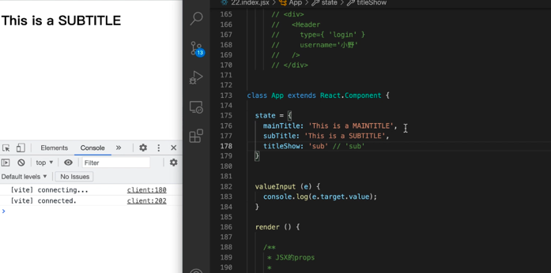

## 字符串与字面量

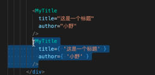


## props的布尔表达

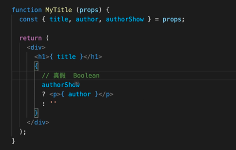

```jsx

function MyTitle(props) {
  const {title, author, authorShow} = props;

  return (
    <div>
      <h1>{title}</h1>
      authorShow
      ? <p>{authoe}</p>
      : ' '
    </div>
  )
}


class App extends React.Component {


  render() {
    return (
      <div>
        <MyTitle
          title="this is title"
          author="richard"
          //语义: 字符串传入的意义是字符串的意思，不代表Bool真假
          //逻辑字符串true是逻辑真
          //下面这种写法是错误的
          // authorShow="true"
          //下面这种写法是正确的,如果为true,上面的richard就显示
          authorShow={true}
          //不赋值的写法: --->默认就是Bool为真
          //不推荐这么做,语义不好
          // authorShow
        />
      </div>
    );
  }
}

```

## 属性展开操作

下面这两种写法一样:

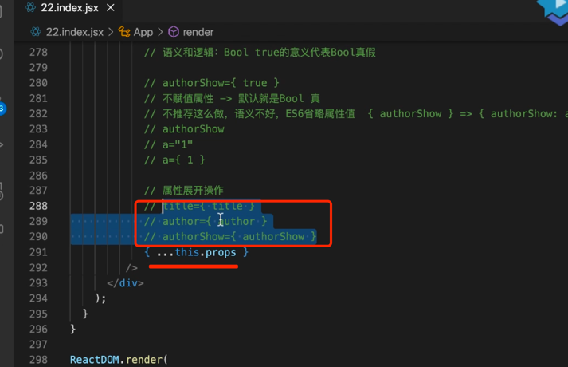

排除某个属性展开的写法:

```jsx

function MyTitle(props) {
  const {children, author, authorShow} = props;

  return (
    <div>
      <h1>{children}</h1>
      authorShow === true
      ? <p>{authoe}</p>
      : ' '
    </div>
  )
}


class App extends React.Component {

  render() {

    const {a, ...others} = this.props;

    return (
      <div>
        <MyTitle
          {...others}
        />
      </div>
    );
  }
}

ReactDOM.render(
  <App
    author='richard'
    authorShow={true}
    a='1'
  >
    this is a title
  </App>,
  document.getElementById('app')
)


```

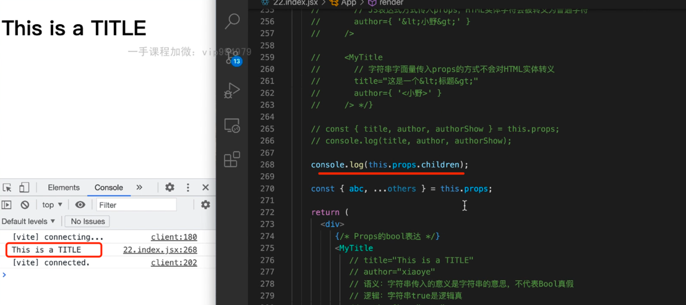

## JSX子元素

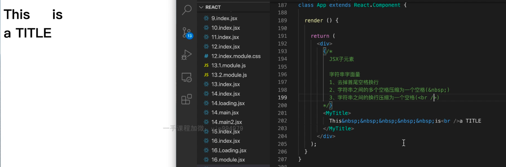

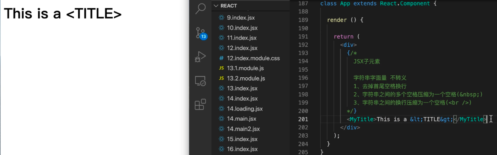

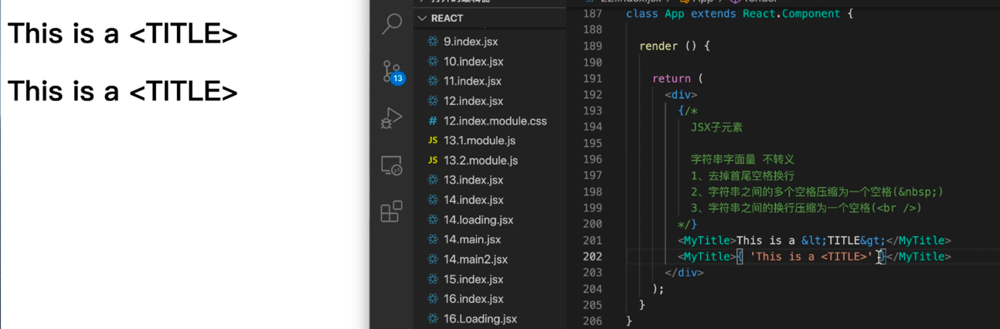

```jsx
class Mylist extends React.Component {
  render() {
    return (
      <div className={this.props.listClassName}>
        <h1>{this.props.title}</h1>
        <ul className="my-list">{this.props.children}</ul>
      </div>
    )
  }
}


class ListItem extends React.Component {
  render() {
    return (
      <li>{this.props.children}</li>
    )
  }
}


class App extends React.Component {

  state = {
    listData: [
      'This is content 1',
      'This is content 2',
      'This is content 3',

    ]
  }

  render() {

    return (
      <MyTitle
        listClassName='my-list-container'
        title='this is my list'
      >

        <ListItem>
          This is my content 1
        </ListItem>
        <ListItem>
          This is my content 2
        </ListItem>
        <ListItem>
          This is my content 3
        </ListItem>
        {/*还有一种写法*/}
        {
          this.state.listData.map((item, index) => (
              <ListItem key={index}>
                Hello, {item}
              </ListItem>
            )
          )
        }
      </MyTitle>

    );
  }
}

ReactDOM.render(
  <App/>,
  document.getElementById('app')
)

```

还有一种写法:

```jsx
class ListItems extends React.Component {
  render() {
    return (
      <li key='1'>This is content 1.</li>,
        <li key='2'>This is content 2.</li>,
        <li key='3'>This is content 3.</li>
    )
  }
}


class App extends React.Component {

  render() {

    return (
      <MyTitle>
        <ListItems/>
      </MyTitle>

    );
  }

}


```

第三种方法:

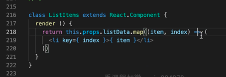

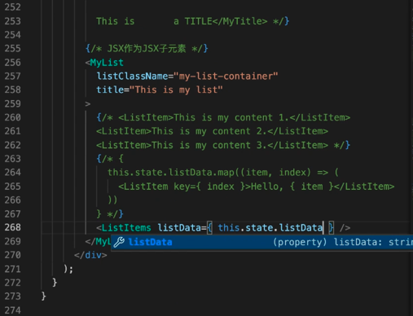

### 不会被渲染的元素

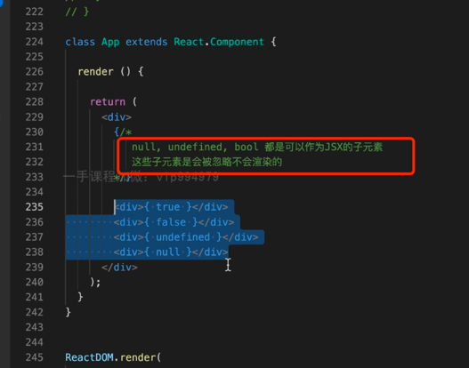

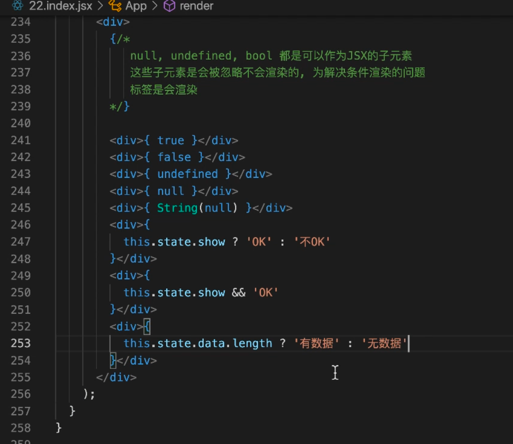


[//]: # (![img_24.png]&#40;img_24.png&#41;)

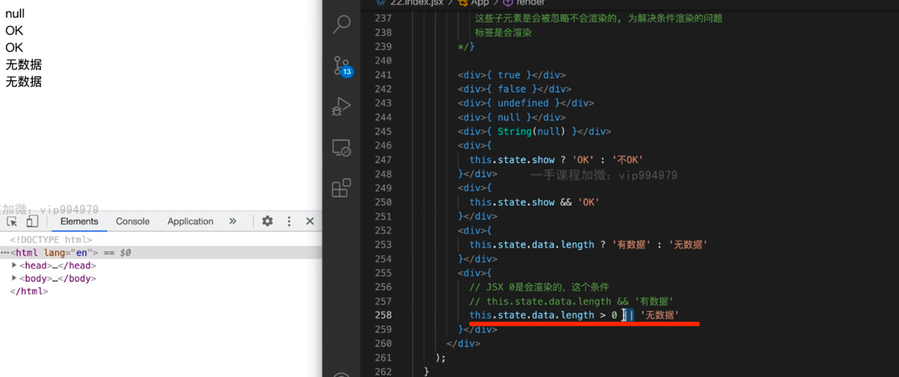

## JSX的函数子元素

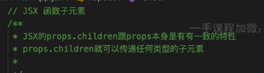

 ```jsx

class Repeat extends React.Component {


  render() {
    const jsxArr = [];
    for (var i = 0; i < this.props.num; i++) {
      jsxArr.push(this.props.children(i))
    }

    return jsxArr;
  }
}


class App extends React.Component {

  render() {
    return (
      <div>
        <Repeat num={10}>
          {
            (index) => <p key={index}>this is item {index + 1}</p>
          }
        </Repeat>
      </div>
    )

  }
}


```

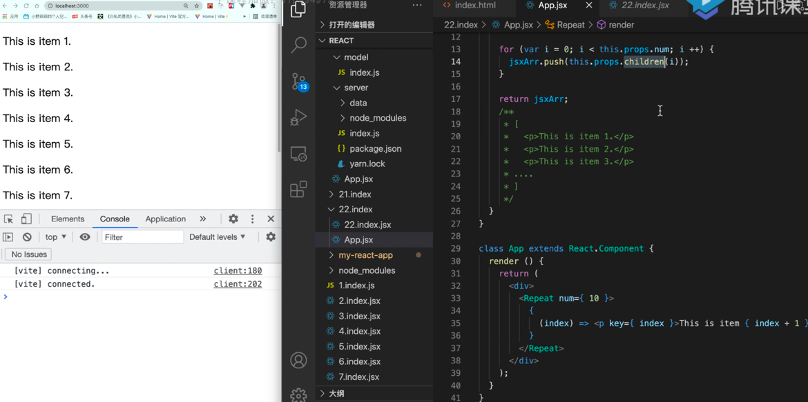

上面是函数作为子元素的例子;

再看一个例子:
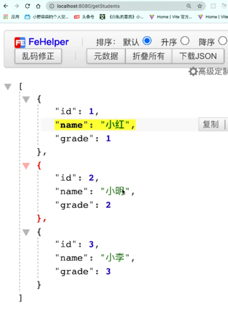 

```jsx
class App extends React.Component {
  render() {
    <table>
      <thead> 
      <tr>
        <th>ID</th>
        <th>姓名</th>
        <th>年级</th>
      </tr>
      </thead>
      <tbody>
      <Http.Get
        url='http://localhost:8080/getStudents'
        loading={
          <tr>
            <td colSpan="3">
              正在加载中...
            </td>
          </tr>
        }
      >
        {
          (data) => {
            return data.map(
              item => (
                <tr key={item.id}>
                  <td>{item.id}</td>
                  <td>{item.name}</td>
                  <td>{item.grade}</td>
                </tr>
              )
            )
          }
        }
      </Http.Get>

      </tbody>
    </table>
  }

}

```


另外一个文件:
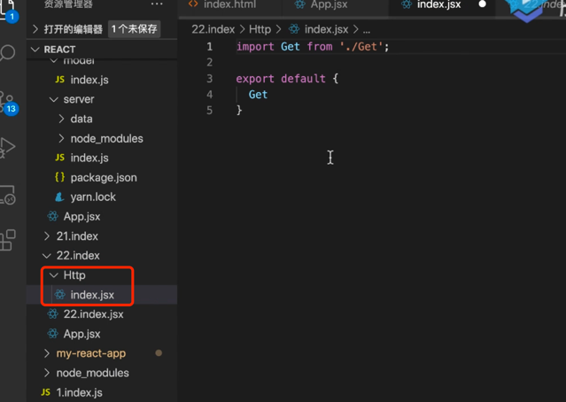

```jsx
import Get from './Get'
export default{
   Get
}
```
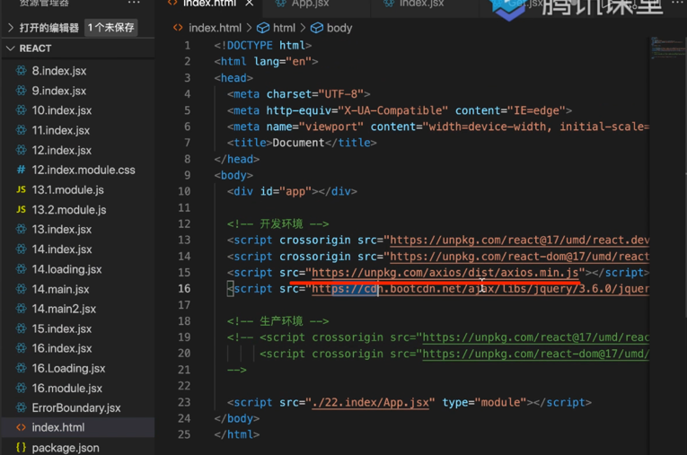
 
Get.jsx
```jsx
class Get extends React.Component{
  async componentDidMount(){
    const result = await axios(this.props.url);
    this.setState({
      data:result.data
    },()=>{
      setTimeout( ()=>{
        this.setState({
         component: this.props.children(this.state.data)
        })
      } ,1000)
    })
    console.log(result)
  }
  
  state = {
    data:[],
    component: this.props.loading
  }
  render(){
    return this.state.component;
  }
}

export default Get;
```
 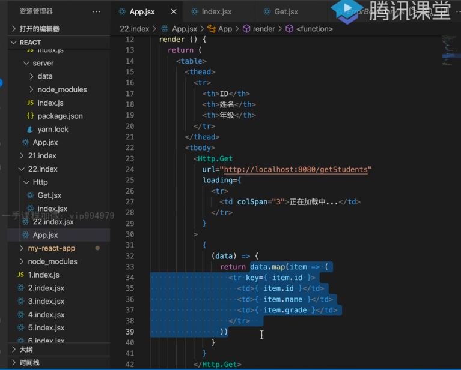


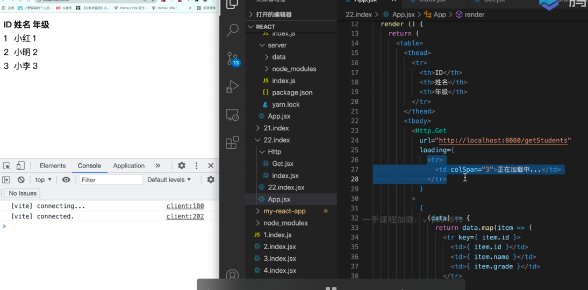


 

