视频地址:
https://www.bilibili.com/video/BV1Z44y1K7Fj?p=100&vd_source=0aa76d6c0cefdf813dbf5b083daafb6a


笔记目录:

https://www.yuque.com/fechaichai/tzzlh1/obkdhx

项目地址

https://gitee.com/react-cp/react-pc-code

## 配置sass

```shell
yarn add sass -D

```


## 配置别名路径

CRA 将所有工程化配置，都隐藏在了 react-scripts 包中，所以项目中看不到任何配置信息(就是类似Webpack相关的文件)

如果要修改 CRA 的默认配置，有以下几种方案： 
 - 通过第三方库来修改，比如，@craco/craco  （推荐）
 - 通过执行 yarn eject 命令，释放 react-scripts 中的所有配置到项目中

实现步骤

1. 安装修改 CRA 配置的包：yarn add -D @craco/craco
2. 在项目根目录中创建 craco 的配置文件：craco.config.js，并在配置文件中配置路径别名
3. 修改 package.json 中的脚本命令
4. 在代码中，就可以通过 @ 来表示 src 目录的绝对路径
5. 重启项目，让配置生效


## @别名路径提示
   本节目标:  能够让vscode/webstorm识别@路径并给出路径提示
   实现步骤
1. 在项目根目录创建 jsconfig.json 配置文件
2. 在配置文件中添加以下配置

jsconfig.json
```json
{
  "compilerOptions": {
    "baseUrl": "./",
    "paths": {
      "@/*": ["src/*"]
    }
  }
}
```

## 登陆模块

https://www.yuque.com/fechaichai/tzzlh1/bivd9h


### 封装http工具模块

```shell
yarn add axios

```


### 配置登录Mobx
```shell
yarn add mobx mobx-react-lite
```

### 请求拦截器注入

一处配置token,多处生效


### 路由鉴权实现

思路为：判断本地是否有token，如果有，就返回子组件，否则就重定向到登录Login


token删除以后,再次刷新就重定向到登陆页面了


## Layout模块


### 401token实现

```shell
$yarn add history
```


### 125-echart基础使用

```shell
yarn add echarts

```

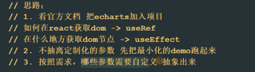

### p130获取文章列表

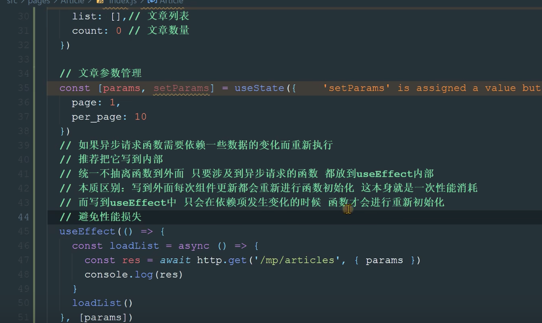


p132继续

后面每次提交之前搞的截图,说明每次完成了什么功能


## p137(要写效果图了)

p137效果图:

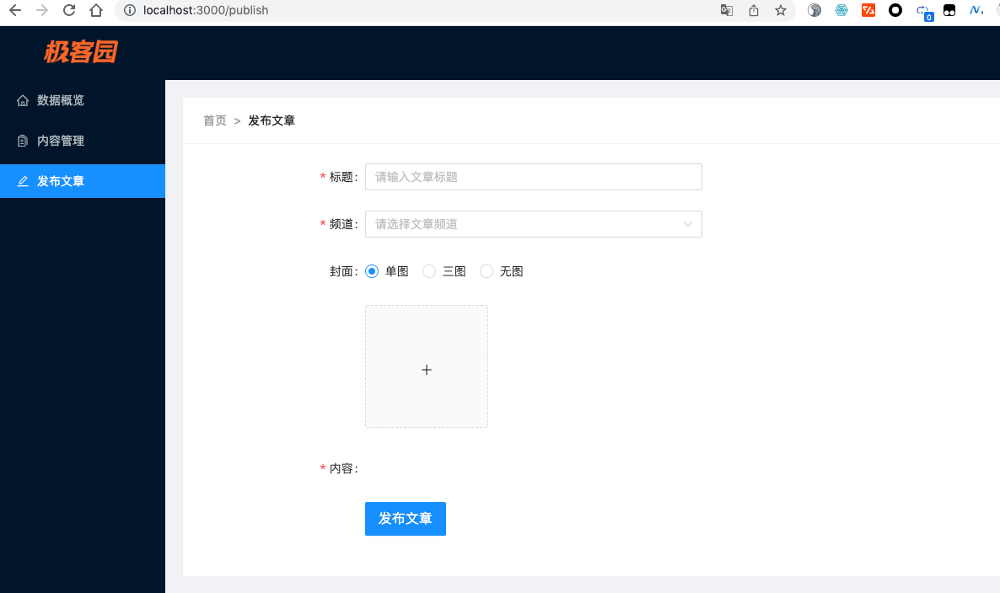

### 138-富文本编辑器

```shell
yarn add react-quill
```

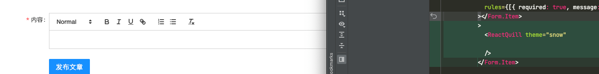

改高度:

```scss
.publish {
  position: relative;
  // 加的是下面这行
  .ql-container{
    height: 400px !important;
  }
}
```

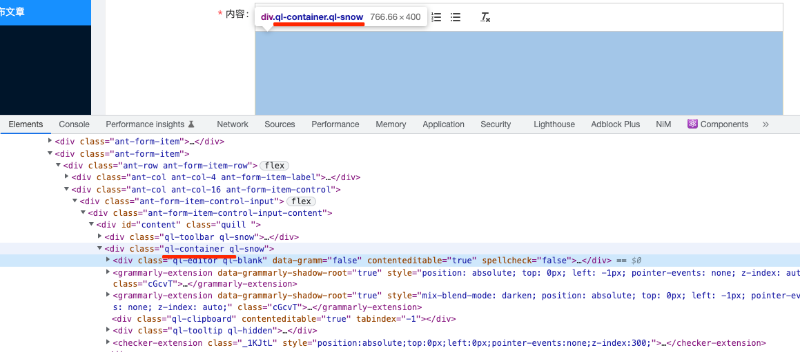

## p139重构频道获取


0.article和publish同时用到channel接口中数据(称为channel)

1.channel可以写在store里面,而后将其导出

2.article和publish又都被包含在Layout模块里面,可以通过导入store,使其在页面刚加载的时候渲染(通过useEffect)

3.分别在article和publish中导入store,在各自模块中使用map展开


## p140基础上传

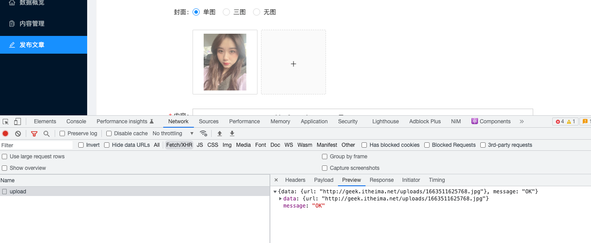

p141:

主要看序号为1的,序号为0的是前面上传的第一个图片

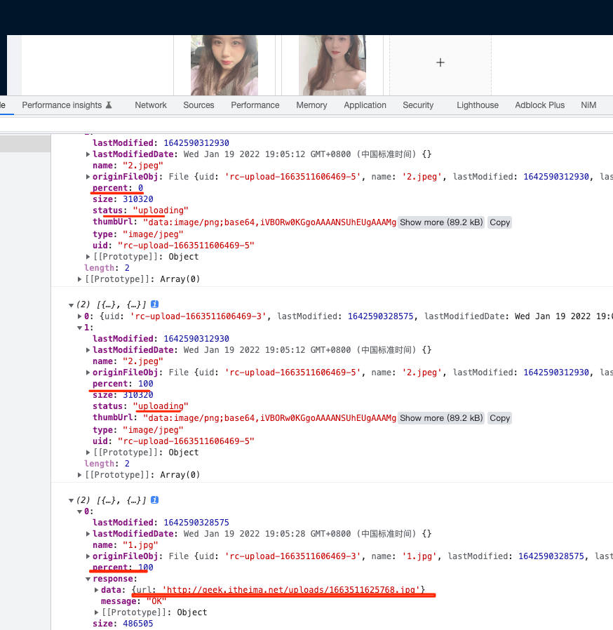

## p142


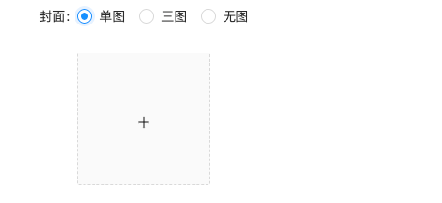


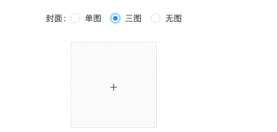

切换到无图的时候需要没有上传的那个界面!

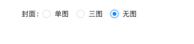


## p143 允许上传图片的数量

是否支持多传:
```jsx
 <Upload
                name="image"
                listType="picture-card"
                className="avatar-uploader"
                showUploadList
                action="http://geek.itheima.net/v1_0/upload"
                fileList={fileList}
                onChange={onUploadChange}
                multiple={imgCount>1}//表示大于1 的时候支持上传多张图片
                maxCount={imgCount}//表示最多上传几张图片

              >
```


## p144 收集表单数据提交接口

```jsx
const onFinish = (data)=>{
    console.log(data);//先看一下这个数据是啥

  }
```

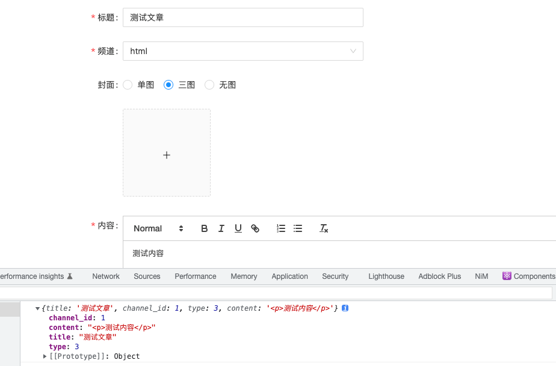

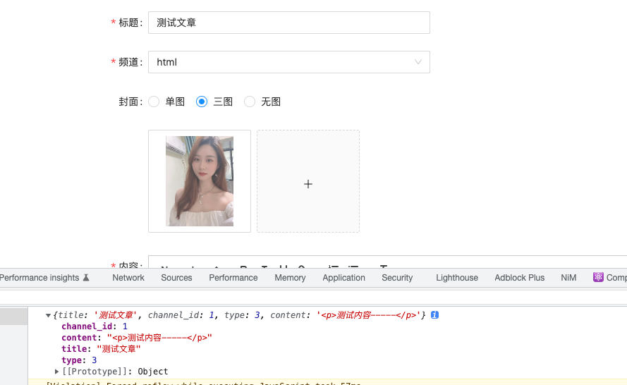

需要做二次处理:  原来的要求为: https://www.yuque.com/fechaichai/tzzlh1/oh9sx3#1eb071f3
```
{
   channel_id: 1
   content: "<p>测试</p>"
   cover: {
      type: 1, 
      images: ["http://geek.itheima.net/uploads/1647066600515.png"]
   },
   type: 1
   title: "测试文章"
}
```

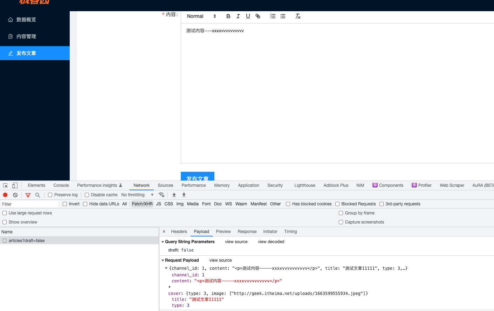


## 145-暂存图片列表


一个问题:

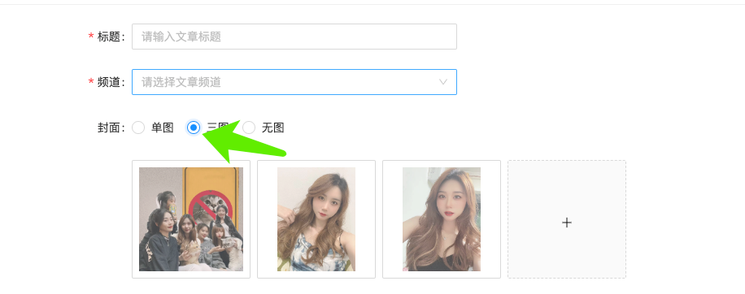

由三图切换至单图的时候发现图片始终为三张,没有变:

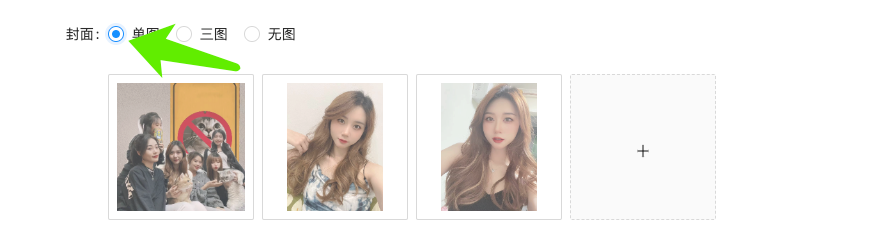


## p146

找到文章id,切换编辑与发布文章

```jsx
const [params] = useSearchParams()
  const id = params.get('id')
  console.log('route ',id);

{id?'编辑':'发布'}文章
```


## 147

通过文章id获取文章详情，进行回显操作:

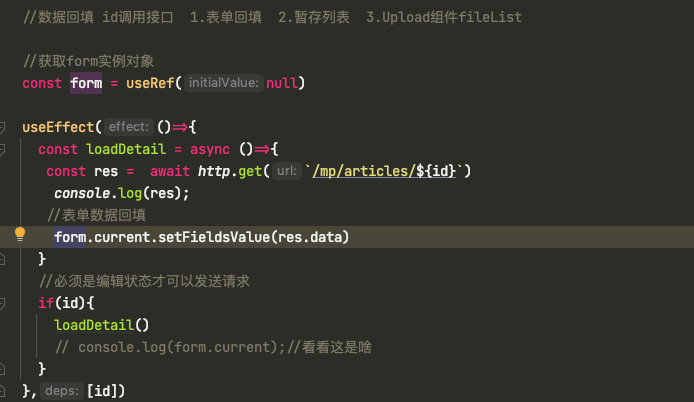


## 148-149

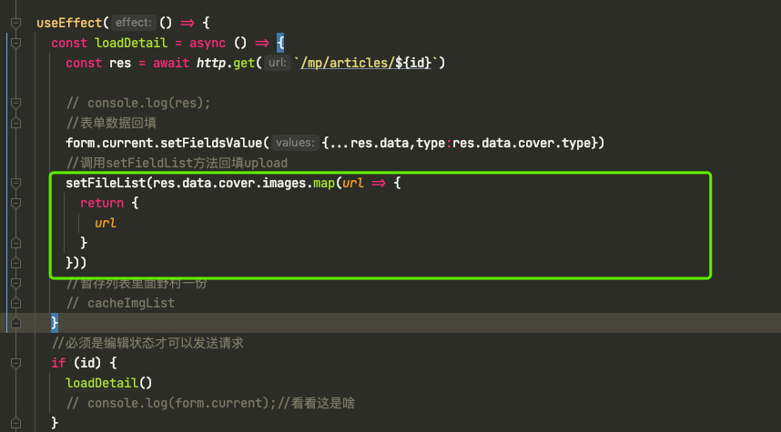


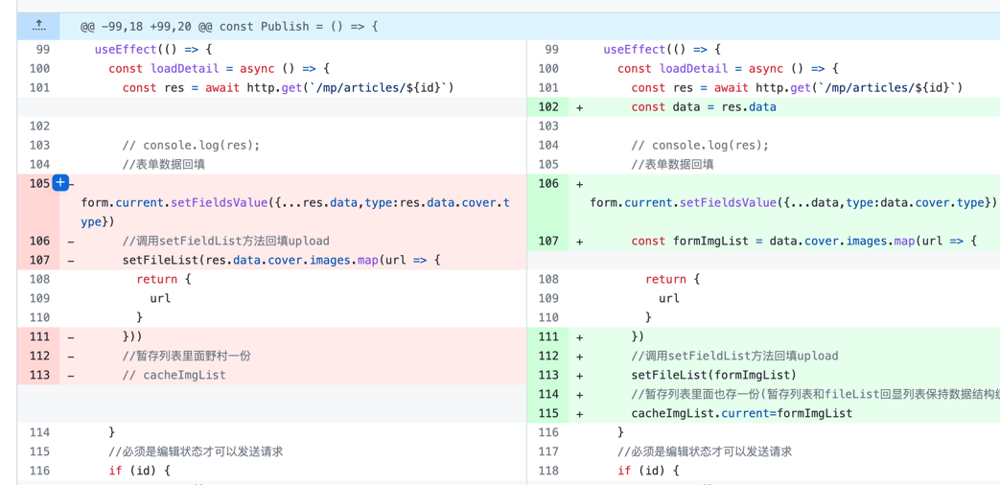


## 150

```jsx
cover: {
        type: type,
        image: fileList.map(item => item.response.data.url)//这里是有问题的
      }
```
之前:

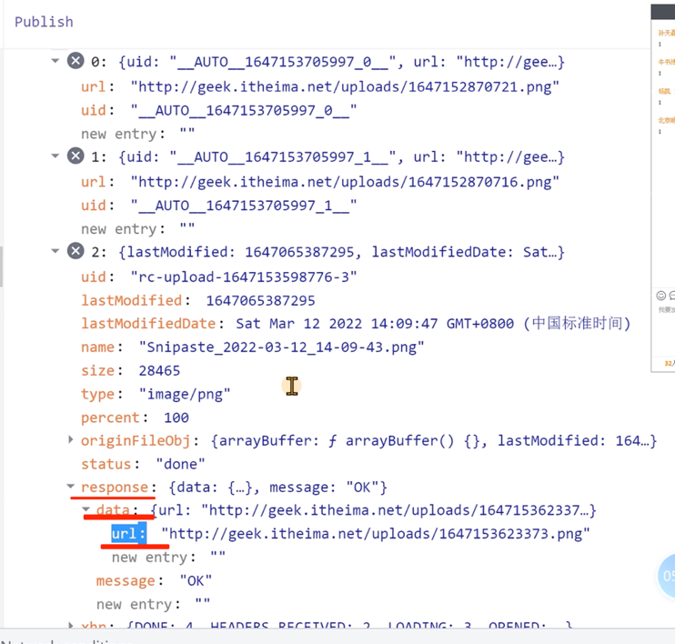


现在:

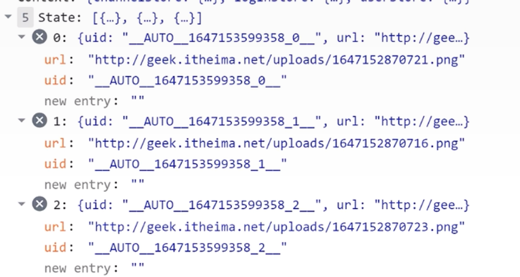


## 参考

文章管理模块: https://www.yuque.com/fechaichai/tzzlh1/rm4hzp#3dccd864


