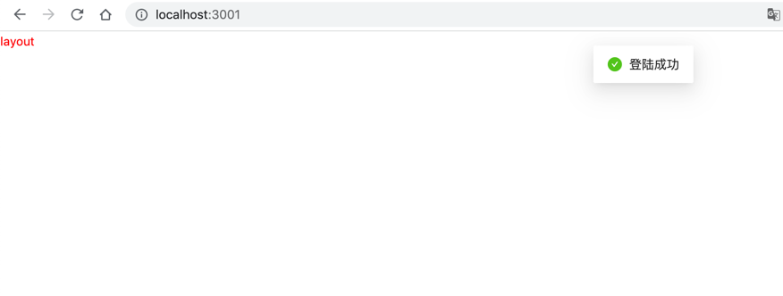
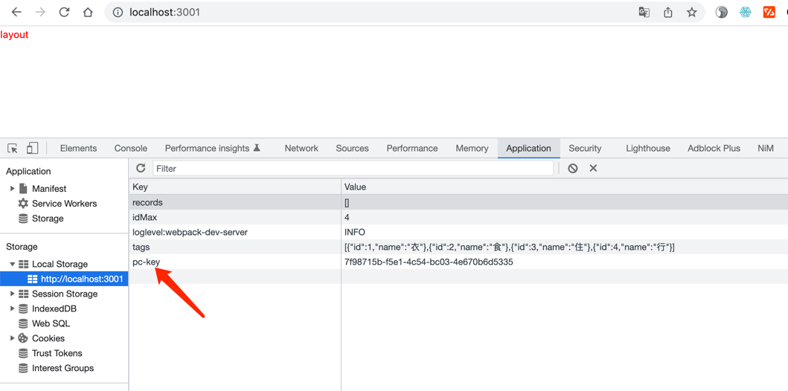
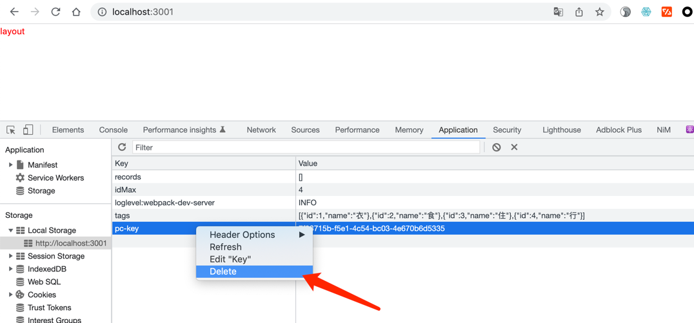
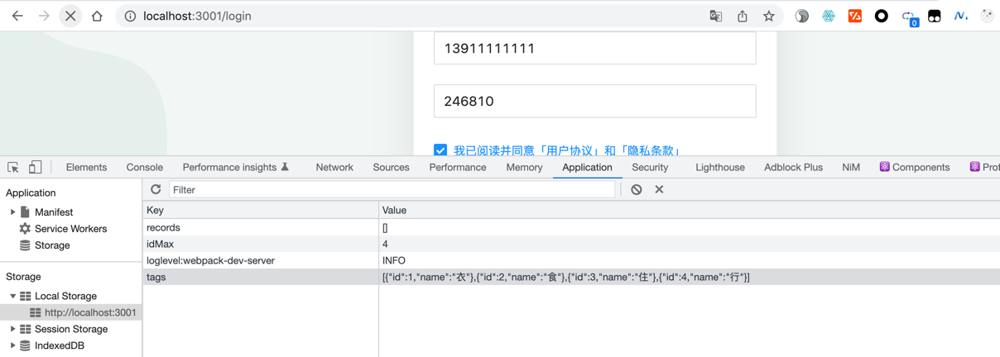

视频地址:
https://www.bilibili.com/video/BV1Z44y1K7Fj?p=100&vd_source=0aa76d6c0cefdf813dbf5b083daafb6a


笔记目录:

https://www.yuque.com/fechaichai/tzzlh1/obkdhx

项目地址

https://gitee.com/react-cp/react-pc-code

## 配置sass

```shell
yarn add sass -D

```


## 配置别名路径

CRA 将所有工程化配置，都隐藏在了 react-scripts 包中，所以项目中看不到任何配置信息(就是类似Webpack相关的文件)

如果要修改 CRA 的默认配置，有以下几种方案： 
 - 通过第三方库来修改，比如，@craco/craco  （推荐）
 - 通过执行 yarn eject 命令，释放 react-scripts 中的所有配置到项目中

实现步骤

1. 安装修改 CRA 配置的包：yarn add -D @craco/craco
2. 在项目根目录中创建 craco 的配置文件：craco.config.js，并在配置文件中配置路径别名
3. 修改 package.json 中的脚本命令
4. 在代码中，就可以通过 @ 来表示 src 目录的绝对路径
5. 重启项目，让配置生效


## @别名路径提示
   本节目标:  能够让vscode/webstorm识别@路径并给出路径提示
   实现步骤
1. 在项目根目录创建 jsconfig.json 配置文件
2. 在配置文件中添加以下配置

jsconfig.json
```json
{
  "compilerOptions": {
    "baseUrl": "./",
    "paths": {
      "@/*": ["src/*"]
    }
  }
}
```

## 登陆模块

https://www.yuque.com/fechaichai/tzzlh1/bivd9h


### 封装http工具模块

```shell
yarn add axios

```


### 配置登录Mobx
```shell
yarn add mobx mobx-react-lite
```

### 请求拦截器注入

一处配置token,多处生效


### 路由鉴权实现

思路为：判断本地是否有token，如果有，就返回子组件，否则就重定向到登录Login









token删除以后,再次刷新就重定向到登陆页面了


## Layout模块

p118