React中的闭包陷阱以及如何使用useState姿势(II)

[TOC]


## 前言
昨天发了一篇闭包陷阱的文章,然后有后台的童鞋问我为什么0会无限循环,这里科普一下一个基础知识==!:

setTimeout与setInterval有一个重要区别:
>setTimeout 只执行一次，setInterval 是每间隔给定的时间周期性执行(也就是说如果不调用函数停止执行,比如clearInterval,它会无限循环下去)。

这里还有一个例子:

```jsx

const App = () => {
  const [value, setValue] = useState(1)
  const show = () => {
    setTimeout(() => {
      alert(value)
    }, 2000);
  }
  return (
    <div>
      <p>this is App</p>
      <div>value: {value}</div>
      <button onClick={() => setValue(value + 1)}>add</button>
      <br/>
      <button onClick={show}>alert</button>
    </div>
  )
}

```
在上面的函数式组件中，我们点击 alert 按钮后会在 2s 后弹出 value 的值，我们在这 2s 的时间内可以继续点击 add 按钮增加 value 的值。


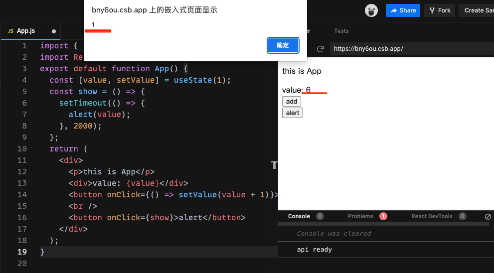

https://codesandbox.io/s/billowing-bush-bny6ou?file=/src/App.js


上图是我们操作的结果。我们发现弹出的值和当前页面显示的值不相同。换句话说：`show` 方法内的 value 和点击动作触发那一刻的 value 相同，**value 的后续变化不会对 show 方法内的 value 造成影响**。这种现象被称为“闭包陷阱”(又称为stale-closure:有名字就可以知道:传递给setTimeout的回调引用了闭包捕获的value的过期值)：**函数式组件每次render 都会生产一个新的 show 函数**，这个新的 show 函数会产生一个在当前这个阶段 value 值的闭包。


再看一下前面的代码:

```jsx

import { useEffect, useState } from'react';


export default App() {
  const [count, setCount] = useState(0);

  useEffect(() => {
    setInterval(() => {
      setCount(count + 1);
    }, 1500);
  }, []);

  useEffect(() => {
    setInterval(() => {
      console.log(count);
    }, 1500);
  }, []);

  return<div>Hello world</div>;
}
```
虽然上面第一个useEffect中一直在 加 1,但是第二个useEffect中的count的值其实一直是count的初始值,这和前面一个例子中**value 的后续变化不会对 show 方法内的 value 造成影响**的逻辑是一样的;

再次小结一下React中存在的闭包陷阱:

一般是指 useEffect/useMemo/useCallback 等 hook 中用到了某个 state，但是没有把它加到 deps 数组里，导致 state 变了，但是执行的函数依然引用着之前的 state。

## useRef的引入

在引入useRef之前,先看看它的基本用法:


```jsx

import { useRef} from "react";
import React from "react";
export default function App() {
  const ref1 = useRef();
  const ref2 = useRef(2021);
  console.log("if rendered, I am showing");
  console.log(ref1, ref2);
  return (
    <div>
      <h2>{ref1.current}</h2>
      <h2>{ref2.current}</h2>
    </div>
  );
}

```


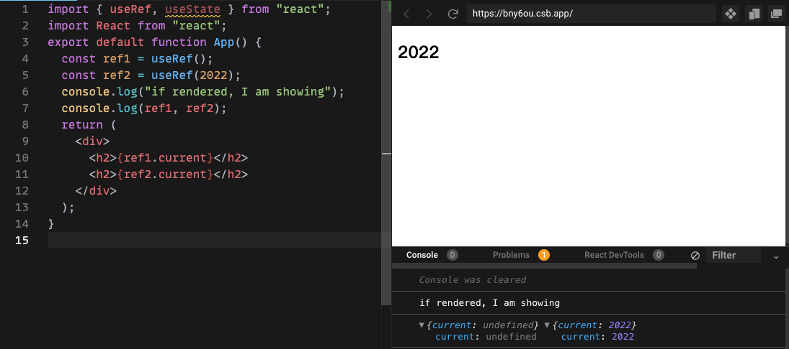


由此可以知道:

useRef返回一个具有current属性的对象;如果将参数initialValue传递给useRef(initialValue)，则此值将存储在current中;


### useRef的常见用例

例1-1:

```jsx
import { useRef } from "react";
import "./styles.css";
const App = () => {
  const countRef = useRef(0);
  console.log("render");
  return (
    <div className="App">
      <h2>count: {countRef.current}</h2>
      <button
        onClick={() => {
          countRef.current = countRef.current + 1;
          console.log(countRef.current);
        }}
      >
        increase count
      </button>
    </div>
  );
};
```

不断点击按钮:

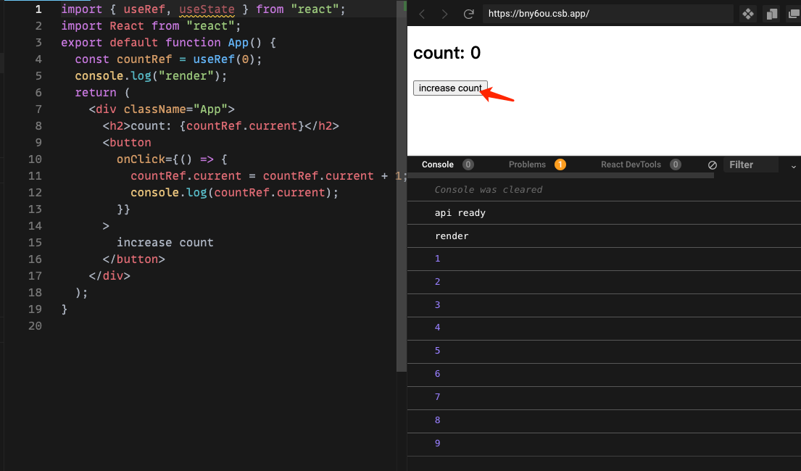

我们的目标是定义一个名为countRef的ref，用0初始化该值，并在每次单击按钮时该计数器变量会增加。呈现的计数值应该更新

令人惊讶的是:页面上的计数值没有更新,但是:控制台的输出证明了当前属性是保存了正确的更新的;

同时,自从初始渲染之后,组件就没有重新渲染了;也就是说useRef不会触发重新渲染


那么useRef应该怎么用？<br>
其实它与其他触发重新渲染的 Hook 结合起来很方便，例如useState,useReducer和useContext

看个例子(和useState结合的):

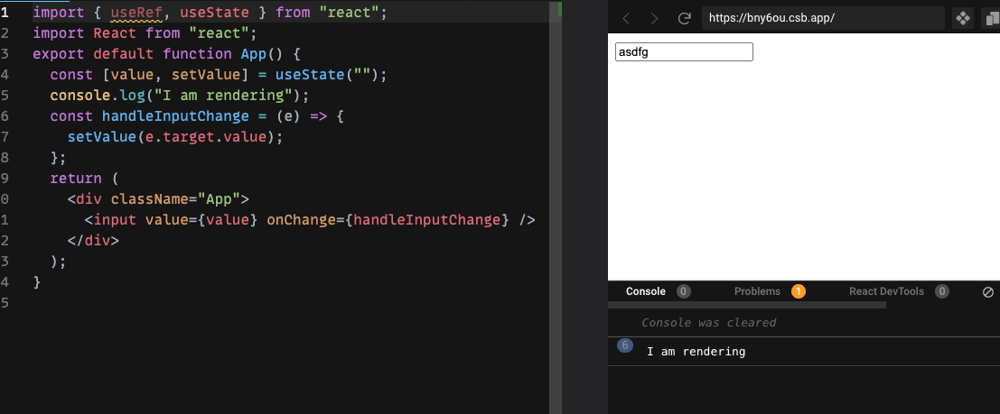


```jsx
import { useState } from "react";
import React from "react";
export default function App() {
  const [value, setValue] = useState("");
  console.log("I am rendering");
  const handleInputChange = (e) => {
    setValue(e.target.value);
  };
  return (
    <div className="App">
      <input value={value} onChange={handleInputChange} />
    </div>
  );
}
```
上面这个例子中没有用useRef,发现只要state一变化,页面就重新渲染;

下面使用useRef重写一下:

```jsx

import { useRef, useState } from "react";
import React from "react";
export default function App() {
  const [value, setValue] = useState("");
  const valueRef = useRef();
  console.log("render");
  const handleClick = () => {
    console.log(valueRef);
    setValue(valueRef.current.value);
  };
  return (
    <div className="App">
      <h4>Value: {value}</h4>
      <input ref={valueRef} />
      <button onClick={handleClick}>click</button>
    </div>
  );
}

```


点击前:

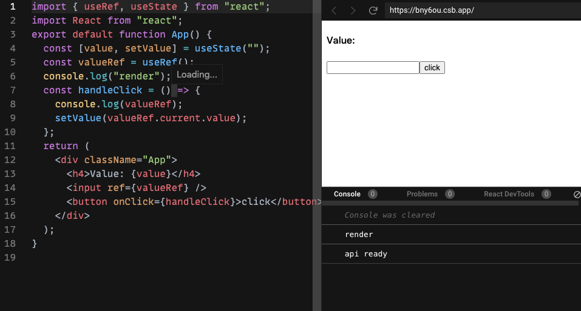

点击后:

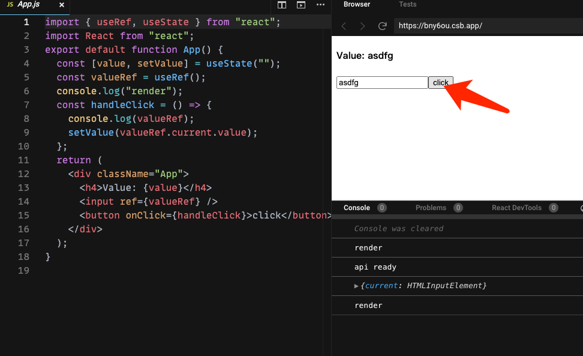


通过该ref属性，React 提供了对 React 组件或 HTML 元素的直接访问。控制台输出显示我们确实可以访问该input元素。ref存储在current属性中。


再看一个和useEffect结合的例子:

```jsx
import { useRef, useState, useEffect } from "react";
import React from "react";
export default function App() {
  const inputRef = useRef();
  console.log("render");
  useEffect(() => {
    console.log("running in useEffect");
    inputRef.current.focus()//注意有无这句话刷新前后的区别
  }, []);
  return (
    <div className="App">
      <input ref={inputRef} placeholder="this is input" />
    </div>
  );
}

```
输入前:

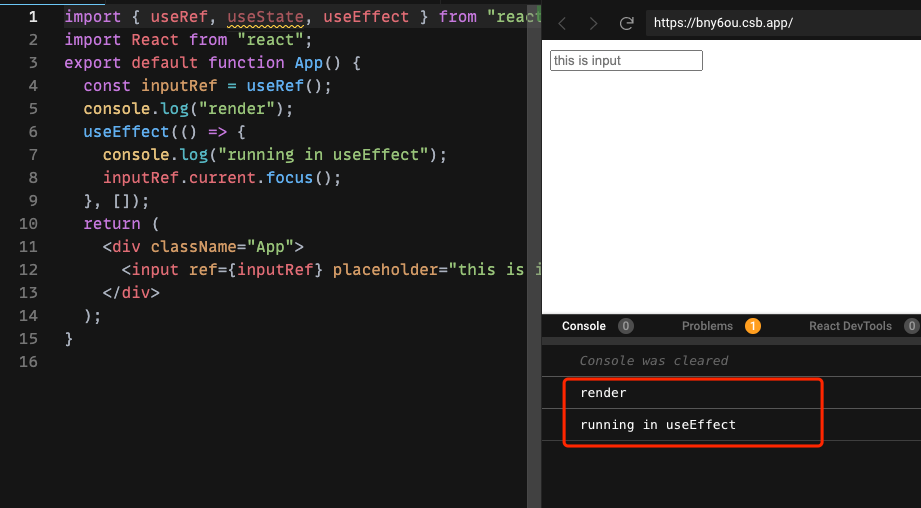

如果没有`inputRef.current.focus()`:

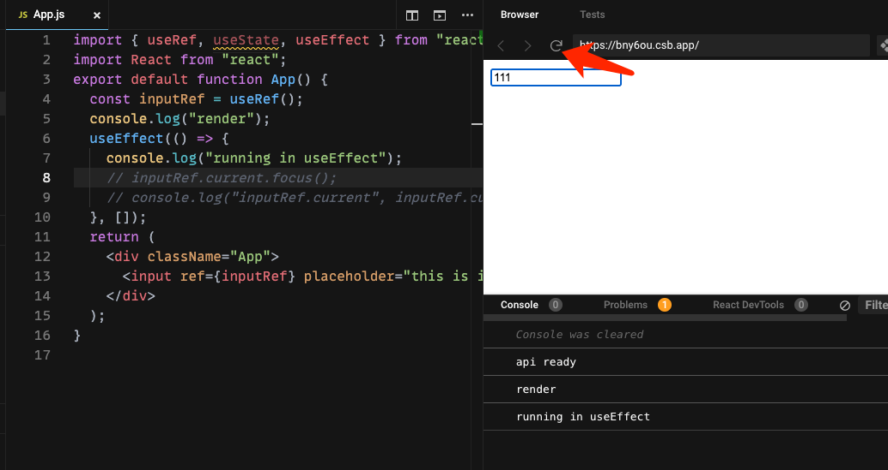

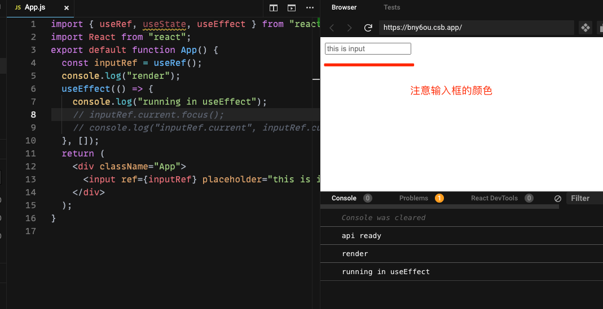

如果有`inputRef.current.focus()`:

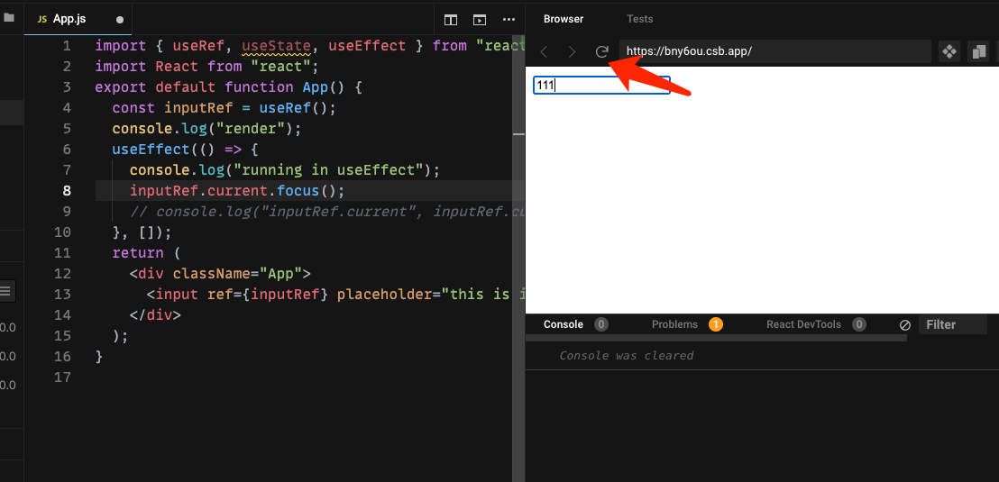


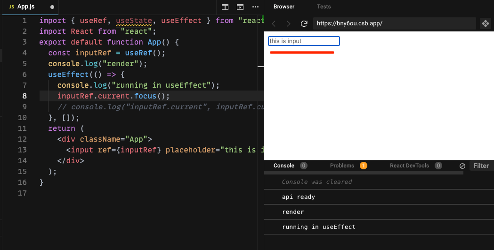


通过ref可以直接访问DOM元素;

### 实例3

另外一个例子是需要上一个渲染周期的状态值时也要运用到useRef

这个例子很重要(终于讲到重点了)

```jsx
import { useRef, useState, useEffect } from "react";
import React from "react";
export default function App() {
  console.log("render");
  const [count, setCount] = useState(0);
  //获取上一个值(在上次渲染时传递给钩子的)
  const ref = useRef();
  // 存储ref中的current值
  useEffect(() => {
    console.log("useEffect");
    ref.current = count;
  }, [count]); // count变化时才会重新渲染
  return (
    <div className="App">
      <h1>
        Now: {count}, before: {ref.current}
      </h1>
      <button onClick={() => setCount(count + 1)}>Increment</button>
    </div>
  );
}


```

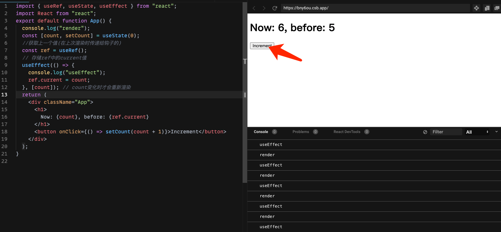

在初始渲染之后，呈现出初始状态，将状态变量count分配给`reference.current`。因为没有发生额外的事件，故呈现出来的值是未定义的。单击按钮会触发状态更新，由于调用了setCount。

由于state发生变化,重新渲染UI, before标签显示正确的值(此时为0)。渲染之后，再次执行useEffect中的回调。1被赋值给ref，以此类推...


需要注意的是: 所有的ref都需要在useEffect/useCallback/回调或内部处理函数中更新,达到在渲染过程中改变ref的目标，如果从其他地方(比如例1-1),可能会引入bug。useState同理。


## 解决闭包陷阱的终极解决方案

好了,回归正题:如何解决昨天的闭包陷阱问题,受实例3的启发,这里给出解决方案:


```jsx
import { useRef, useState, useEffect, useLayoutEffect } from "react";
import React from "react";
export default function App() {
  const [count, setCount] = useState(0);

  useLayoutEffect(() => {
    setInterval(() => {
      setCount((count) => count + 1);
    }, 500);
  }, []);

  const log = () => {
    console.log(count);
  };
  const ref = useRef(log);

  useEffect(() => {
    ref.current = log;
  });

  useEffect(() => {
    setInterval(() => ref.current(), 500);
  }, []);

  return <div>hello world</div>;
}

```

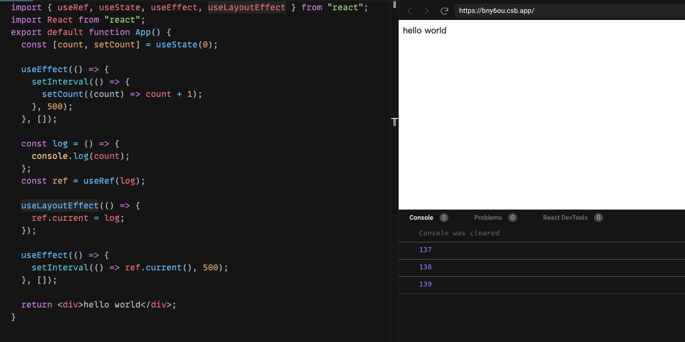


## 总结

最好总结一下useState和useRef的区别:


- 两者都在渲染周期和UI更新期间保存它们的数据，但useState Hook会导致重新渲染(ref.current更新不会导致重新渲染,但是state更新会)
- useRef返回一个具有current保存实际值的属性的对象。相反，useState返回一个包含两个元素的数组：第一项构成状态，第二项表示状态更新函数
- useRef的current属性是可以被赋值的;但useState的state不是，要改变state,只能通过setState来进行,不能通过赋值的方式
- useRef可以直接访问React组件或DOM元素,而useState不可以


在点赞，收藏这种业务中经常用到useRef


