React中的闭包陷阱以及如何使用useState姿势

##  问题的引出

```jsx
import { useEffect, useState } from 'react';

export default function App() {
  const [count, setCount] = useState(0);

  useEffect(() => {
    setInterval(() => {
      setCount(count + 1);
    }, 1500);
  }, []);

  useEffect(() => {
    setInterval(() => {
      console.log(count);
    }, 1500);
  }, []);

  return <div>Hello world</div>;
}
```

控制台会输出什么?


如上图所示,输出的是0,而不是我们所期待的`0, 1, 2, 3, …`

这就是闭包陷阱;

## 分析

1.组件是一个Fiber节点

2.每个Fiber节点都有一个属性叫做memorizedState，它是一个链表结构

3.组件的每个Hook都对应于memorizedState链表的一个节点，它们从对应的节点访问相对应的值。


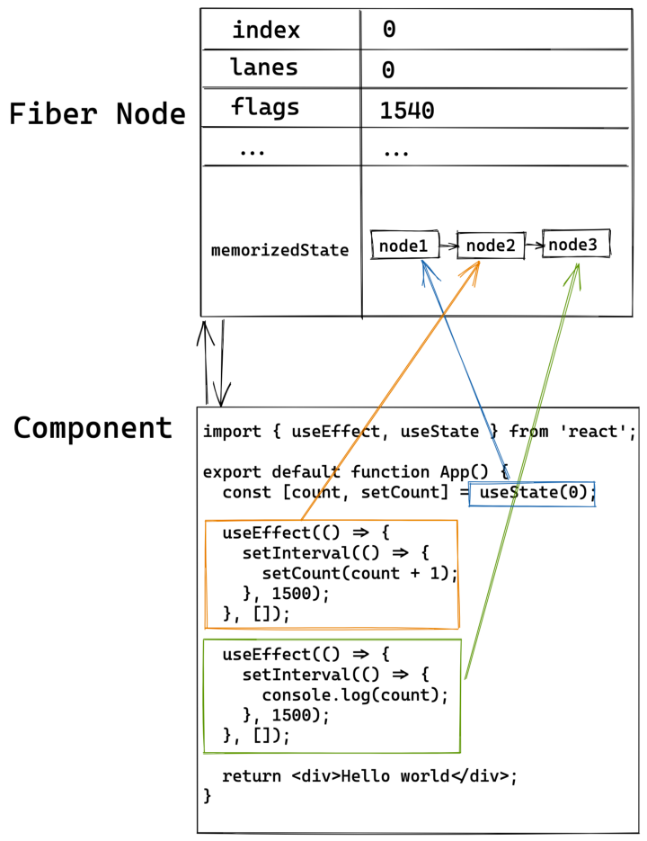

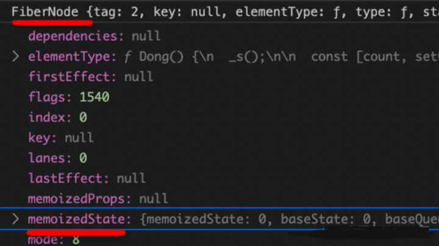

上例中有三个Hook，每个Hook对应链表中的一个节点memorizedState

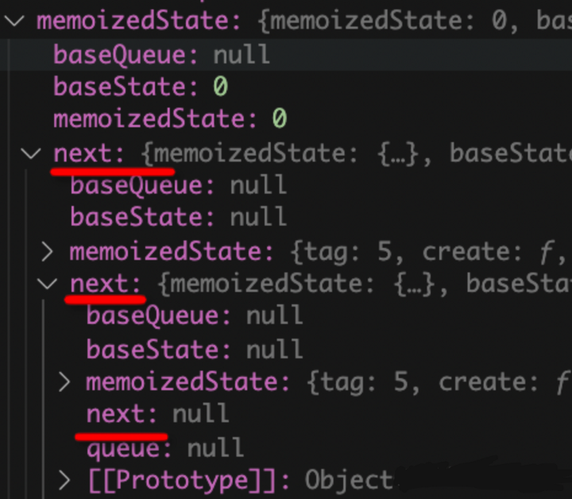

然后每个Hook访问自己的memorizedState以完成自己的逻辑。

## Hooks的实现

Hook 有两个阶段：挂载和更新。

mount函数在第一次创建Hook时执行，之后每次更新Hook时执行update函数。


这里是useEffect实现:

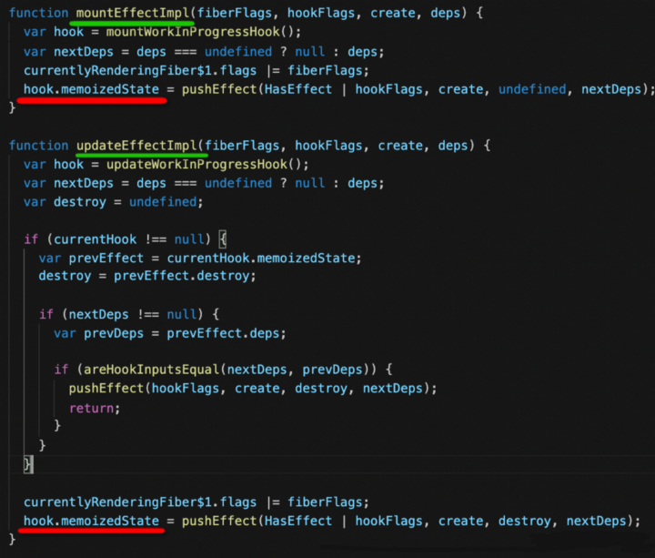

## Hooks 如何处理 deps？

这里要注意deps参数的处理：如果deps是未定义的，则将deps其视为null

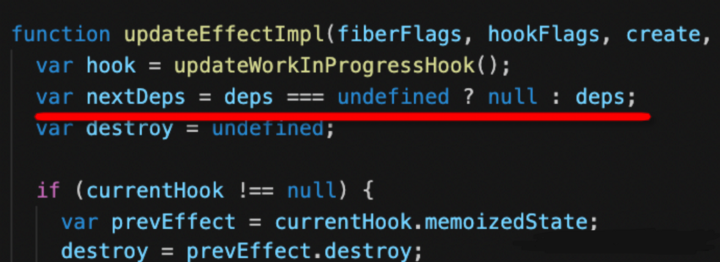

然后它将新传递的deps与之前memorizedState中的deps进行比较：如果两者相等，则直接使用先前给定的函数，否则，创建一个新函数。

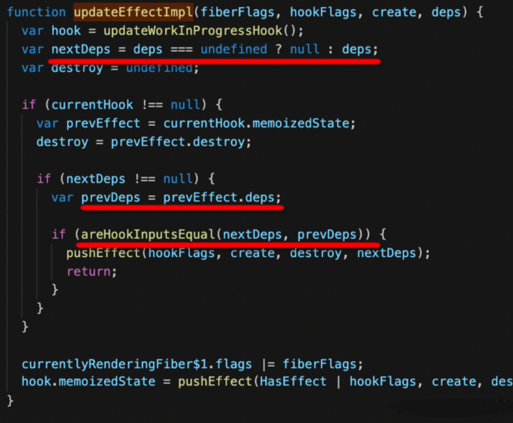

比较两个dep是否相等的逻辑非常简单：如果先前的dep为null，则直接返回false，也就是说，它们不相等；否则，会遍历并进行比较。

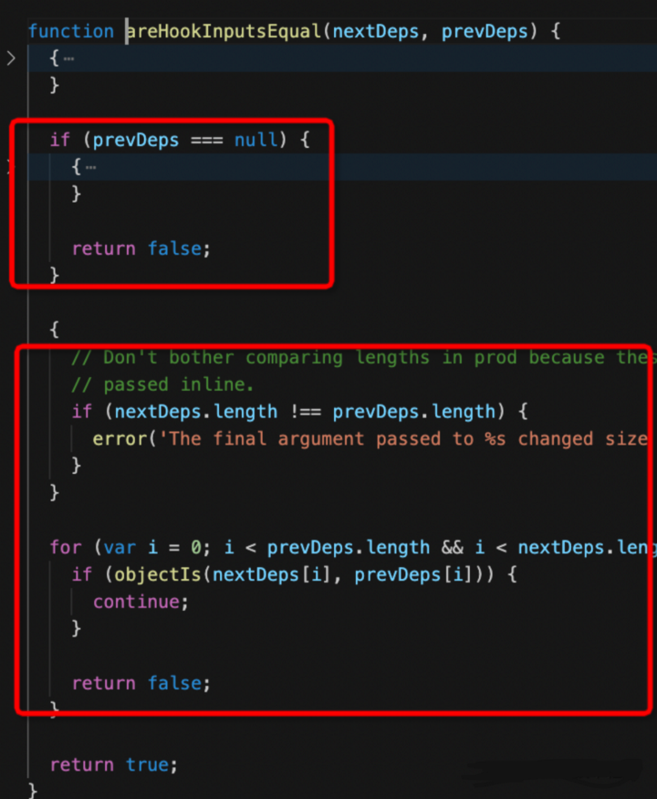

### 所以我们可以得到三个结论:(重点)

如果useEffect的deps参数为undefined或null，则将在每次渲染中重新创建并执行回调函数(产生无限循环)。<br>
如果它是一个空数组，那么回调将只执行一次。  <br>
否则，它将比较deps数组中的每个元素是否已更改，以决定是否执行该效果。<br>


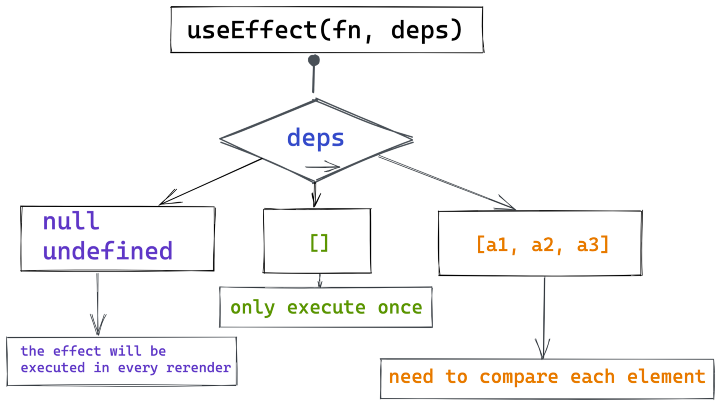

像useMemo和useCallback这样的钩子也以同样的方式处理deps:

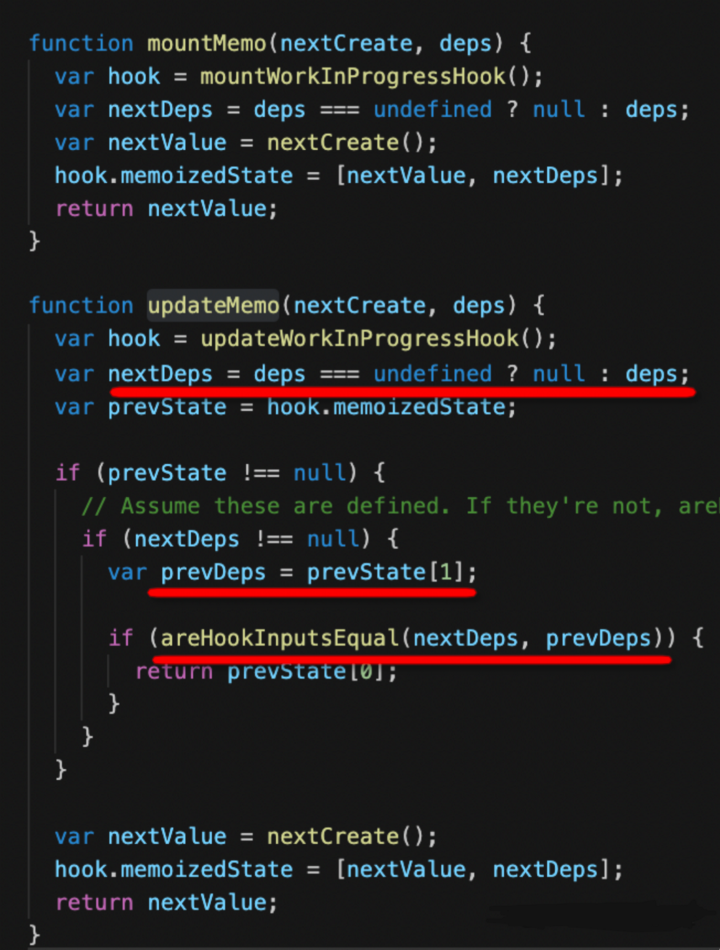


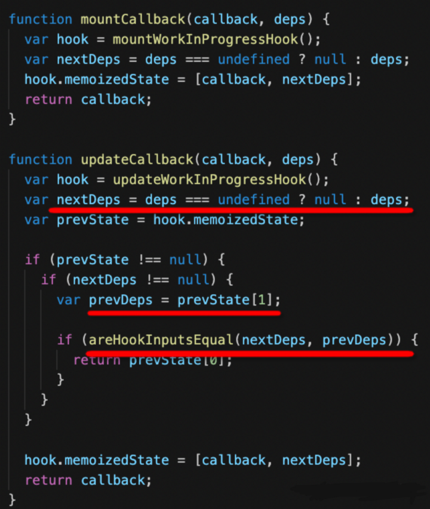

从前面的讨论中，我们确定了两件事:

- 像useEffect这样的钩子(Hooks)访问的是memriorizedState中的数据。
- 钩子(Hooks)通过比较dep是否相等来决定是否执行回调函数。


## 闭包陷阱

现在回到闭包陷阱中来:

```jsx
useEffect(() => { 
    const timer = setInterval(() => { 
        setCount(count + 1); 
    }, 500); 
}, []);
useEffect(() => { 
    const timer = setInterval(() => { 
        console.log(count); 
    }, 500); 
}, []);
```

deps是一个空数组，所以这个回调只会执行一次。

对应的源码实现如下：

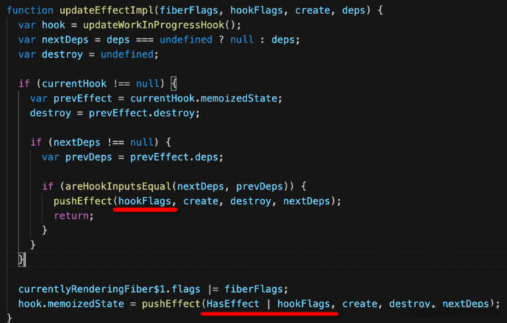

需要执行的Effect会被标记为HasEffect，之后再执行:

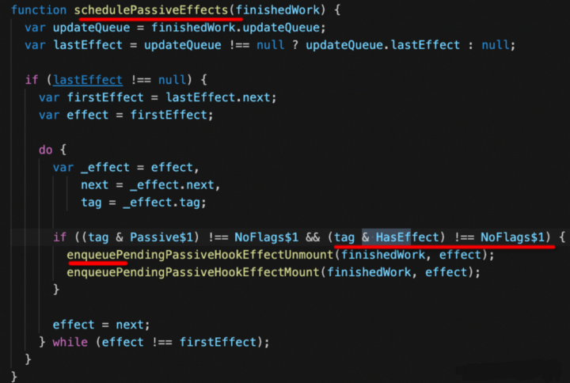

因为deps这里是一个空数组，所以没有HasEffect标志。Effect将不再执行。

所以定时器setInterval只会设置一次。因此，其回调函数引用的状态始终是初始状态，无法获取最新状态。

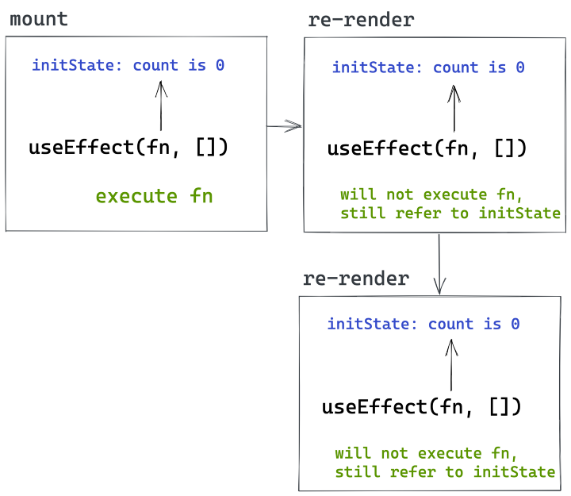

如果我们想要获得最新的State，那么我们需要让fn在每次重新渲染时执行一次。也就是说，我们应该把count放在依赖数组中。

```jsx
useEffect(() => {
        setInterval(() => {
            setCount(count + 1);
        }, 1500);
    }, [count]);
useEffect(() => {
        setInterval(() => {
            console.log(count);
        }, 1500);
    }, [count]);
```


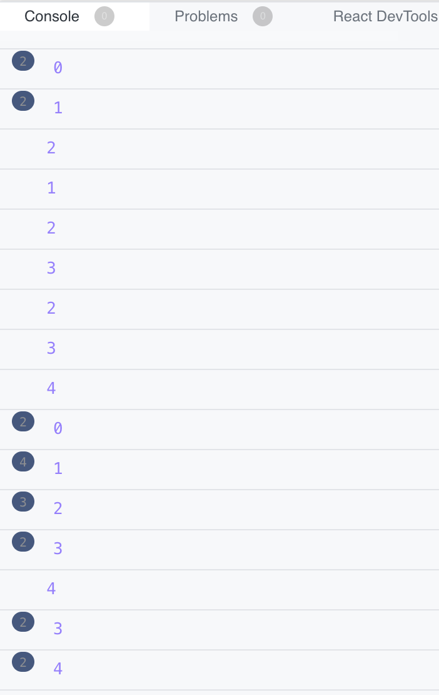

为什么控制台的结果如此混乱?

这是因为每个Effect都创建了一个计数器。所以我们需要清除效果中之前的计数器。

```jsx
useEffect(() => {
    let timer = setInterval(() => {
      setCount(count + 1);
    }, 1500);
    return () => clearInterval(timer);
  }, [count]);
useEffect(() => {
    let timer = setInterval(() => {
      console.log(count);
    }, 1500);
    return () => clearInterval(timer);
  }, [count]);

```

## 小结

- 一个名为memorizedState的链表存储在Fiber节点中。链表的节点与钩子一一对应，每个钩子访问对应节点上的数据。
- 像useEffect、useMomo和useCallback这样的钩子都有一个deps参数。每次执行渲染时，都会比较新的和旧的deps，如果deps发生变化，则会重新执行回调函数。
- 如果 useEffect 第二个参数传入 undefined 或者 null或者没有第二个参数，每次都会执行 ----->不断调用这个回调--->产生无限循环 ;如果传入了一个空数组，只会执行一次(一般在异步请求的时候这么设置);第二项为一个非空数组(正常情况),会对比数组中的每个元素有没有改变，来决定是否执行。

产生闭包陷阱的原因是，在useEffect等钩子中使用了某个状态，但它没有添加到deps数组中，因此即使状态发生了变化，也不会重新执行回调函数，它仍然引用旧的状态。

闭包陷阱也很容易修复，我们只需要正确设置deps数组。这样，每次状态改变时，回调函数都会被重新执行，引用新的状态。但是，我们还需要注意清理以前的计时器、事件监听器等。


彩蛋:这个问题还没完,还有后续,敬请期待...


