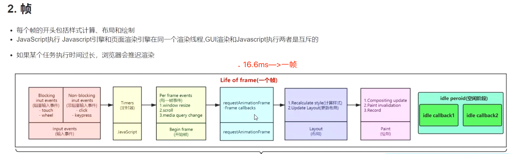
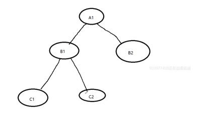
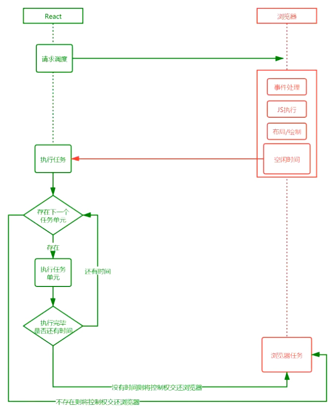
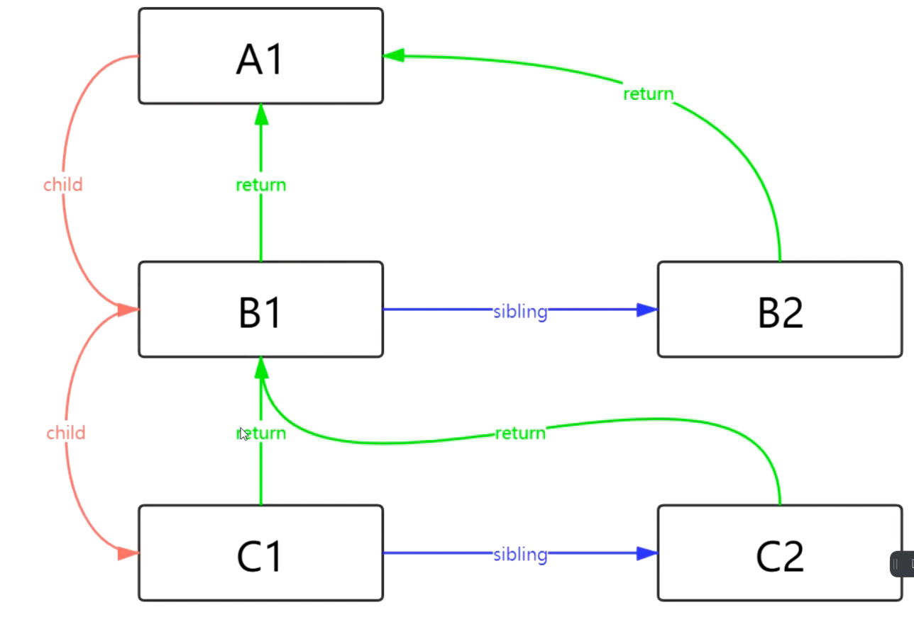
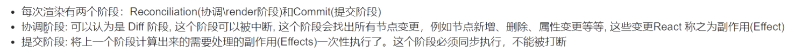
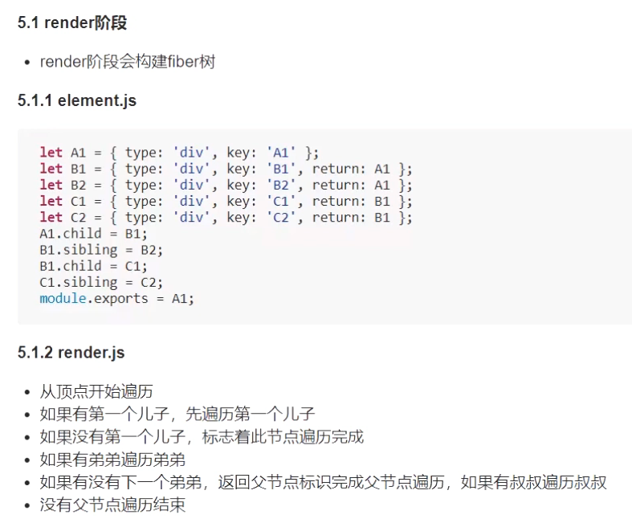

## 帧


## React16之前的结构



```JavaScript
/**
 * 1.fiber之前是什么样的？为什么需要fiber?
 * 1.看一下fiber的代码是怎么样的? 完成任务之后，我是如何遍历子节点
 * 这种遍历是递归调用，执行栈会越来越深。而且 不能中断，因为中断后再想恢复 就非常难了
 * 1.不能中断 执行栈太深
 *
 */
let root = {
    key: 'A1',
    children: [
      {
        key: 'B1',
        children: [
          {key: 'C1', children: []},
          {key: 'C2', children: []},
        ]
      },
      {
        key: "B2", children: []
      }
    ]
  }

function walk(vdom) {
  doWork(vdom);
  vdom.children.forEach((child) => {
    walk(child);
  });
}

function doWork(vdom) {
  console.log(vdom.key);
}

walk(root);


```

## React16
## Fiber架构



## Fiber是什么
Fiber是一种数据结构,React目前的做法是使用链表,每个VirtualDOM节点内部表示为一个Fiber;

每个Fiber节点就是一个对象,有三个指针,分别指向兄弟,父亲,儿子




## Fiber执行阶段




遍历的原则: 儿子==>弟弟==>叔叔(爸爸)


蓝颜色表示完成的顺序,绿颜色表示遍历的顺序


fiber解决了执行栈不能中断的问题,可以干一会休息一会,干一会休息一会;


